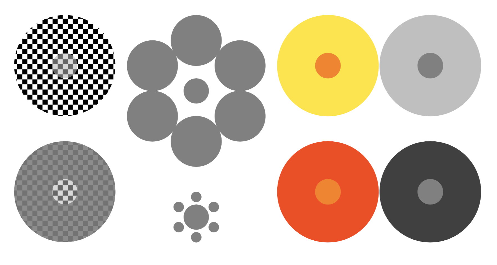
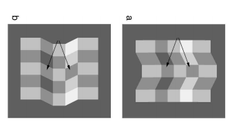
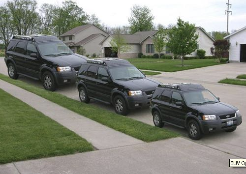

# Biases in Judgment of Sensation

[remains to add: (1) prediction: unsupervised neural net should show assimilation, supervised should show contrast; (2) the "relief" problem: people should have enough information to fix this, unless they're ignorant of strength of spillovers.]

There are many cases where people make systematic mistakes about    their own sensations - what they see, what they hear, what they touch. Most well-known are optical illusions, such as the Muller-Lyer illusion in which one line appears longer than another, even though they are both the same length, because each has slightly different adjoining lines.

These are not just imperfections in inferences about the world, they are misjudgments of the sensations themselves. The two lines cast two identical projections upon your retina, yet you perceive them to have different lengths -- they seem to be both different in the world and different on your eye.

**A common pattern of many illusions is *comparison* effects,** where judgment of the strength of some sensation $s$ is affected by the strength of another sensation, $s'$ shown alongside or prior to $s'$. These effects can be split into assimilation effects, where an increase in $s'$ causes an increase in the apparent size of $s$, and contrast effects, where an increase in $s'$ causes a decrease in the apparent size of $s$. A second class of effects is cross-modal where, for example, judgment of a visual stimulus is affected by a sound, or vice versa. In general I will define a bias as an effect:
   $$\frac{d\hat{s}}{ds'}\neq0,$$

where $\hat{s}$ is an estimate of some sensation $s$, and $s'$ is the intensity of some other sensation.

**The most common theories of these effects say they are a side-effect of the bottleneck of perceptual coding:** the idea that neurons compress sensory information, and certain distortions are introduced when the information is decompressed. I will state an alternative theory. The basic idea has a long history - Helmholtz in the 18th century, Ted Adelson in the late 20th century interpreted many things this way -- but I try to state it in a more explicit and formal way, and derive a number of predictions which are not otherwise obvious.

**Before stating the theory we need to be claer about the distinction between sensations and the values inferred from those sensations.** Some examples are as follows:

| sensation ($s$)  | values inferred ($v$)                           |
| ---------------- | ----------------------------------------------- |
| size on retina   | size and distance of object                     |
| sound heard      | syllable spoken and the speaker                 |
| pressure on hand | weight and density of object                    |
| colour on retina | colour of object, colour of light               |
| motion on retina | motion of object, motion of eye, motion of head |

Table: The distinction between sensation and value.

The contents of the second column is a matter of conjecture - we do not know which things are being inferred from a particular sensation, and probably multiple things. However it's worth noting that it can be rational for your judgment of a value to be influenced by a range of sensations: it is not irrational for your judgment of the syllable spoken to be influenced by your hearing, your vision, or your prior expectations about what syllable is likely to be spoken. The biases we are interested in explaining regard the cross-contamination of the *sensations* themselves, i.e. cases where
$\frac{d\hat{s}}{ds'}\neq0$.

A second preliminary remark is that humans are, in general, extremely good at inferring properties of the world from sensations. A simple demonstration is the difficulty in writing a computer program to perform as well as a human in making inferences about properties of the world.

## Back-Inference of Sensations and Correlated Noise.

My account of biases is based on two assumptions: (1) back-inference and (2) correlated noise.

**Back-inference.** I mean by "back-inference" the idea that we do not have direct conscious access to our sensations, and that we infer them by reversing the inferences made by early perceptual modules. The model assumes two stages: the lower perceptual system infers values of the world from the sensations it receives; subsequently, the higher cognitive centers receive those inferences, without information about the original sensations themselves. Thus when we are asked about the sensations, we *back-infer* from the values which were themselves inferred from the stimuli. Schematically, the setup is as follows:

$$\xymatrix{
&  &  &  &  & \hat{s}_{1}=s_{1}|\hat{v}\\
v\ar@/^2pc/[rr]|(.3){s_{1}}\ar[rr]|(.3){s_{i}}\ar@/_2pc/[rr]|(.3){s_{n}} &  & \boxed{1}\ar[rr]^{\hat{v}=v|\mathbf{s}} &  & \boxed{2}\ar@/^1pc/[ur]\ar[r]\ar@/_1pc/[dr] & \hat{s}_{i}=s_{i}|\hat{v}\\
& \,\ar@{.}[uu] &  &  &  & \hat{s}_{n}=s_{n}|\hat{v}
}$$

The first system, $\boxed{1}$, receives sensations $\mathbf{s}=s_{1},\ldots,s_{n}$, from which it forms $\hat{v}$, an inference about $v$, which it sends to the second system, $\boxed{2}$. The second system, when asked to estimate sensations, does not have direct access to $s_{1},\ldots,s_{n}$, so it will *back-infer* them. Therefore estimates of one sensation can be influenced by another sensation. More interestingly, the direction of the influence will be predictable if we know the relationship between $s$ and $v$:[^4] $$\frac{d\hat{s}_{1}}{ds_{2}}\propto\frac{d\hat{v}/ds_{2}}{d\hat{v}/ds_{1}}.$$

A simple intuitive example is the McGurk effect, in which subjects are presented with two stimuli: (i) video of lips mouthing a syllable, and (ii) a sound clip of speech. Often a subject who is played exactly the same sound twice will report *hearing* different syllables, when the video shows different motion of lips.[^5] This follows from back-inference: System 1 first infers the syllable spoken (from both vision and sound), and then System 2 back-infers the original sensations from the reconstructed syllable. In this example the effect is quite intuitive, and the formal model doesn't add much. In other cases the analysis is more enlightening.[^6] [^7]

The theory's predictions rest entirely on the correlation of $v$ and $s$. A simple prediction is that there should exist positive comparison effects ("assimilation" effects) between two similar stimuli. Suppose that there were two values ($v_{1},v_{2}$), each with a corresponding correlated signal ($s_{1},s_{2}$). In most cases it seems natural to assume that $v_{1}$ and $v_{2}$ are, if anything, positively correlated. Then $s_{2}$ should be positively correlated to $v_{1}$, and therefore we would generally expect $\frac{d\hat{s}_{1}}{ds_{2}}>0$.

However - and this is a common paradox in the study of perception - in many cases we find the opposite: i.e. *contrast* effects, with $\frac{d\hat{s}_{1}}{ds_{2}}<0$. This fact has come up as a paradox in many discussions of perception (though discussions often fail to make a clear distinction between $s$ and $v$).[^8][^9]

**Correlated noise.** The prevalence of contrast effects can be accounted for by my second assumption: correlated noise. Suppose that $s_{1}$ and $s_{2}$ are each related to $v_{1}$ and $v_{2}$, and each has additive noise, $e_{1}$ and $e_{2}$. If $e_{1}$ and $e_{2}$ are sufficiently correlated then, although $s_{2}$ is positively correlated to $v_{1}$, it will enter negatively into $\hat{v}_{1}(s_{1},s_{2})$, because it will now become more informative about $e_{1}$ than about $v_{1}$. In the Gaussian model below I show the following relationship:
 $$\frac{d\hat{v}(s_{1},s_{2})}{ds_{2}}\propto\mbox{corr}(v_{1},v_{2})-\mbox{corr}(e_{1},e_{2}).$$

In short: we should expect assimilation effects when the values are more correlated than the noise, and contrast effects when the noise is more correlated than the values. I will argue that this fits the patterns we observe in the world: contrast effects occur in contexts where there is reason to expect noise to be correlated, and vice versa.

Why would errors be correlated? Because in our sense organs pick up a mixture of environmental variables, most of which are irrelevant, requiring us to contininuously recalibrate our sensations. I give some examples in the following table:

| sensation ($s$)       | value ($v$)            | noise ($e$)          |
| --------------------- | ---------------------- | -------------------- |
| light on retina       | colour of object       | illumination         |
| size on retina        | size of object         | distance of object   |
| pressure on hand      | weight of object       | sensitivity of hand  |
| oriention on retina   | orientation in world   | orientation of head  |
| motion on retina      | motion of object       | motion of eye        |

Table: The distinction between sensation, value,  and noise for a variety of sensory contexts.

Contrast effects will occur whenever noise tends to be more correlated, or slower-moving, than value: for example when we have priors that nearby objects tend to share the same illumination, or the same distance. Another way of putting this is that the low-frequency elements of a stimulus tend to be noise, thus the best estimate of value often looks like a high-frequency filtered version of the original stimuli.

**Summary of predictions.** My claim is that this theory can give a good prediction of the direction of biases across a range of psychophysics experiments. In summary:
1.  When comparing similar stimuli, contrast effects ($\frac{d\hat{s}_{1}}{ds_{2}}<0$) will tend to occur when the stimuli are shown clearly (i.e., not near the limits of    perceptability), and when the two stimuli are perceived to reside in the same plane. Assimilation occurs in the opposite type of situation.
2.  When judgment is affected by a dissimilar stimulus (e.g., visual judgment being affected by auditory cues), contrast effects will tend to occur when the additional cue is associated with the stimulus, assimilation effects will occur when it is associated with the value.
3.  These biases will tend to be smaller for more automatic responses - e.g. grasping responses - insofar as they receive signals prior to high-level processing.

## Gaussian Model of Back-Inference

A simple and intuitive solution for the entire model exists when the signals and values are all Gaussian. Treating $s$ and $v$ as vectors, we will be interested in their covariance:

$$Var\begin{pmatrix}s\\
    v
    \end{pmatrix}=\begin{pmatrix}U & C\\
    C' & V
    \end{pmatrix},$$

and we can then derive the output of the first stage, $E[v|s]$, denoted $v|s$ for short:

$$\hat{v}=v|s = C'U^{-1}s,$$

which means we can derive the second stage output, $s|\hat{v}$:

$$\begin{aligned}
    cov\begin{pmatrix}s\\
    \hat{v}
    \end{pmatrix} & = & \begin{pmatrix}U & C\\
    C' & C'U^{-1}C
    \end{pmatrix}\\
    s|\hat{v} & = & C(C'U^{-1}C)^{-1}\hat{v}\\
     & = & C(C'U^{-1}C)^{-1}C'U^{-1}s.
\end{aligned}$$

Suppose we have just two values and two sensations, all are mean zero, with covariance: $$Var\begin{pmatrix}s_{1}\\
    s_{2}\\
    v_{1}\\
    v_{2}
    \end{pmatrix}=\begin{pmatrix}\sigma_{s}^{2} & \theta_{s,s}^{2} & \theta_{s,v}^{2} & \phi_{s,v}^{2}\\
     & \sigma_{s}^{2} & \phi_{s,v}^{2} & \theta_{s,v}^{2}\\
     &  & \sigma_{v}^{2} & \theta_{v,v}^{2}\\
     &  &  & \sigma_{v}^{2}
    \end{pmatrix}.$$

We can solve for $\hat{v}$:[^10]

$$\begin{aligned}
    \hat{v}= E\left(\begin{array}{c} v_{1}\\ v_{2}\end{array}|
                   \begin{array}{c}s_{1}\\s_{2}\end{array}\right) & =  Cov_{v,s}Var_{s}^{-1}\begin{pmatrix}s_{1}\\s_{2}\end{pmatrix}\\
     =& \begin{pmatrix}\theta_{s,v}^{2} & \phi_{s,v}^{2}\\ \phi_{s,v}^{2} & \theta_{s,v}^{2} \end{pmatrix}
    \begin{pmatrix}\sigma_{s}^{2} & \theta_{s,s}^{2}\\ \theta_{s,s}^{2} & \sigma_{s}^{2} \end{pmatrix}^{-1}
    \begin{pmatrix}s_{1} \\ s_{2} \end{pmatrix} \\
      = & \begin{pmatrix}\theta_{s,v}^{2} & \phi_{s,v}^{2}\\
    \phi_{s,v}^{2} & \theta_{s,v}^{2}
    \end{pmatrix}\frac{1}{\sigma_{s}^{4}+\theta_{s,s}^{4}}\begin{pmatrix}\sigma_{s}^{2} & -\theta_{s,s}^{2}\\
    -\theta_{s,s}^{2} & \sigma_{s}^{2}
    \end{pmatrix}\begin{pmatrix}s_{1}\\
    s_{2}
    \end{pmatrix}\\
     = & \frac{1}{\sigma_{s}^{4}+\rho_{s}^{4}}
     \begin{pmatrix}\theta_{s,v}^{2}\sigma_{s}^{2}-\phi_{s,v}^{2}\theta_{s,s}^{2} & \sigma_{s}^{2}\phi_{s,v}^{2}-\theta_{s,s}^{2}\theta_{s,v}^{2}\\
     \sigma_{s}^{2}\phi_{s,v}^{2}-\theta_{s,s}^{2}\theta_{s,v}^{2} & \theta_{s,v}^{2}\sigma_{s}^{2}-\theta_{s,v}^{2}\theta_{s,s}^{2}\end{pmatrix}
    \begin{pmatrix}s_{1}\\s_{2}\end{pmatrix}
\end{aligned}$$
so

$$\frac{d\hat{v}_{1}}{ds_{2}}=\frac{\sigma_{s}^{2}\phi_{s,v}^{2}-\theta_{s}^{2}\theta_{s,v}^{2}}{\sigma_{s}^{4}+\theta_{s}^{4}}.$$

If signals have additive noise, as in $s_{i}=v_{i}+e_{i}$, where $e_{1}$ and $e_{2}$ have variance $\sigma_{e}^{2}$ and covariance $\theta_{e,e}^{2}$, then:

$$\begin{aligned}
    \sigma_{v}^{2}   = & \sigma_{v}^{2}\\
    \sigma_{s}^{2}   = & \sigma_{v}^{2}+\sigma_{e}^{2}\\
    \theta_{s,v}^{2} = & \sigma_{v}^{2}\\
    \phi_{s,v}^{2}   = & \theta_{v,v}^{2}\\
    \theta_{s,s}^{2} = & \theta_{v,v}^{2}+\theta_{e,e}^{2}.
\end{aligned}$$

Plugging back in we get:

$$\begin{aligned}
    \frac{d\hat{v}_{1}}{ds_{2}}  \propto & (\sigma_{v}^{2}+\sigma_{e}^{2})\rho_{v}^{2}-(\rho_{v}^{2}+\rho_{e}^{2})\sigma_{v}^{2}.\\
      = & \alpha^{3}\sigma_{v}^{2}\rho_{v}^{2}+\sigma_{e}^{2}\alpha\rho_{v}^{2}-\alpha^{3}\rho_{v}^{2}\sigma_{v}^{2}-\rho_{e}^{2}\alpha\sigma_{v}^{2}\\
       = & \alpha(\rho_{v}^{2}\sigma_{e}^{2}-\rho_{e}^{2}\sigma_{v}^{2})\\
       = & \alpha\sigma_{e}^{2}\sigma_{v}^{2}(\rho_{v}-\rho_{e}).\end{aligned}$$

Meaning that a contrast effect in value $\frac{d\hat{v}_{1}}{ds_{2}}<0$ will occur if and only if errors are more correlated than values ($\rho_{v}>\rho_{e}$).

An important limitation of this 2-element model is that it does *not* imply any comparison effects in sensations ($\frac{d\hat{s}_{1}}{ds_{2}}<0$), because, in this case, $\hat{v}$is invertible, i.e. both $s_{1}$ and $s_{2}$ can be identified from observing $v_{1}$ and $v_{2}$. Comparison effects in sensationscould be derived if we add some additional noise, however I believe they would be of a relatively small magnitude.

## Applications of the Model

### Comparison Effects

When comparing similar stimuli, contrast effects ($\frac{d\hat{s}_{1}}{ds_{2}}<0$) will tend to occur whenthe stimuli are shown clearly (i.e., not near the limits of perceptability), and when the two stimuli are perceived to reside in the same plane. Assimilation ($\frac{d\hat{s}_{1}}{ds_{2}}>0$) will occur in the opposite type of situation.

These predictions seem to be supported by the literature: the most common reported perceptual comparison effect is of a contrast effect, and these often occur in good viewing conditions: i.e., with high contrast and plenty of time.

illustrates a variety of contrastillusions, and Parducci (1995) has a long discussion of other similar effects.

Sequential contrast effects are also very common, Series et al.(2009) say:
> "prolonged exposure to a visual stimulus of a particular orientation, contrast, or direction of movement induces a systematic bias in the estimation of the orientation ..., contrast ..., or direction ... of subsequent stimuli."[^11]
and they refer to, for each case, evidence that the exposure causesa *contrast* effect.[^12]

There are some reported instances of assimilation effects ($\frac{d\hat{s}_{1}}{ds_{2}}>0$), but they tend to be in caseswhere the stimuli are presented only briefly or with low contrast, implying that the idiosyncratic noise for each sensation is relatively larger, and so the autocorrelation of noise islower.[^13]

### Context-dependence of Comparison Effects

The theory implies that comparison effects should vary with context, in particular that contrast effects should be strongest when other cues indicate that a pair of stimuli share the same noise. This is exactly the argument of Ted Adelson's extensive work onlightness illusions: contrast effects occur almost exclusively when the neighboring patches appear to lie on the same plane, and therefore appear subject to the same illumination. One example is given in

In this figure the two indicated squares appear to have similar colours in (a), but dissimilar colours in (b), though in fact both images are distortions of exactly the same set of squares. The illusion can be explained as different interpretations of orientations, and therefore illumination. From Adelson(2001).

If our analysis is correct then each of the illusions in the first figure should modulate in equivalent ways, when subject to manipulations similar to Adelson's.

Eagleman (2001) discusses sequential contrast effects ("adaptation"), and says that there is strong evidence ofcontext-dependence, which argues against a simple neuronal explanation.[^14] In particular, adaptation effects occur mainly for stimuli which are similar in other respects.

### Independent Cue Effects (cross-modal effects)

When judgmentis affected by a dissimilar stimulus, e.g., visual judgment being affected by auditory cues, then contrast effects will tend to occur when the additional cue is associated with the stimulus, assimilation effects will occur when it is associated with the value.

Some examples of classic cross-modal effects are when perception ofwhat syllable is being heard is affected by vision - as in theMcGurk effect discussed above; perception of the path of a moving dot, when ambiguous, is affected by an accompanying sound (Shimojo(-)); perception of how many times a light flashed are affected byhow many times an accompanying beep sounded (Shams, Kamitani,Shimojo (2000)). A review article is Shams & Kim (2010, Physics of Life reviews) "Crossmodal influences on visual perception." Most of these effects are quite intuitive, and seem to fit the back-inference framework without having to discuss the value-noise distinction.

There exists a famous exception to these congruent cross-modal effects: the size-weight illusion, in which the perceived weight of an object is negatively influenced by its size. An intuitive example is that an empty cardboard box can seem to have almost no weight. Brayanov and Smith (2010) call this an "anti-Bayesian" illusion, because the size of an object is, in general, positively correlated with its weight, so size should have a positive Bayesian effect on judgment of weight. The back-inference theory suggests a reinterpretation. We observe that $\frac{d\hat{\mbox{weight}}}{d\mbox{size}}<0$. This implies that:
$$\frac{d\hat{\mbox{v}}/d\mbox{weight}}{d\hat{\mbox{v}}/d\mbox{size}}<0,$$

and these derivatives don't make sense if $v$ is the weight of the object. However they would follow if $v$ was the *density* of the object. Suppose that our perceptual systems transmit, to our conscious brains, the density of an object of interest. Why? perhaps because density is informative about the composition of the object, and that's the most relevant information for making a decision about the object. If, in turn, estimated density is used to estimate weight then, if we only have noisy information about size, the size-weight illusion will follow: as an object becomes larger, holding constant weight, it will (correctly) be judged to be less dense, and in turn it will be judged to weigh less.

Another interesting case is the effect of distance cues on size judgment. In a number of illusions (Muller-Lyer, Ponzo) cues which make an object look farther away also cause it to appear larger. Gregory (1996) says this is a paradox from the Bayesian point of view because "[t]hese are illusory expansions from represented distance; though increased distance is associated with smaller retinal images."

Figure: a Ponzo illusion -- all the cars are the same size.

However this illusion can also be explained in this model:

 $$\frac{d\hat{\mbox{v}}/d\mbox{distance}}{d\hat{\mbox{v}}/d\mbox{size}}<0.$$

[need to finish this]

### Perceptual Learning and Contrast Effects

Another common finding is that learned associations can bias judgment: when two sensations are paired in a training phase, subsequently presenting one of the sensations biases judgment of the other. A simple Bayesian account with noisy perception would seem to predict that the bias would go in the direction of the association, however there are many cases with strong effects in the opposite direction: Howells (1944) paired red colours with a tone, subsequently playing the tone biased judgment of colour *away* from being red (when asked to identify white, subjects would choose a slightly green colour). McCollough (1965) found that staring at a horizontal red grille makes a subsequent horizontal black grille look greenish, and the effect can last several days. Mayhew and Anstis (1972) found that staring at a disk spinning clockwise under red light makes a subsequent stationary disk, under red light, appear to move counter-clockwise; this effect, again, can last several days.

A brief explanation is this: when we see a red object, we attribute the redness to two factors: the colour of the object, and the colour of the illumination (likewise, we attribute rotation in part to rotation of the object, and in part to rotation of our frame of reference). If we think that the paired stimuli are predictive of the context (e.g., illumination, frame of reference), then this can get the effect using the model from above.

Haijing et al. (2006) find the opposite effect. They showed subjects a cube in 3D, rotating either left or right, and paired the direction of rotation with another cue (e.g., lateral motion of the cube). Subsequently when shown the cube in 2D, where the direction of rotation was ambiguous, the cue caused subjects to perceive rotation in the *same* direction as paired in the training task. Again the effect was long-lasting.

### Comparison of Automatic and Cognitive Responses to Biases

The back-inference theory implies that bias in judgment of $s$ will be smaller for the early system ($\boxed{1}$), and so automatic actions, which might be processed by the earlier system, could exhibit less bias. Pylyshyn (1990) and Aglioti DeSouza & Goodale (1995) find that illusions tend to affect visual judgment more than grasping. Franz (2001), however, finds no difference.

### Relative vs Absolute Judgment

A common observation in psychophysics is that relative judgment is much more sensitive than absolute judgment. This will obviously be true if errors are positively correlated in relative judgment. Take the derivation of the Just-Noticeable Difference (JND) above. Suppose that the two observations have noise with variance $\sigma_{e}^{2}$ and correlation $\rho_{e}$, then the JND will be: $$\begin{aligned} JND(v_{1},p)=\delta & = & v_{1}\left[\exp(2(\sigma_{e}^{2}-\rho_{e}\sigma_{e}^{2})\Phi^{-1}(p))-1\right].\end{aligned}$$ As the correlation increases, the JND will fall, and it will go to zero as $\rho_{e}$ goes to 1.

### Back-inference and Reproduction (AKA bad painters)

Outside of the laboratory it is not very common for people to pay attention to the distinction between a sensation itself and the object inferred from that sensation. However when we paint a picture, exactly this task is necessary. If the back-inference theory is correct, it predicts that amateur painters will make certain systematic mistakes: i.e., when they see $s$, they will paint $\hat{s}$. The mistakes can be of two kinds: first, they know the function $\hat{v}(s)$, but because it is not invertible they cannot infer the original $s$; second, they do not know the function $\hat{v}(s)$, and so use their beliefs about it to reconstruct $\hat{s}$. Here are some quick examples:

**Shadows.** Amateur painters tend to underestimate the depth of shadows: they paint the colours of each surface as if they were under uniform white illumination. This is because information about illumination is discarded by the perceptual system, as not relevant. Similarly, objects tend to be turned to face the viewer.

**Distance & Tint.** The light coming from distant objects tends to be tinted bluer due to refraction by the atmosphere. Amateur painters tend not to tint colors in this way, because the visual system discards the tint. Leonardo da Vinci noticed, and used, this relationship, he said: "if one is to be five times as distant, make it five times bluer."

**Distance & Contrast.** More distant objects tend to be blurrier and of lower contrast. Amateur painters tend not to show this colouring. Leonardo again:

   > "To our obtaining a correct idea of the magnitude and distance of any object seen from afar, it is necessary that we consider how much of distinctness an object loses at a distance (from the mere interposition of the air) ... [t]his calculation, as to distinctness, must be made upon the idea that the air is clear, as, if by any accident it is otherwise, we shall (knowing the proportion in which clear air dims a prospect) be led to conclude this farther off than it is ... "

**Foreshortening.** Amateur painters tend to underestimate foreshortening effects, making near and far objects of a similar scale. Of course a mountain and a man couldn't fit in the same painting if drawn at the same scale, but a common feature of amateur paintings is a *local* constancy of size; for example very commonly characters towards the front of a scene and towards the back are drawn at the same scale, despite a foreshortening of the architecture in which they are standing.

Misc quotes:

* Friedrich, 1830s: "They begin with a sky of pure dark blue such that the unbiased observer can see from the first glance that with the restricted means that lie at the artist's disposal the painting cannot successfully be completed in the same tone. Inevitably, al lthe force and vitality of the colours is emplyed in the middle ground, and nothing remains over for the foreground."

* Ruskin: "Objects are seen therefore, in general, partly by direct light, and partly by light reflected from the objects around the, or from the atmosphere and clouds. The colour of their light sides depends much on that of the direct light, and that of the dark sides on the colours of the objects near them. It is therefore impossible to say beforehand what colour an object will have at any point of its surface, that colour depending partly on its own tent, and partly on infinite combinations of rays reflected from other things. The only certain fact about dark sides is, that their colour will be changeful, and that a picture which gives them merely darker shades of the colour of the light sides must assuredly be bad."

### Related Literature
-   Adelson (1993) says "[i]t is as if the visual system automatically estimates the reflectances of surfaces in the world, and the resulting lightness percepts inevitably sway the judgment of brightness."
-   Schwartz, Hsu and Dayan (2007) discuss Adelson's theory of  lightness illusions, and briefly consider it as an explanation of other contrast effects: "[suppose] that the visual system does not act as a veridical photometer, reporting the photon flux from different patches of visual space, but rather that it is interested in extracting two key properties that are associated with the patches illumination ... and surface reflectance ... The underlying generative model assumes that the observed luminance in a patch is multiplicatively generated by these properties. Crudely, brightness illusions arise when correct Bayesian inference about these properties is at variance with the manner in which particular scenes were generated."

-   Kahneman (2002): "For a perceptual example of attribute substitution, consider the question: "What are the sizes of the two horses in Figure 7, as they are shown on the page?" The images are in fact identical in size, but the figure produces a compelling illusion. The target attribute that the observer is instructed to report is two-dimensional size, but the responses actually map an impression of three-dimensional size onto units of length that are appropriate to the required judgment. In the terms of the model, three-dimensional size is the heuristic attribute. As in other cases of attribute substitution, the illusion is caused by differential accessibility. An impression of three-dimensional size is the only impression of size that comes to mind for nave observers painters and experienced photographers are able to do better and it produces a perceptual illusion in the judgment of picture size. The cognitive illusions that are produced by attribute substitution have the same character: an impression of one attribute is mapped onto the scale of another, and the judge is normally unaware of the substitution."

-   J T Enright on the moon illusion: "The subconscious impression of distance, once it has determined apparent size, must remain irretrievably locked in the subconscious ... [t]hese seem to be unresolvable paradoxes."

### Alternative theory: coding

Many people have noticed an interesting analogy between perceptual, neural, and cognitive evidence: that some kind of *contrast effects* seem to occur in all three areas contrast-biases in perception; inhibition or normalization in neural coding; and reference-dependence in decision-making.[^17]

A common conjecture has been that the perceptual and cognitive effects can both be explained by the neural coding of signals, and in turn, that the neural coding is an optimal solution to an information transmission problem. The "efficient coding" interpretation was first made by Barlow and Attneave in the 1950s, in trying to explain activation patterns of neurons; the application to observable behaviour in perception and decision-making has been made independently by many people since.

In this section I review the evidence for the phenomena in perception and decision-making, and I give a number of reasons why I think that neural coding is *not* the correct explanation for most examples of those phenomena. The argument is largely independent of whether or not the neural coding is efficient.

The particular phenomena which I think are *not* explained by neural coding are the following:

1. Contrast illusions in perception, as in the simultaneous contrast and sequential contrast examples given above.
2.  Common-difference effects in decision-making, for example being more sensitive to a \$10-\$20 difference than a \$210-\$220 difference; being more sensitive to a 1%-2% difference than 51%-52% difference; and being more sensitive to a 1-2 day difference than to a 71-72 day difference.
3. Loss aversion in decision-making, for example unwillingness to take small gambles, and unwillingness to trade an endowment.

The main points I will make are the following:

1. The principal point is this: suppose we break up maps of stimuli into high-frequency and low-frequency parts. The biases we observe are as if people had discarded the low-frequency part - i.e., they are sensitive to local differences, but seem to ignore gradual changes. But if we are optimally compressing the stimuli, we should expect the exact opposite bias: the reconstructed version of the image should be *smooth*, because it's much more efficient to discard the high-frequency parts. We can justify discarding the low-frequency part if people are, instead of choosing a code to minimize a loss function in reconstructed sensations, $L=\sum_{i}(s_{i}-\hat{s}_{i})^{2}$, we use a loss function to minimize loss in reconstructed *values*: $V=\sum_{i}(v_{i}-\hat{v}_{i})^{2}$, where $s_{i}=v_{i}+e_{i}$, and error is more correlated than value (i.e., $corr(e_{i},e_{j})>corr(v_{i},v_{j})$).

2.  The magnitude of the biases we observe tends to be much larger than the magnitude of discriminability. For example, in Figure 1, the contrast effects are quite strong - they seem an order of magnitude stronger than the limits of discrimination, for two stimuli presented side by side. Yet perceptual coding theories suggests that the two effects should be of similar magnitude.

3. Neural coding cannot generate *unambiguous* contrast effects, contrast effects can only occur for a subset of the signals, and in fact, because coding introduces noise into transmission, it will tend to produce the opposite effect, i.e. assimilation.

4. Perceptual contrast biases are sensitive to context in ways that are difficult to explain with perceptual coding.

These criticisms of perceptual coding explanations also apply to the decision-making anomalies I discuss above.

Finally I discuss some reasons to believe that the patterns of neural coding we observe may themselves not be explained by the efficiency argument originally proposed by Attneave and Barlow. Horace Barlow made these points himself, in 2001:
 > "[T]wo points have become clear since those early days. First, anatomical evidence shows that there are very many more neurons at higher levels in the brain, suggesting that  redundancy does not decrease, but actually increases. Second, the obvious forms of compressed, non-redundant, representation would not be at all suitable for the kinds of task that brains have to perform with the information represented."

**History: comparison effects in neurons.** In the 1950s and 60s neuroscientists measured the response pattern of cells in the sensory system, and found patterns that generated what looked like contrast effects. In particular, Stephen Kuffler shined spots of light into cats' eyes and found retinal ganglion cells which responded positively to stimulation at one point in the visual field and negatively to stimulation in surrounding points.[^18] This pattern of response among neurons has since been documented many times, and given various names "lateral inhibition", "mexican hat response", "center-surround filter", "normalization", and "contrast effects". A similar pattern is a *sequential* contrast effect: i.e., neurons' firing rate tends to be lower when prior inputs were higher. The latter has also been called "adaptation" and "fatigue."

**Comparison effects and efficient coding.** In the 1950s Horace Barlow and Fred Attneave independently proposed that the input-output relationship of neurons can be explained as implementing an efficient compression of sensory information, applying the tools of Shannon's information theory.[^19] Dawkins (2000) gives a lucid explanation:

> "By exploiting redundancy, it is possible to devise codes that convey the same information at a cost of fewer pulses. Temperatures in the world mostly stay the same for long periods at a time. To signal 'It is hot, it is hot, it is still hot ...' by a continuously high rate of machine-gun pulses is wasteful; it is better to say, 'It has suddenly become hot' (now you can assume that it will stay the same until further notice)."
> "[T]o push the idea to an extreme, most of the time the brain does not need to be told anything because what is going on is the norm. The message would be redundant. The brain is protected from redundancy by a hierarchy of filters, each filter tuned to remove expected features of a certain kind ... the set of nervous filters constitutes a kind of summary description of the norm, of the statistical properties of the world in which the animal lives."

Applied to comparison effects, if there tends to be a positive correlation between two sequential stimuli, $s_{t}$ and $s_{t-1}$, then in a loose sense it will be efficient to only send the *difference* between $s_{t}$ and $s_{t-1}$.

**Coding and biases.** If neural signals are encoded, what does this imply for behavior? If the encoding is perfect, i.e. there is a 1:1 mapping between stimuli and encoded value, then the original stimuli can be perfectly inferred, and there will be no biases observed in behavior.[^20] We can therefore ask this question: given some stimuli $s$, what is the nature of the bias produced by the encoding function $c(s)$? A simple way of expressing this is to ask what is the average posterior for a given stimulus, i.e.:
   $$E[E[s|c(s)]|s].$$

   Although this is a well-defined question, given a prior over $s$ and the coding function $c(s)$, it is not in general easy to characterize the solution. A trivial observation is that coding cannot generate a monotonic bias (i.e., systematic over-estimation or under-estimation). However we can make a number of less trivial observations.

**Contrast effects as changing the prior.** A common way of defining contrast effects, in this setup, is by varying the prior, $f(s)$. For example suppose that the subject observes first $s'$ then $s$. A higher $s'$ might lead to a higher expected $s$ in the subsequent trial, if $s'$ and $s$ are positively correlated. We can then define a contrast effect as: $$\frac{dE[E[s|c]|s]}{d\mu_{s}}<0.$$ i.e. high signals ($s>\mu_{s}$) are, on average, over-estimated ($E[E[s|c]|s]>s$), and low signals are under-estimated.

**Coding cannot generate unambiguous contrast effects.** One general observation is that the posterior means must always have less variance than the prior, by the law of total variance: $$Var[E[s|c]]=Var[s]-E[Var[s|c]].$$ Suppose that the average posterior is always pushed away from the mean, i.e. suppose $E[E[s|c]|s]\gtrless s$ when $s\gtrless\mu_{s}$. Then the distribution of posteriors must have a greater variance than the distribution of $s$ itself, violating the law of total variance.[^21]

**Gaussian noise generates *assimilation* not *contrast* effects.** If stimuli ($s$) are Gaussian and $c(s)=s+e$, with Gaussian $e$, then the solution is:[^22] $$E[E[s|c(s)]s]=\frac{\sigma_{s}^{2}}{\sigma_{s}^{2}+\sigma_{e}^{2}}(s-\mu_{s}),$$ i.e. there is a bias towards the prior expectation of $s$(i.e., a bias towards $\mu_{s}$).

**Coding *can* generate over-reaction.** The coding example just given, with Gaussian noise, generates *under-reaction*, i.e. $\frac{dE[E[s|c(s)]|s]}{ds}<1$. However this is not a necessary property of coding, for example suppose $c(s)=\begin{cases} 1 & ,\,s\geq\mu_{s}\\ 0 & ,\,s<\mu_{s} \end{cases}$. This will generate a very steep response function in the neighborhood of $s=\mu_{s}$. However the function $E[E[s|c(s)]|s]$ cannot be steeper than 1 everywhere, for the same reason that it cannot generate unambiguous contrast effects above.

**Woodford (2017) claim on coding.** Suppose that the prior over stimuli and the transformation function are the same thing. This implies that the distribution of codes, $c=F(s)$, will be uniform. Now add Gaussian noise, and he claims that the average mean posterior, given a signal, will be: $$E[\hat{s}|s]=E[F^{-1}(F(s)+\tilde{u})]$$ This means that the bias will depend on the curvature of $F^{-1}$. Suppose $F$ is the standard normal, then $F^{-1}$ is concave then convex. By Jensen's inequality: $$\begin{aligned} s & >0\iff E[F^{-1}(F(s)+\tilde{u})]>s\\ s & <0\iff E[F^{-1}(F(s)+\tilde{u})]<s.\end{aligned}$$ But this seems to contradict the result above, the law of total variance.

**Wei & Stocker (2015) claim on coding.**[^23] They say that they can derive an expression for the bias (**$b(s)=E[\hat{s}|s]-s$**) which depends on the slope of the prior: when the prior is decreasing, the bias is positive, and vice versa.

**Question:** we can decompose the effect into two parts: (1) the effect of the prior (pulling you in); (2) the effect of the nonlinear transform (pushing you out?).

**Related literature.**
* Stocker and Simoncelli (2006) propose that the comparator $s'$ does not change the mean $\mu_{s}$, but changes the coding so that it becomes more sensitive in the neighborhood of $s'$. They argue that this will tend to produce a     contrast effect.
- Schwartz, Hsu & Dayan (2007) discuss the orientation contrast illusion (see Figure  1 above), and find that it occurs, with similar characteristics, in both sequential or simultaneous comparisons. The discuss whether it could be generated by some sort of encoding process (whether efficient or not).
- Series, Stocker & Simoncelli (2009) make a similar point.
- Wei & Stocker (2014) give conditions under which there will be a contrastive bias. In their setup the signals are     defined on a circular space, so it is not clear whether the argument using the law of total variance applies (I don't know how to define variance for variables in a circular space).

**Barlow on efficient coding.** Barlow (2001) says:

> "I think one has to recognize that the information capacity of  the higher representations is likely to be greater than that of the representation in the retina or optic nerve. If this is so, redundancy must increase, not decrease, because information cannot be created."

**Difficulties with the coding explanation of contrast effects.**

1. Stochasticity.
2. Modulation by context.
3. Purpose of information.

**Loss aversion in decision-making is not similar to contrast in perception.** Comparison effects in perception (e.g., contrast illusions) are often compared to reference dependence in decision-making; the analogy is discussed at length in Kahneman's 2002 Nobel lecture. However the analogy is in fact not very close. If taken literally it implies, regarding decision-making, that a quantity $x$ of some good comes to be perceived as less valuable when a comparison quantity $x'$ becomes larger.[^24] In contrast, the typical evidence for "reference dependence" is that people are more sensitive to regions below a reference point $x'$ than above it. Classical evidence for loss aversion comes from unwillingness to take small gambles, and unwillingness to trade away endowments. In fact, with a loss-averse utility function the effect of the comparison (or reference point) $x'$ on value is ambiguous. Consider the linear loss-averse function (with $\lambda>1$):
    $$u(x|x')=\begin{cases}
    \kappa+\lambda\beta(x-x') & ,\,x\leq x'\\
    \kappa+\beta(x-x') & ,\,x>x'
    \end{cases}$$
If we add the assumption that it goes through the origin ($u(0|x')=0,\,\forall x'$) then this predicts the exact opposite of perceptual comparison effect, an increase in the comparator will, if anything, *increase* the value of $x$ $\frac{du(x|x')}{dx'}\geq0$.

### Miscellanous Notes

If this analysis is correct it seems to imply that we are making a certain type of systematic mistake: when we see a contrast illusion, as in Figure 1, we seem to have enough information to invert $\hat{v}$ to get the original $s$. An alternative explanation could be ignorance of the coefficients.

[Cross-modal effects sometimes taken as evidence *against* modularity, e.g. Shams and Kim (2010) say "In contrast with the modular view of perception, ... the accumulating evidence, especially over the last several years has revealed that visual perception can both quantitatively and qualitatively be modified by the input from other modalities."; yet evidence from cross-modal illusions in fact is difficult to interpret without modularity.]

[Coren & Miller 1974 find that contrast effects are modulated by context: the Ebbinghaus effect is much stronger when context is *similar*.]

**Side-effects.** The theory makes predictions not only about $\hat{s}$, but also about $\hat{v}$, and the noise $\hat{e}$. A nice example is the Muller-Lyer illusion, in which the apparent length of a line is affected by the orientation of arrowheads at the end of the line. Gregory (1966) finds that, when a line is suspended in space, the orientation of the arrowheads affects not just the perceived length, but also the perceived distance, such that the line which appears longer also appears to be farther away. This effect is consistent with the back-inference theory: people infer the object's true size ($\hat{v}$) from a set of cues, including the size on the paper and the presence of arrowheads; when comparing two lines they infer two different true sizes $\hat{v}_{1}$ and $\hat{v}_{2}$, and so judge the size on paper to be different.

[Damian Stanley finds an emotion contrast effect: show pictures of angry black men, then you become more gentle towards subsequent faces of black men.]

**Moon illusion.** (and size-distance paradox). [^15]

**Back-inference and expectation.** Many studies find an effect of expectations on sensory perception.
This helps to solve an apparent puzzle in perception: do expectations influence perception positively or negatively? Both findings are common, and indeed there are strong intuitions about both cases: each of the following two sentences makes intuitive sense:
   > "It looked big to me because I was expecting it to be big." > > "It looked big to me because I was expecting it to be small."
   According to the back-inference theory, expectations will have a positive effect for values ($\frac{d\hat{v}}{d\mu_{v}}>0$), but a negative effect for sensations ($\frac{d\hat{v}}{d\mu_{s}}<0$).[^16]

**smoothness effects.** (In some cases people don't notice changes: acclimatisation, cornsweet effect. A natural Bayesian interpretation is that both value and error are correlated, but there is a spike at zero in the prior about changes in value, i.e. we expect there to be flat surfaces of value, not smoothly changing surfaces. This implies (I think) there should be an assimilation effect for small changes, and a contrast effect for large changes. I ran some experiments but didn't find it.).

**distinguishing the theories.** (see the file "compression v inference")

**filters derived from artificial neural nets:** (ANNfilters)

[^4]: This is assuming that $\frac{d\hat{s}_{i}(\hat{v})}{d\hat{v}}$ has the same sign as $\frac{d\hat{v}(s_{i})}{ds_{i}}$, which will be true in the Gaussian model below, and seems to be generally true if $\hat{v}(\mathbf{s})$ satisfies the monotone likelihood ratio (MLRP) in $\hat{v}$ and $s_{i}$. Note also that the second term will become equal to $\propto\frac{Cov(v,s_{2}|s_{-2})}{Cov(v,s_{1}|s_{-1})}$, where $Cov(v,s_{2}|s_{-2})$ represents the covariance of $v$ with $s_{2}$, conditional on all the other sensations.

[^5]: https://youtu.be/G-lN8vWm3m0?t=36s

[^6]: When estimating a categorical varaible, such as the syllable being spoken, instead of treating $v$ and $s$ as real numbers, they could be a vector of dummy variables, or a simplex.

[^7]: The fundamental difference from efficient coding theories here is that the intermediate stage is implementing *inference* instead of *compression*. In both models $\hat{s}$ is inferred from a coarse signal of $s$, call it $c(s)$. The two theories just differ on what determines $c(s)$, whether $c(s)$ is designed to minimize $\sum_{i}(v_{i}-\hat{v}_{i})^{2}$ (inference), or to minimize $\sum_{i}(s_{i}-\hat{s}_{i})^{2}$ (coding, compression).

[^8]: The puzzle is discussed in Gregory (2006) (who calls it "anti-Bayesian"), Schwartz, Hsu & Dayan (2007), Series, Stocker & Simoncelli (2009), Brayanov & Smith (2010) - who also call it "anti-Bayesian".

[^9]: Could mention Series-style experiments which get assimilation

[^10]: A nice property of the Gaussian distribution is that the whole of the posterior can be summarized just by the mean (i.e., the variance of the posterior is independent of the data observed), so we just work with expectations.

[^11]: See also Stewart (2006) and Webster (2011).

[^12]: Sequential contrast effects are also called "after-effects" or "adaptation effects."

[^13]: For example in Chalk, Seitz, Series (2012), they show subjects faint dots in motion, and find that prior experience with dots biases judgments in an *assimilatory* direction. Petzschner et al. (2015) reports assimilation effects in four domains: estimation of distance, angle, time, and length. All of the experiments she reports are from reproduction tasks, meaning that subjects are shown a stimulus, and then must reproduce graphically, or estimate numerically, its magnitude. For example in Petzschner et al. (2011) subjects use a 3D computer game, and must reproduce, by moving through the world, an angle or a distance shown to them previously. Again, in these cases the idiosyncratic component of error seems high.

[^14]: "it now seems clear that the fatigue of neuronal populations falls short as an explanation for after-effects."

[^15]: http://en.wikipedia.org/wiki/Perceived\_visual\_angle\#The\_size.E2.80.93distance\_paradox

[^16]: The Gaussian derivations above assumed that $\mu_{v}=\mu_{s}=0$. More generally we can write $\hat{v}=\mu_{v}+C'U^{-1}(s-\mu_{s})$, which directly implies the comparative statics in the text.

[^17]: Also some kind of diminishing sensitivity seems to occur at least in perceptual judgment (Weber's law), and in decision-making.

[^18]: It's not clear to me who first documented this pattern of lateral inhibition: some people say Baumgartner (1960), or Ratliff and Hartline (1959), or Hubel and Wiesel.

[^19]: Simoncelli (2003) reviews empirical evidence for efficient coding by neurons.

[^20]: There is a long literature which assumes that the brain makes a systematic error when decoding the signals, i.e., treating the signals as if they were raw data and had not been encoded. This will of course generate biases exactly following the encoding function. I don't discuss this as a candidate explanation for biases, but it is discussed in Series, Stocker & Simoncelli (2009) who call it "unaware decoding" and Schwartz, Hsu & Dayan (2007) who call it a "coding catastrophe."

[^21]: To see this, suppose that each signal generates a degenerate posterior, $V[E[s|c]|s]=0$. Then, if there is an unambiguous contrast effect, the variance of the posteriors will be greater than the variance of $s$. Things will be even worse if the posteriors are non-degenerate.

[^22]: Sims (2003) discusses assumptions under which this would represent the optimal signal.

[^23]: http://www.sas.upenn.edu/\~astocker/lab/publications-files/journals/NN2015/Wei\_Stocker2015b.pdf

[^24]: In fact, this direct interpretation does fit some observed features in choice, see Cunningham (2012).
