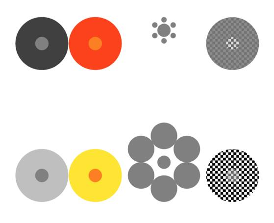

# On Illusions

**General principles:**

1. **Perception as inference.** You get some lower-order projection of higher-order reality, and make inferences about that reality:
   $$\begin{aligned}
      \text{perception}=& \text{a} + \text{b} \\
      \text{brightness}=& \text{lightness} + \text{illumination} \\
      \text{2D image}=& \text{3D object} + \text{orientation} \\
      \text{motion} =& \text{shape} + \text{deformation}
     \end{aligned}$$
     because you're inverting to a higher-order space, necessarily you must use priors.
2. **Illusions from unusual arrangements.** Illusions occur when you get a signal that is more common from one .
3. **Examples.**
      * **Contrast illusion from covariance of signal and noise.**
      * **Motion illusion from mapping local movements.**
5. **Collpase of uncertainty.** There are sometimes cases where you have broad posterior, or bimodal posteriors, over the percept. It feels like, in some sense,  there is *collapse*, i.e. you just see a single object -- but that's not quite right, familiar feeling that you're uncertain about exactly what you see or *hear*.

[to add: Something about folding & unfolding, 2D & 3D]

## In Prose

**Unfolding & Refolding.** Many illusions have the same basic pattern: we are shown a picture, and asked to judge "which square is darker" or "which square is larger" or "which square is tilted more," and we give the wrong answer. But our answer would've been the right answer to a different question: "which of these squares represents an *object* that is darker/larger/more tilted." We make the mistake because our brain is unfolding then refolding what we see. When we see a 2D image we instinctively make inferences about the 3D reality that it represents: how dark, how large, how tilted. Then when we are asked a question about the *picture* we answer with a description of the *object depicted*. Why would we make such a consistent mistake? It makes sense if our conscious brain only has access to the inference, and not to the original data. When asked about the picture we makes inferences from what we know about the object, knowledge which is itself inferred from the original picture. If you ask me which square is darker on the page, I'll make a guess based - in part - on which object seems darker in life. If you ask me what my dog can smell, I'll tell you my best guess based on the direction in which she's pulling.

---

[good image of illusions on facebook from latex:]




---

## Contrast Illusions

---

## Barberpole Type

A set of illusions have this common form: you play these three frames sequentially, and it looks like continuous rightward motion:

```
1. X--X--X--
2. -X--X--X-
3. --X--X--X
```


1. **Barber's pole.** The pattern is moving horizontally, but appears to be moving vertically. Stripes have the unique property that it's impossible to tell the true movement: all 360 degrees get compressed down into two types of motion, up and down. Must have some prior of vertical motion.
   * See also the *scrolling* illusion. 

2. **Shephard tones.** Series of chords that sound like they are continually increasing. They are a series of chords, with (i) each tone is shifted up slightly relative to prior one; (ii) gradually becomes louder then softer, so you don't hear entry & exit.

* Can think of this as points making circles through a 2D space (pitch & volume), & the perception of motion is more influenced by the points with higher volume.

3. **Illusory motion with an inverted in-between frame.** Has this form:

```
1. X--X--X--
2. -X--X--X-
3. X-XX-XX-X
```

Here the key is, perhaps, that you perceive rightward motion in 1->2, but in 2->3 and 3->1 you don't perceive any motion. So does frame 3 need to be the inverse, or does it work equally well with just a black frame?

4. **Intransitive dice.** (Perhaps a stretch)


**could we make new illusions using the same principle on other domains?**
  + **lightness:** animation that is constantly getting brighter: each pixel has sawtooth pattern of lightness. But you might see the sharp jumps where a pixel suddenly gets darker.
  + **hue.** Something is continuously turning green?

---
  
## Other Notes

* **Q: Applied to amodal completion?** (Kaniszawa triangle) / People say that magic tricks are 
   * Magic & amodal completion: e.g. you naturally assume that a semi-sphere is a sphere. https://www.ncbi.nlm.nih.gov/pmc/articles/PMC4129385/
   * good article @ https://journals.sagepub.com/doi/full/10.1177/1745691616654676


* **Physiologizing Illusions.**
   * Thinking that atmosphere caused the moon illusion.
   * 