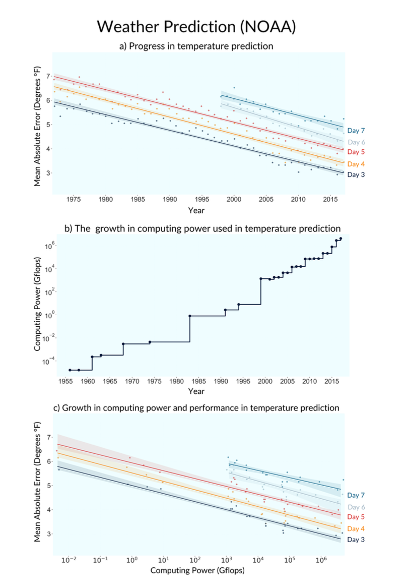
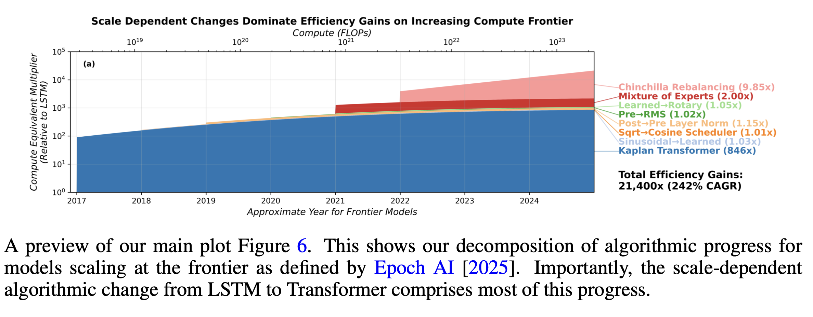
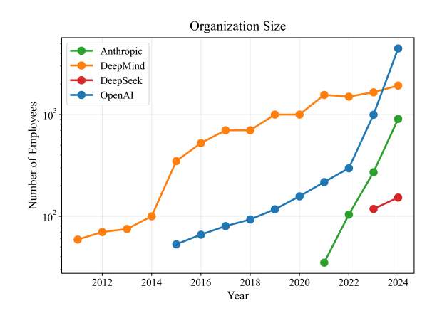

<!-- https://tecunningham.github.io/posts/2025-09-13-recursive-self-improvement-explosion-optimization.html -->

::: {.callout-important}
1. This is a draft report on what we know about RSI, it covers:
    - Basic introduction to the problem
    - Survey of data: training expenditure (3X/year); training efficiency (4X/year); R&D effort (2X/year).
    - A single canonical model, & then an overview of ~10 different models of RSI
2. TO DO:
    - Survey of evidence on speedup & autonomous optimization ability.
    - Crisper statement of the balance of evidence.
:::

#               Summary

Summary.
: 
    AI capabilities have grown very rapidly over the last decade, in large part due to R&D by researchers (we discuss other inputs such as data and compute below).
    $$\xymatrix@C=3em@R=1.4em{
        *++[F]{\text{R\&D}}\ar[r]|(0.4)r
        & *++[F]{\text{AI Capabilities}}
    }
    $$
    
    We are now beginning to see signs of feedback, where AI is sufficiently capable to accelerate progress in R&D:
    $$
    \xymatrix@C=3em@R=1.4em{
        *++[F]{\text{R\&D}}\ar[r]|(0.4)r 
        & *++[F]{\text{AI Capabilities}}\ar@{.>}@/_3em/[l]|{a} 
    }
    $$

    The two critical quantities are:

    - $r$: the effect of R&D on AI capabilities (an elasticity)
    - $a$: the effect of AI capabilities on R&D (an elasticity

    If $r$ and $a$ are sufficiently large ($r+a>1$) then the process will be explosive, such that a 1% increase in capabilities would cause a greater-than-1% increase in the next generation of capabilities.

In the pre-automation world we care about $a$.
: 
    The discussion of recursive self-improvement breaks down into two very distinct questions depending on whether we have already achieved AI research automation, i.e. agents that are at least as good as human researchers.^[@davidson2025howquickandbigwo calls this ASARA, "AI System for AI R&D Automation", @kokotajlo2025aifuturesmodel calls this SAR, "superhuman AI researcher".]

    In the pre-automation world we are most interested in the degree to which AI accelerates human researchers, the variable $a$ in the diagram above. We can distinguish between two effects on R&D, prior to full automation:[^ryan]
    
    1. **Uplift:** (AKA acceleration) agents are accelerating researcher productivity. As of April 2026 typical estimates are around 20%-100%.
    2. **Partial Automation:** agents are able to make autonomous contributions. As of April 2026 typical estimates are around 3 days to 1 month of a researcher's work.

In the post-automation world we care about $r$.
: 
    In the post-automation world the effective stock of R&D labor will suddenly expand, and so there will clearly be a rapid advance in AI capabilities, the question is how quickly that will explode.
    
    Formal models typically assume that $a=1$ (a conservative assumption), and then observe this will lead to explosive growth if and only if $r\geq1$.^[A justification of $a=1$ is, if we interpret AI capabilities as algorithmic efficiency, then a 1% increase in efficiency implies at least a 1% increase in effective R&D labor.]
    
    The critical questions for $r$ then become potential bottlenecks on R&D inputs:
    
    1. The historical rate of returns to research input. Many studies cited below have tried to estimate $r$ (or related terms), though there is little consensus.
    2. Bottlenecks due to the limited supply of inference compute for automated running researchers.
    3. Bottlenecks due to the limited supply of compute for running research experiments.
    4. Logical limits on research progress, e.g. statistical ceilings on algorithmic efficiency.


[^ryan]: Ryan Greenblatt in April 2026 [estimates](https://www.lesswrong.com/posts/WjaGAA4xCAXeFpyWm/my-picture-of-the-present-in-ai)  the speedup to engineering to be around 1.6x, and the autonomous capability to be around 5 hours ("the task duration at which AIs match a randomly selected AI company engineer (who is familiar with that part of the code base) is around 5 hours"). Note that a more robust statistic would be the number of hours.
    

#           Argument


AI capabilities are growing very rapidly.
: 
    There's no consensus on an appropriate scale for AI capabilities, however we see steady and rapid growth across many metrics: 

    - METR's time horizon has been doubling around every 7 months.
    - Algorithmic efficiency (effective compute) has been growing at around 9X/year, though there is some argument on how to measure this.
    - Average benchmark scores (ECI) have been growing steadily for 4 years.

    In time-horizon and benchmark scores, there are signs of an acceleration since late 2025.

Much of the growth in capabilities is due to R&D progress.
: 
    AI researchers have been making a very consistent series of discoveries, typically estimated at increasing compute efficiency by around 4X/year, with many qualifications, discussed below.

    The 4X/year increase in algorithmic efficiency seems to be coming from a roughly 2X/year growth in researchers.

We are seeing signs of AI accelerating R&D.
: 
    Until recently AI R&D was mostly done without significant help from AI, but we now see evidence for two channels:

    1. _Augmenting researchers:_ AI researchers self-report big efficiency gains, e.g. @anthropic2025claude_work self-report approximately 50% productivity gains, and @anthropic2026risk estimate 100% productivity gains.^["Productivity uplift estimates ranged from 30% to 700%, with a mean of 152% and median of 100%."]
    2. _Automating research:_ Autonomous systems are making contributions to frontier R&D, e.g. AlphaEvolve, TTT-Discover, autoresearch.

    Both of these effects are hard to measure, & we have a great deal of uncertainty.

Algorithmic progress is sensitive to research input.
: 
    Much of the literature on recursive self-improvement has estimated the effect of R&D inputs on algorithmic progress, with $r$ representing the elasticity between R&D and a measure of efficiency.

    $$
    \xymatrix@C=3em@R=1.4em{
        *++[F]{\text{R\&D}}\ar[r]|(0.4)r 
        & *++[F]{\text{AI Capabilities}}
    }
    $$

    | source                                   | $r=\lambda/\beta$ |
    | ---------------------------------------- | :---------------: |
    | @erdil2024estimating                     |      0.8-3.5      |
    | @ho2025explosionexperiments              |     0.96-1.89     |
    | @davidson2025howquickandbigwo            |        1.2        |
    | @davidson2026automatingairesearch ($r_s$) |         1         |


There are two basic mechanisms used in the literature.
: 
    **Multiplying robots.** Some papers assume that the effective R&D workforce will be directly proportional to a measure of AI algorithmic progress, e.g. algorithmic efficiency. This would be true in a simple model where we have invented a perfect substitute for a human R&D worker, and then further algorithmic progress allows us to multiply the number of automated R&D workers. This assumption makes the problem very tractable: we can estimate the relationship between R&D investment and algorithmic efficiency ($r$), then we should expect a self-sustaining growth cycle if and only if $r>1$.

    $$
    \xymatrix@C=3em@R=1.4em{
        *++[F]{\text{R\&D}}\ar[r]|(0.4)r 
        & *++[F]{\text{AI Capabilities}}\ar@{.>}@/_3em/[l]|1
    }
    $$

    This basic mechanism is used by @davidson2021could, @davidson2025howquickandbigwo, @ho2025explosionexperiments, @eth2025willairdautomati, @davidson2026automatingairesearch.


    **Automating tasks.** Instead we could assume that, as AI progresses, it can progressively replace labor with capital in certain tasks. Humans will still be required but they will be sped-up, in proportion to (i) the fraction of task automated, (ii) substitutability between tasks, and (iii) the cost of automated tasks. This is the model in @aghion2019artificial, @jones2025aird, @kwa2026simpleraitimelines. The difficulty is that the relationship between AI capabilities and the automation or uplift rate is very difficult to estimate, here represented as $f(a)$:

    $$
    \xymatrix@C=3em@R=1.4em{
        *++[F]{\text{R\&D}}\ar[r]|(0.4)r 
        & *++[F]{\text{AI Capabilities}}\ar@{.>}@/_3em/[l]|{f(a)}
    }
    $$

    **Models which do not fall into these buckets:** @kokotajlo2025aifuturesmodel, David Rein's model (see below), and  Tom and Manish's apple-picking model.


In this note we are focussing on near-term acceleration.
: 
    For this note we are focussing on whether the progress in AI capabilities will significantly accelerate over a short period, e.g. compressing 3 years into 1 year of progress, which would imply going from 4X/year to 64X/year compute efficiency.

    We thus leave aside questions of the *ceiling* on AI capability growth, e.g. discussed in @davidson2025howquickandbigwo, @cotra2020biologicalanchors.

    An implication of this constraint is also that if we achieve an AI research agent that is a perfect substitute for a human researcher (ASARA) then there will likely be an immediate jump in AI research, and would satisfy the criteria for acceleration. E.g. @davidson2025howquickandbigwo predict that when an ASARA is first possible, AI capabilities will jump by 8X. 


##           Important Qualifications

Training expenditure is likely to grow more slowly.
: 
    We can decompose frontier capabilities progress into two parts: (1) increased training expenditure; (2) progress in efficiency given training expenditure: algorithms, data collection, and other cost efficiencies in other parts of the AI stack.

    ```{tikz}
    #| fig-width: 6
    \begin{tikzpicture}[scale=6]
        \draw[step=0.1, gray, dotted] (0,0) grid (1,1);
        \draw (0,0) -- (1,0) node[midway,below] {ln(training expenditure)}
            -- (1,1) -- (0,1) -- (0,0) node[midway,above,rotate=90] {model intelligence};
        
        \draw[blue,->] (0.15,0.1)--(0.11,0.1);
        \draw[blue,->] (0.25,0.1)--(0.2,0.1);

        \draw[thick, blue, dotted] (0,0) plot[domain=0.2:1, samples=100] (\x, {0.75*(1-exp(-2*(\x-0.2)))}) node[anchor=north west]{2023 technology};
        \draw[thick, blue, dotted] (0,0) plot[domain=0.1:1, samples=100] (\x, {0.75*(1-exp(-2*(\x-0.1)))}) node[right]{2024 technology};
        \draw[thick, blue] (0,0) plot[domain=0:1, samples=100] (\x, {0.75*(1-exp(-2*\x))}) node[anchor=south west]{2025 technology};    

        \fill[black] (0.4,{0.75*(1-exp(-2*(0.4-0.2)))}) circle (0.01) node[anchor=north west, xshift=2pt, fill=white, draw=black, inner sep=2pt] {2023 model};
        \fill[black] (0.5,{0.75*(1-exp(-2*(0.5-0.1)))}) circle (0.01) node[anchor=north west, xshift=2pt, fill=white, draw=black, inner sep=2pt] {2024 model};
        \fill[black] (0.6,{0.75*(1-exp(-2*0.6))}) circle (0.01) node[anchor=north west, xshift=2pt,  fill=white, draw=black, inner sep=2pt] {2025 model};
    \end{tikzpicture}
    ```

    We estimate below that training expenditure is growing around 3X/year, and training efficiency at around 4X/year, for a net growth of 12X/year.


    Most people expect the growth rate of training expenditure will fall over the next few years, from 3X to around 1.2X.


AI R&D may be bottlenecked on experiment compute.
: 
    @erdil2025automatingrd argue that experimental compute could be important:

    > "AI is the [domain] that has seen both the fastest experimental compute scaling and the fastest rate of software progress, with both of them currently being around 3-4x per year. This coincidence suggests that using experimental compute to generate data is at least important for software progress, though we can’t tell on this basis alone to what extent it’s a complementary input to researcher effort.

    @whitfill2025bottlenecks estimate the relative contribution of experiment compute and R&D workers, but their findings are inconclusive.

    @leibowich2025couldadvancedaia, based on interviews with researchers, say:

    > "AI cognitive labor could probably extract significantly more research insights out of limited compute."

The contribution of AI R&D may be overstated.
: 
    @gundlach2025algorithmicprogressai argue that previous estimates have overstated algorithmic progress, they estimate a 1.5X growth per year instead of 2.5X (more details below).

    I find this estimate hard to reconcile with other estimates, which show ~2.5X growth even in small models. 

AI R&D may be bottlenecked on data.
: 
    It is possible that data is an important input to capability growth, which could cause us to overstate our estimate of algorithmic advances. Two relevant arguments:
    
    - Berren Millidge, ["Most Algorithmic Progress is Data Progress"](https://www.beren.io/2025-08-02-Most-Algorithmic-Progress-is-Data-Progress/), and he notes that data has been growing slower than compute.
    - @vonwerra2025jaggeddata argues that LLM capabilities are mostly determined by data coverage, and so implicitly growth is determined by the ability to collect more data.


#           Training Expenditure $\approx$ 3X/year

Best estimates.
: 
    1. Training compute *expenditure* has been growing around 3X/year, but expected to gradually fall to 1.1X/year over 2026-2030.
    2. Training compute (FLOP) has been growing around 4X/year, but will fall to around 1.5X/year.


| source                                | scope                                 | growth     | years             | quantity                   |
| ------------------------------------- | ------------------------------------- | ---------- | ----------------- | -------------------------- |
| @amodei2018aiandcompute               | largest AI training runs              | 10X        | 2012-2018         | training compute (FLOP)    |
| @epoch2025trainingcomputefrontier     | notable models                        | 4.1X       | 2010-May 2024     | training compute (FLOP)    |
| @epoch2025trainingcomputefrontier     | frontier models                       | 5.3X       | 2010-May 2024     | training compute (FLOP)    |
| @epoch2025trainingcomputefrontier     | recent frontier models                | 4.2X       | ~2018-May 2024    | training compute (FLOP)    |
| @epoch2025trainingcomputefrontier     | frontier language models              | 5.0X       | mid-2020-May 2024 | training compute (FLOP)    |
| @epoch2025trainingcomputefrontier     | notable language models               | 9.5X       | Jun 2017-May 2024 | training compute (FLOP)    |
| @epoch2026computetrendpost2010        | notable models                        | 4.4-4.7X   | 2010-2026         | training compute (FLOP)    |
| @EpochAIModels2025                    | notable models graph                  | ~4.6X      | 2020-Jul 2025     | training compute (FLOP)    |
| @EpochAITrends2026                    | frontier language models              | 5X         | 2020-             | training compute (FLOP)    |
| @EpochAITrends2026                    | installed NVIDIA compute stock        | 2.3X       | 2019-             | compute stock (FLOP/s)     |
|                                       |                                       |            |                   |                            |
| @efrati2025openaicomputingcostproblem | OpenAI training compute spend         | 2.3X->1.1X | 2025-2030         | training compute (\$)      |
| @EpochAITrends2026                    | frontier language model training cost | 3.5X       | 2020-             | training compute (\$)      |
| @epoch2025computescaling              | OpenAI compute spend / compute stock  | 2.2X       | 2024-2025         | compute spend / stock (\$) |
| @efrati2025openaicomputingcostproblem | OpenAI compute spend                  | 2.3X->1.1X | 2025-2030         | total compute (training+inference) (\$)   |


@amodei2018aiandcompute "AI and compute"
: 
    > "since 2012, the amount of compute used in the largest AI training runs has been increasing exponentially with a 3.4-month doubling time"

    > "The trend represents an increase by roughly a factor of 10 each year."


@EpochAITrends2026 "Trends in Artificial Intelligence"
: 
    As of March 2026, but they say "These trends appear set to continue through 2030."

    - Compute stock growth: 2.3X/year (2.2X-2.5X), "the total computing power of the stock of NVIDIA chips"
    - Training compute: 5X/year (4X-6X)
    - FLOP/s per dollar: 1.37X/year (1.30X-1.45X)
    - Algorithmic progress: 3X/year (2.8X-4.4X) ("pre-training compute efficiency")
    - Training cost: 3.5X/year (2.8X-4.4X)
    - LLM inference prices: 40X/year (10X-900X) "the cost to inference an LLM at a fixed level of performance has fallen rapidly, but unevenly across tasks"

@epoch2025computescaling "Compute scaling will slow down due to increasing lead times"
: 
    > "OpenAI currently likely has over $15 billion worth of compute, and this compute stock has been growing by around 2.2x each year. At that pace, current trends would predict a trillion dollar cluster around 2030 -- but longer lead times would delay this to around 2035."

    > "OpenAI’s compute spend in mid-2024 was around $6 billion, compared to roughly $13 billion mid-2025. This leads to a factor increase of around 2.2x

@efrati2025openaicomputingcostproblem "OpenAI’s $350 Billion Computing Cost Problem"
: 
    They have leaked data on OpenAI compute expenditure forecasts, as of late 2025:

    | Year | R&D Compute   | Inference Compute | R&D% | Revenue       |
    | ---- | ------------- | ----------------- | ---- | ------------- |
    | 2025 | ~$8B          | ~$6B              | 57%  | ~$12B         |
    | 2026 | ~$18B (+125%) | ~$14B (+133%)     | 56%  | ~$30B (+150%) |
    | 2027 | ~$32B (+78%)  | ~$20B (+43%)      | 62%  | ~$60B (+100%) |
    | 2028 | ~$40B (+25%)  | ~$28B (+40%)      | 59%  | ~$100B (+67%) |
    | 2029 | ~$45B (+13%)  | ~$35B (+25%)      | 56%  | ~$145B (+45%) |
    | 2030 | ~$50B (+11%)  | ~$50B (+43%)      | 50%  | ~$200B (+38%) |


@epoch2025trainingcomputefrontier "Training compute of frontier AI models grows by 4-5x per year"
: 
    > "compute growth in recent years is currently best described as increasing by a factor of 4-5x/year."

    More granular estimates from the same post:

    - notable models: 4.1x/year (90% CI: 3.7x to 4.6x) between 2010 and May 2024
    - frontier models: 5.3x/year (90% CI: 4.9x to 5.7x) between 2010 and May 2024
    - recent frontier models: 4.2x/year (90% CI: 3.6x to 4.9x) after ~2018
    - frontier language models: 5.0x/year (90% CI: 3.1x to 7.3x) after mid-2020
    - notable language models overall: 9.5x/year (90% CI: 7.4x to 12.2x) between June 2017 and May 2024

    > "recent frontier growth since 2018 is better described as a 4x/year trend."

    > "notable language models overall ... have grown as fast as 9x/year between June 2017 and May 2024."

@epoch2026computetrendpost2010 "The training compute of notable AI models has been doubling roughly every six months"
: 
    > "Since 2010, the training compute used to create AI models has been growing at a rate of 4.4x per year."

    Historical: 2010 onward. The same page's regression table gives `4.7x / year (4.3x to 5.2x)`, so the safest summary is probably "roughly 4.5x/year."

@whitfill2025forecastingaitimehorizon "Forecasting AI Time Horizon Under Compute Slowdowns"
: 
    They use OpenAI's own compute-spend forecasts up to 2030, as reported in journalism.

    The annualized growth rates I wrote above (`~2.5X/year` for 2026-2028, `~1.5X/year` for 2028-2030) are only rough chart reads from the figure, not direct textual claims in the paper.

@EpochAIModels2025 "Data on AI Models"
: 
    > "Our comprehensive database of over 3200 models tracks key factors driving machine learning progress."

    The interactive graph currently shows about 4.6x/year growth in FLOPs of notable models, over 2020 - July 2025 (the latest datapoint).


@you2025openaicomputespend "Most of OpenAI's 2024 compute went to experiments"
: 
    - $5B total research compute
    - $2B inference compute
    - only a minority of R&D compute appears to have gone to the final training runs of released models
    - GPT-4.5 final training run was only a modest share of the total R&D bucket


#           Training Efficiency $\approx$ 4X/year

Best estimates.
: 
    - Around 4X/year, including the entire stack (GPU, pretraining, posttraining, elicitation).

| source                                  | scope                                                     | progress     | years          | quantity                                                  |
| --------------------------------------- | --------------------------------------------------------- | ------------ | -------------- | --------------------------------------------------------- |
| @EpochAITrends2026                      | AI hardware price-performance                             | 1.37X        | 2012-2025      | FLOP/s per dollar                                         |
| @ho2024algorithmicprogresslm            | pre-training compute efficiency                           | 3X           | 2012-2023      | compute to reach a fixed performance threshold            |
| @whitfill2025forecastingaitimehorizon   | broad software progress implied by the time-horizon model | 3.5X         | 2019-2025      | effective software progress                               |
| @ho2026leastunderstooddriver            | broad all-in software progress                            | 10X (2X-50X) | recent LLM era | inclusive of training + post-training                     |
| @byrnes2026naturellmalgorithmicprogress | narrow core learning algorithm improvements               | 1.3X         | 2018-2026      | excludes data/setup-specific gains                        |
| @gundlach2025algorithmicprogressai      | small-scale algorithmic progress                          | 1.5X         | 2012-2023      | FLOPs required to achieve benchmark scores at small scale |
| @gundlach2025algorithmicprogressai      | frontier-scale algorithmic progress                       | 2.5X         | 2012-2023      | FLOPs required to achieve benchmark scores at large scale |
| @eth2025willairdautomati                | training efficiency                                       |              | 2X             |                                                           |
| @EpochAITrends2026                      | pre-training compute efficiency                           | 3X           | 2026-          | forward-looking pre-training compute efficiency           |
| @whitfill2026gpt2tweet                  | GPT-2 replication case study: fewer FLOPs                 | 1.72X        | 2019-2026      | FLOP efficiency in training GPT-2                         |
| @whitfill2026gpt2tweet                  | GPT-2 replication case study: fewer GPUs                  | 2.5X         | 2019-2026      | GPU required to train GPT-2                               |


@thompson2022importancecomputingpower "The Importance of (Exponentially More) Computing Power"
: 
    > "we assemble direct quantitative evidence of the impact that computing power has had on five domains: two computing bellwethers (Chess and Go), and three economically important applications (weather prediction, protein folding, and oil exploration). Computing power explains 49%-94% of the performance improvements in these domains."

    [Not a direct estimate for LLM training efficiency, but useful outside-view background for the broader compute-versus-algorithms debate.]

    

@ho2024algorithmicprogresslm "Algorithmic progress in language models": 3X/year
: 
    > "the compute required to reach a set performance threshold has halved approximately every 8 months, with a 95% confidence interval of around 5 to 14 months", i.e. about 2.8X/year.

@gundlach2025algorithmicprogressai "On the Origins of Algorithmic Progress in AI": 1.5X/year.
:   > "Our results indicate that algorithmic progress for small models has been far slower than previously assumed, and that measures of algorithmic efficiency are strongly reference-dependent."

    > "We find two strongly scale-dependent algorithmic innovations: LSTMs to Transformers, and Kaplan to Chinchilla re-balancing. Together, these account for 91% of total efficiency gains when extrapolating to the 2025 compute frontier."

    

    Estimates over 2012-2023:

    - 21,000X total (2.5X/year)
    - 100X at small scale (1.5X/year), i.e. if we hadn't scaled compute we'd only be increasing at 1.5X/year.

@eth2025willairdautomati
: 
    They survey the speed of algorithmic progress in a lot of domains, in summary they say for LLMs *"We believe it’s reasonable to ... conclude that both training efficiency and runtime efficiency have a ~6 month doubling time."*

@ho2026leastunderstooddriver "The least understood driver of AI progress": 10X/year.
: 
    > "So here's my best guess: after accounting for all training compute (including post-training), I think we're seeing software progress at around 10x per year, and my 80% credible interval would probably range from 2x to 50x per year."

@byrnes2026naturellmalgorithmicprogress "The nature of LLM algorithmic progress (v2)": 1.3X/year.
: 
    > "apart from [transformers] the field has produced probably <10x of training efficiency improvements in this category in the entire period from 2018 to today (approx. 30%/year)."

    He says he is deliberately restricting attention to core "learning algorithm" improvements, excluding data-related improvements and setup-specific optimizations.

@whitfill2026gpt2tweet "Post on GPT-2 to nanoGPT efficiency gains": 2.5X/year
:   
    He estimates GPT-2 efficiency improvement was 700X over 2019-2026. Important to note that this is all at relatively small scale, so I think it is best treated as a case study rather than an estimate for frontier models.

    - Current nanogpt SOTA is 707x faster (2.5X/year)
    - 15x faster FLOP per second (on fixed hardware) (1.5X/year)
    - 46x less FLOPs to reach the same val loss (1.7X/year)
    
    Also notable from nanoGPT (@kellerjordan2026moddednanogpt):

    - Wall clock time: 30X lower (May 2024 was 45 minutes; Feb 2026 was 1.5 minutes; 5 doublings over 21 months so doubling every 4 months).
    - Cost: 2500X lower (Karpathy says his 2024 nanoGPT costs ~$20 to train the model to get GPT-2 @karpathy2024llmcdiscussion, a 2019 blog post estimated GPT-2 training cost was $50K).


#           R&D Workers $\approx$ 2X/year

- [Epoch](https://epoch.ai/data/ai-companies) estimate growth rates of around 2X-3X/year in total staff for frontier labs over 2023-2025.


- @whitfill2025bottlenecks estimate headcount growth rates of 2-3X/year for Anthropic and OpenAI over 2022-2024:

    

- @ho2025explosionexperiments estimate the growth in AI-related publications, as a proxy for R&D effort. Their data is in [github](https://github.com/parkerwhitfill/epoch_RRD/blob/main/code/bayesian.ipynb).

#           Review of RSI Models

##          Canonical Model

Basic model.
: 
    Most of the models below are variations on this @jones1995rd formulation, where growth in algorithmic efficiency ($\frac{\dot{A}}{A}$) depends positively on research effort ($R$) and the existing level of efficiency ($A$):

    $$\begin{aligned}
        \utt{\frac{\dot{A_t}}{A_t}}{growth rate}{of efficiency}
            &= \utt{R_t^\gamma}{research}{effort} \times \utt{A_t^{-\beta}}{algorithmic}{efficiency}
    \end{aligned}$$

    With the following definitions:
    $$\begin{aligned}
        \gamma \geq 0 &&& \text{returns to research effort}\\
        \beta \geq 0 &&& \text{fishing-out of ideas} \\
    \end{aligned}$$

Observations.
: 
    **Growth will be self-sustaining if $\beta=0$.** A static level of $R$ can cause $A$ to grow at a constant rate if $\beta=0$. If $\beta>1$ then $A$ can only continue to grow if $R$ continues to grow.

    **Progress can be written as a function of cumulative R&D** We can also write the level of progress at time $t$ as a function of the *cumulative* research effort up to that point:
        $$A_t\propto \bar{R}_t^{1/\beta},\ \bar{R}=\int_0^t R_s^\gamma ds.$$
    if $\beta=1$ then $A_t\propto \bar{R}_t$.

    **If $r<1$.** If we assume that both $A$ and $R$ are growing at constant rates, then we can show:
        $$\frac{\dot{A}}{A} = \frac{\gamma}{\beta} \frac{\dot{R}}{R}.$$
    
    

    **If we can automate research, there will be explosion if $r>1$.** Suppose we can automate researcher input, then for a fixed level of capital we can write:
        $$R_t\propto A_t.$$
    as a consequence we have:
        $$\frac{\dot{A}}{A} \propto A_t^{\gamma-\beta}.$$
    
    Thus we will get explosive growth if and only if $\gamma>\beta$, or equivalently if $r\equiv\frac{\gamma}{\beta}>1$. Note that this .


##          Summary of Models


| Model                                                                                                            | Summary                                                                                                                                                                               |
| ---------------------------------------------------------------------------------------------------------------- | ------------------------------------------------------------------------------------------------------------------------------------------------------------------------------------- |
| @jones1995rd "R&D-Based Models of Economic Growth."                                                              | Standard endogenous growth model: (1) diminishing returns to R&D effort; (2) positive spillovers from knowledge.                                                                      |
| @aghion2019artificial "Artificial Intelligence and Economic Growth"                                              | They model gradual automation of research tasks; in the limit, AI replaces people in idea production.                                                                                 |
| @davidson2021could "Could Advanced AI Drive Explosive Economic Growth"                                           | An AI robot perfectly substitutes for a worker, & then they model the quantity increase of AI workers.                                                                                |
| @ho2025explosionexperiments "The software intelligence explosion debate needs experiments"                                                                                     | effective R&D is proportional to algorithmic efficiency (i.e. assumes multiplying robots)                                                                                             |
| @kokotajlo2025aifuturesmodel "AI Futures Model: Dec 2025 Update"                                                 | Stagewise automation of AI R&D: coding first, then research taste / direction-setting; eventual full automation at SAR.                                                               |
| @eth2025willairdautomati "Will AI R&D Automation Cause a Software Intelligence Explosion?"                       | An AI robot (ASARA) perfectly substitutes for a researcher, then model the quantity increase of AI workers.                                                                           |
| @erdil2025gate "GATE: An Integrated Assessment Model for AI Automation"                                          | They model both which tasks AI can do, and the quantity of digital workers.                                                                                                           |
| @jones2025aird "Artificial Intelligence in Research and Development"                                             | AI progress causes both (1) a larger share of tasks to be automated; (2) cost to drop for already-automated tasks.                                                                    |
| @davidson2026automatingairesearch "When Does Automating AI Research Produce Explosive Growth?"                   | AI progress automates some fraction of tasks, multiplying the value of human labor; they also model multiple sectors with spillovers. Task automation is *exogenous* in this model.   |
| @kwa2026simpleraitimelines "Research Note: A Simpler AI Timelines Model Predicts 99% AI r&d Automation in ~2032" | A simplification of @kokotajlo2025aifuturesmodel, AI automates a fraction $f$ of R&D tasks asymptotically approaching 1, assumes zero substitutability so speedup is $\frac{1}{1-f}$. |


##              @jones1995rd "R&D-Based Models of Economic Growth"

I'll use the notation from @jones2022semiendogenous:
$$\begin{aligned}
    Y_t &= A_t^\sigma L_{yt} 
        && \text{(final good)} \\
    \frac{\dot{A_t}}{A_t} &= R_t^\lambda A_t^{-\beta}
        && \text{(ideas)} \\
    R_t+L_{yt} &= L_t
        && \text{(resource constraint)} \\
    L_t &= L_0 e^{nt}
        && \text{(population growth)} \\
    R_t &= \bar{s}L_t
        && \text{(allocation)}
\end{aligned}
$$

Balanced-growth implications:
$$\begin{aligned}
    g_A &= \frac{\lambda}{\beta}n \\
    g_y &= \sigma g_A = \frac{\lambda\sigma}{\beta}n = \gamma n
\end{aligned}
$$

Parameters:

|                                                         |                                                                                                                                                                           |
| :-----------------------------------------------------: | ------------------------------------------------------------------------------------------------------------------------------------------------------------------------- |
|                    $\beta \approx 3$                    | how fast proportional improvements are getting harder to find. Jones writes that aggregate data are roughly consistent with $\beta \approx 3$ if $\lambda = 1$.           |
|                   $\lambda \approx 1$                   | elasticity of idea production with respect to research effort. $\lambda = 1$ means no duplication effect; $\lambda < 1$ allows duplication/congestion.                    |
|                      $\sigma > 0$                       | how strongly nonrival ideas raise final output; this is the degree of increasing returns in goods production. He doesn't separately calibrate.                            |
| $\gamma \equiv \frac{\lambda\sigma}{\beta} \approx 1/3$ | the overall degree of increasing returns in this simple semi-endogenous setup. Jones says $\gamma = 1/3$ is consistent with data when research intensity has been rising. |

**Visually:**

1. Basic model with research effort but no knowledge term. If $R$ is constant, then $\dot{A}$ is constant, so $A$ rises linearly and the growth rate $g_A = \dot{A}/A$ declines toward zero:
    $$\begin{gathered}
    \dot{A}=R^\lambda\\
    \xymatrix{*++[F]{R\&D} \ar[r]|(0.4)\lambda & *++[F]{\Delta knowledge}\ar[r] & *++[F]{knowledge}}
    \end{gathered}
    $$

2. Add the knowledge term:
    $$\begin{gathered}
    \dot{A}=R^\lambda A^{1-\beta}\\
    \xymatrix{*++[F]{R\&D} \ar[r]|(0.4)\lambda & *++[F]{\Delta knowledge}\ar[r] & *++[F]{knowledge}\ar@/^2em/[l]|{1-\beta}}
    \end{gathered}
    $$

    Then $g_A = \frac{\dot{A}}{A} = R^\lambda A^{-\beta}.$

    So if $R$ is constant, $g_A$ declines as $A$ rises.^[@jones1995rd introduced diminishing returns to knowledge, whereas Romer (1990) had assumed no diminishing returns to knowledge, $\beta=0$.] If $R$ grows at rate $g_R$ along a balanced growth path, then $g_A = \frac{\lambda}{\beta}g_R.$

3. Recursive self-improvement, where knowledge directly raises research input:
    $$\begin{gathered}
    R=A^\kappa\\
    \dot{A}=(A^\kappa)^\lambda A^{1-\beta}=A^{\lambda\kappa+1-\beta}\\
    \xymatrix{*++[F]{R\&D} \ar[r]|(0.4)\lambda & *++[F]{\Delta knowledge}\ar[r] & *++[F]{knowledge}\ar@/^2em/[l]|{1-\beta}\ar@/^4em/[ll]|\kappa}
    \end{gathered}
    $$

    This yields:

    - if $\lambda\kappa < \beta$, growth slows over time;
    - if $\lambda\kappa = \beta$, you get constant exponential growth;
    - if $\lambda\kappa > \beta$, the model implies a finite-time singularity.


##              @aghion2019artificial "Artificial Intelligence and Economic Growth"

Setup:

$$\begin{aligned}
         Y_t &= A_t^{\sigma} K_t^{\alpha} L^{1-\alpha} \\
         \dot A_t &= K_t^{\beta} S^{\lambda} A_t^{\phi}
      \end{aligned}
$$

Implications / thresholds:

- In this notation, $\alpha$ is the capital exponent in goods production and $\beta$ is the capital exponent in idea production; the "ideas getting harder to find" term is $\phi < 1$, not Jones's $\beta>0$.
- In the paper's task-automation framing, more automation raises the role of capital in both sectors, which can raise the long-run growth rate by making research effort more accumulable.
- The paper distinguishes Type I growth explosions, where growth rates rise without bound but remain finite at each date, from Type II explosions, where output becomes infinite in finite time.
- Type I condition in their examples: full automation of goods production. Once all goods tasks are automated, the goods sector becomes an AK-style economy, $Y_t = A_tK_t$, and with ongoing technological progress the growth rate $g_Y = g + sA_t$ rises without bound.
- Type II condition in their Example 2: full automation of ideas production. In their one-dimensional analogue this becomes $\dot{A}_t = A_t^{1+\phi}$, so explosive growth requires $\phi>0$.
- Type II can also arise without full automation in their Cobb-Douglas Example 3, where a key "constant returns to accumulable factors" parameter exceeds one.

|           |                                                                                                                                |
| --------- | ------------------------------------------------------------------------------------------------------------------------------ |
| $\alpha$  | capital exponent in goods production.                                                                                          |
| $\beta$   | capital exponent in idea production.                                                                                           |
| $\lambda$ | elasticity of idea production with respect to research labor.                                                                  |
| $\phi$    | standing-on-shoulders term in the paper's notation, with Jones-style harder-to-find parameter $\beta_{\text{Jones}} = 1-\phi$. |
| $\sigma$  | role of nonrival ideas in final output.                                                                                        |
|           |                                                                                                                                |

##              @davidson2021could "Could Advanced AI Drive Explosive Economic Growth."

He estimates $\phi$ for a few different areas:

| Domain               | $\phi$ | $\beta (=1-\phi)$ |
| -------------------- | ------ | ----------------- |
| Aggregate innovation | -2.1   | 3.1               |
| Hardware             | 0.8    | 0.2               |
| ML software          | 0.85   | 0.15              |


##              @erdil2024explosive "Explosive growth from AI automation: A review of the arguments"

> "Bloom et al. 2020, which provides us perhaps with the best estimates of the extent to which ideas get “harder to find", estimates that $\lambda/\phi \approx 0.32$ for total factor productivity in the US economy. Based on this, we find that hyperbolic growth occurs with values of $\beta$ as low as $1 - 0.32 = 0.68$. Hence, hyperbolic growth with AI is predicted by R&D-based growth models even if we do not strictly accept the conclusion of the replication argument that $\beta = 1$. This point, that avoiding increasing returns to scale is difficult to avoid even when ideas get “harder to find" over time, has been noted elsewhere, notably by Davidson 2021. Indeed, this outcome is consistent with fairly conservative assumption on there being decreasing returns on inputs to final goods production."

##              @erdil2024estimating "Estimating Idea Production: A Methodological Survey"

$$\begin{aligned}
    \frac{\dot{A}}{A} &= \theta A^{-\beta}I^\lambda \\
    I &= \text{inputs to R\&D}\\
    \beta &= \text{increasing vs diminishing returns on finding new ideas}\\
    \lambda &= \text{the returns to scale on research effort at any given instant}\\
    r = \lambda/\beta &= \text{the returns to research effort}
\end{aligned}$$

In steady-state equilibrium, $r$ will be the ratio of the growth-rate of $A$ and the growth of inputs, $I$. They discuss in detail a variety of methods of estimating $r$.

Broad empirical conclusion: the case studies don't pin down $r$, it could be above or below 1. They say $r$ is of interest because it's the critical condition for hyperbolic growth, with RSI.


| domain                          | doubling time | median $r=\lambda/\beta$ | $\beta$                | $\lambda$               |
| ------------------------------- | ------------- | ------------------------ | ---------------------- | ----------------------- |
| TFP (table 3)                   |               | 0.245                    | 5.42                   | 1.33                    |
| Stockfish                       |               | 0.83                     |                        |                         |
| Computer vision, 2012-2022      | 9 months      | 1.44 (0.8-2.4)           | 0.985 (0.224 to 4.050) | 1.410 (0.290 to 6.021)  |
| RL sample efficiency, 2015-2019 | 11 months     | 1.58  (0.46-3.7)         | 1.023 (0.212 to 3.914) | 1.482 (0.266 to 6.650)  |
| SAT solvers, 1997-2018          | 2 years       | 3.54 (1.28-6.90)         | 0.648 (0.139 to 2.891) | 2.143 (0.387 to 11.312) |
| Linear programming, 1998-2018   | 6 years       | 1.08  (0.25-3.1)         | 1.290 (0.254 to 4.953) | 1.259 (0.222 to 5.772)  |


##              @ho2025explosionexperiments "The software intelligence explosion debate needs experiments"

Equations:

$$\begin{aligned}
    \dot{A} &= A^{1-\beta}F(L,K)^\lambda
        && \text{(algorithmic progress depends on prior progress and R\&D)}\\
    F(L,K) &\propto cA 
        && \text{(R\&D is proportional to algorithmic progress)}
\end{aligned}
$$

Implications:

$$\dot{A} \propto A^{\lambda+1-\beta}.$$

- Let $r\equiv\frac{\lambda}{\beta}$, then you get super-exponential growth if $r>1$.
- In their domain-level estimates, the NLP / language-model proxy is the strongest case for $r>1$, but the uncertainty intervals are still very wide.
- In their OpenAI 2022-2025 back-of-the-envelope exercise, the central estimate is $r \approx 0.96$, and under a Cobb-Douglas bottleneck story the relevant object becomes $(1-\epsilon_K)\lambda/\beta$, which pushes the effective value further below $1$.
- The proxies for software quality are based on measures of training compute efficiency. They note that if $A$ is inference compute efficiency, the augmentation equation holds exactly; if $A$ is training compute efficiency, it requires an additional linearity assumption connecting training efficiency to effective researchers.

|                                   | $\beta$          | $r=\lambda/\beta$ |
| --------------------------------- | ---------------- | ----------------- |
| computer vision                   | 1.302 (0.27-5.6) | 1.26              |
| reinforcement learning            | 1.30 (0.24-1.58) | 1.20              |
| natural language processing proxy | 1.39 (0.32-1.15) | 1.89              |
| OpenAI 2022-2025 back-of-envelope | (not identified) | $\simeq 0.96$     |


|              |                                                                                                             |
| ------------ | ----------------------------------------------------------------------------------------------------------- |
| $\beta$      | the ideas-get-harder-to-find parameter for AI software.                                                     |
| $\lambda$    | the elasticity of progress with respect to effective research input.                                        |
| $\epsilon_K$ | the elasticity of research input with respect to experiment compute in the Cobb-Douglas bottleneck variant. |


##              @erdil2025automatingrd "Most AI value will come from broad automation, not from R&D"

They give arguments for why AI R&D will be bottlenecked by experiment compute:

> "By default, a software-only or software-biased singularity should be treated as an unlikely outcome rather than a likely one."

> "If the two inputs are indeed complementary, any software-driven acceleration could only last until we become bottlenecked on compute and end up having to do the physical work of obtaining more GPUs in order to run more experiments."

> "Just as one example, Oberfield and Raval (2014) estimate that the elasticity of substitution between labor and capital in the US manufacturing sector is 0.7, and this is already strong enough for any “software-only singularity” to fizzle out after less than an order of magnitude of improvement in efficiency."

##              @eth2025willairdautomati "Will AI R&D Automation Cause a Software Intelligence Explosion?"

- They don't give a formal model, but argue that critical threshold is $r>1$. I think basically the same model as in @davidson2025howquickandbigwo.
- The analysis is based around developing an autonomous researcher (AI System for AI R&D Automation, ASARA).
- Once an autonomous system is created then any future progress will multiply the efficiency of those researchers, thus we only need to estimate $r$, the effect of R&D on efficiency ("r gives the number of times software doubles for each time the cumulative work on software R&D doubles ... There are a few reasons to think that r is currently above 1")
- Estimates:
    - Doubling time for inference-efficiency is around 6 months.
    - r>1 ("There are a few reasons to think that r is currently above 1"):

| domain                    | estimated r |
| ------------------------- | :---------: |
| image recognition         |     1.4     |
| computer chess            |     0.8     |
| RL training data effiency |     1.6     |
| SAT solvers               |     3.5     |
| Linear programming        |     1.1     |
| Algorithms in general     |     ~4?     |

##              @davidson2025howquickandbigwo "How Quick and Big Would a Software Intelligence Explosion Be?"

They base their analysis around an autonomous researcher (ASARA), and progress translates into the quantity of researchers we can deploy for a given cost.

They predict an initial speed-up when ASARA is first deployed ("Compared to progress in 2020-2024, software progress will be faster by a factor of 2 - 32, with a median of 8"):

> "averaged over one year, AI progress could easily be >3X faster, could potentially be >10X faster, but won’t be 30X faster absent a major paradigm shift."

$$
\begin{aligned}
    \dot S(L, C)    &= a [R(L, C)]^\lambda S^{1-\beta} && \text{(Software L.O.M.)} \\
    R(L, C)         &= (bL)^\alpha (cC)^{1-\alpha} && \text{(Research Input)} \\
    L               &= dS && \text{(Cognitive Labour)}
\end{aligned}
$$

Parameters:

|                                                 |                                                                                                                                                              |
| :---------------------------------------------: | ------------------------------------------------------------------------------------------------------------------------------------------------------------ |
|                       $S$                       | is the level of AI software.                                                                                                                                 |
|                       $L$                       | is the cognitive labour used for improving software.                                                                                                         |
|                       $C$                       | is compute for experiments, assumed to be constant.                                                                                                          |
|              $\lambda \approx 0.6$              | captures "stepping on toes," whereby there are diminishing returns to applying more research effort in parallel ("nine women can't make a baby in a month"). |
|              $\beta \approx 0.25$               | captures the idea that software improvements get harder to find as software improves.                                                                        |
|              $\alpha \approx 0.5$               | captures the diminishing returns of cognitive labour in improving software.                                                                                  |
| $r\equiv\frac{\lambda\alpha}{\beta}\approx$ 1.2 | "We estimate 0.4 < r < 3.6, with a median of r=1.2"                                                                                                          |


##              @kokotajlo2025aifuturesmodel "AI Futures Model: Dec 2025 Update"

> "Davidson and Houlden focuses primarily on trends of how much more  efficiently AIs have been able to achieve the same performance when  determining whether there will be an SIE. Meanwhile, we focus on  estimates of the quality of AIs’ research taste, i.e. how good the AI  is at choosing research directions, selecting and interpreting  experiments, etc. We think that focusing on research taste quality is  a more useful lens from which to view a potential SIE. If there’s an SIE we expect that it will primarily be driven by improvements in  research taste."

Superhuman AI Researcher = "An AI system that can do the job of the best human AI researcher but 30x faster and with 30x more agents, as defined above in the superhuman coder milestone. It must have enough diversity of expertise to on average do the same for other top researchers with complementary skills."


##              @jones2025aird "Artificial Intelligence in Research and Development."

Jones assumes that R&D requires a set of tasks, with elasticity of substitution $\theta$, and that a progressively larger set of tasks is automated by AI. He then says AI's contribution to AI research will depend on three things:

1. The share of research tasks AI performs ($\gamma$)
2. The productivity of AI at those tasks ($M$)
3. The strength of bottlenecks ($\theta$)

Idea growth:

$$\dot Z = 
    \zeta Z^\phi\Big[\gamma (Mx)^\theta + (1-\gamma)(H\ell)^\theta \Big]^{1/\theta},\qquad \theta<0
$$

subject to a fixed R&D budget

   $$\mu x + w\ell = D.$$


|       Symbol       | Meaning                                                                                                                               |
| :----------------: | ------------------------------------------------------------------------------------------------------------------------------------- |
|        $Z$         | the stock of ideas.                                                                                                                   |
| $\gamma \in [0,1]$ | share of research tasks AI can do.                                                                                                    |
|     $1-\gamma$     | share still done by humans.                                                                                                           |
|        $M$         | AI productivity on the tasks it can do.                                                                                               |
|        $H$         | human productivity on the tasks humans do.                                                                                            |
|        $x$         | spending on AI / compute / machines.                                                                                                  |
|       $\ell$       | spending on human research labor.                                                                                                     |
|       $\mu$        | price of AI / compute / machines.                                                                                                     |
|        $w$         | wage of researchers.                                                                                                                  |
|        $D$         | total R&D budget.                                                                                                                     |
|    $\theta < 0$    | bottlenecks / complementarity across tasks. |


##              @davidson2026automatingairesearch "When Does Automating Research Produce Explosive Growth?"

Their setup:

1. **AI progress depends on labor and capital.** They assume Cobb-Douglas.
2. **AI progress increases capital productivity.** They assume a 1% increase in AI capabilities implies 1% higher in productivity for computers (on tasks that are already automated).
3. **Automation increases the capital share:** As a consequence the share of tasks automated ($f$) enters into the threshold for recursive self-improvement.
4. **Spillovers:** If there are spillovers in innovation between sectors, this will bring the explosive growth threshold closer (they include software, hardware, & the general economy).

Derived critical condition for explosive growth with automation:

$$
    \utt{f_Y}{share output}{tasks automated} + 
    \utt{f_S}{share software}{tasks automated}\frac{1}{\beta_S} + 
    \utt{f_H}{share hardware}{tasks automated}\frac{1}{\beta_H} + 
    \utt{f_A}{share innovation}{tasks automated}\frac{1}{\alpha}\frac{1}{\beta_A}
    >1
$$


Parameters:

|                       |                                                                                                           |
| --------------------- | --------------------------------------------------------------------------------------------------------- |
| $\beta_S \approx 1$   | software ideas-get-harder-to-find parameter, citing @ho2025explosionexperiments and @erdil2024estimating. |
| $\beta_H \approx 0.2$ | hardware ideas-get-harder-to-find parameter.                                                              |
| $\beta_A \approx 3.1$ | aggregate innovation ideas-get-harder-to-find parameter.                                                  |
| $\alpha \approx 0.6$              | labor share in production.                                                                              |
| $\lambda$             | stepping-on-toes / parallelization parameter.                                                             |
| $r_S\approx 1$        |                                                                                                           |
| $r_H\approx 5$        |                                                                                                           |
| $r_A\approx 0.32$     |                                                                                                           |


##              @kwa2026simpleraitimelines "Research Note: A Simpler AI Timelines Model Predicts 99% AI R&D Automation in ~2032."

Model:

$$
\begin{aligned}
   S'(t) &= R(t) S^{1 - \beta} = \left(\frac L {1-f}\right)^\alpha C^\zeta S^{1 - \beta}
    && \text{(accumulation of software ideas)}\\
   f(t) &= \sigma(v(\log C(t)S(t) - \log E_{hac})) 
    && \text{(automation of tasks)}
\end{aligned}
$$

Automating a fraction $f$ of R&D tasks multiplies effective R&D labor by $1/(1-f)$ (i.e. tasks are perfect complements). 

$$\begin{aligned}
   \dot{S}  &= L^\alpha C^\gamma S^{1-\beta} \\
\end{aligned}
$$

Parameters:

|                   |                                                                        |
| ----------------- | ---------------------------------------------------------------------- |
| $\beta\in [0.3,1]$ | software-difficulty exponent. |
| $\alpha$ | not pinned down separately; together with $\zeta$, Kwa uses $\alpha/(\alpha+\zeta)\in [0.12,0.35]$ and $\alpha+\zeta\in [0.8,1]$, implying roughly $\alpha\in [0.10,0.35]$. |
| $\zeta$ | not pinned down separately; implied by the same calibration above, roughly $\zeta\in [0.52,0.88]$. |
| $f(t)$ | fraction of R&D tasks automated; Kwa sets current $f$ in Jan 2026 to lie in $[0.25,0.5]$. |
| $v$ | automation velocity; Kwa uses $1/v\in [1.5,4.2]$, so $v\in [0.24,0.67]$. |
| $E_{hac}$ | effective compute level of the half-automated coder; not directly estimated here, but defined as the point where automation reaches 50\%. |

Relevant notes on interpretation / sources:

> "$E_{hac}$ is the effective compute level of the half-automated coder"

> "v is the automation velocity: S must increase by factor of e^(1/v) to get from 50% to 73% automation"

> "alpha/(alpha + zeta) is between 0.12 and 0.35 ... This range is based on Yafah's (Epoch) recommendation to calibrate from lab spending ratios of labor vs capital."


```{mermaid}
flowchart LR
    subgraph Inputs["Inputs"]
        L["Labor<br/>(growing 2×)"]
        C["Compute<br/>(growing 3×)"]
    end
    
    subgraph RnD["AI R&D"]
        E["Efficiency<br/>(growing 5×)"]
    end
    
    subgraph Capabilities["Capabilities"]
        EC["Effective<br/>Compute"]
        TH["Time Horizon"]
    end
    
    subgraph Feedback["Feedback Loop"]
        A["Automation"]
    end
    
    L -->|"α = 0.25"| E
    C -->|"ζ = 0.6"| E
    E -->|"β = 0.5<br/>(self-improving)"| E
    C --> EC
    E --> EC
    EC --> TH
    TH -->|"ν = 1/3"| A
    A -->|"augments"| L
```


##              @jones2026pastautomation "Past Automation and Future A.I.: How Weak Links Tame the Growth Explosion"

Model
: 
    As with @jones2025aird, there is endogenous allocation of capital vs labor across tasks.

    $$
        \begin{aligned}
        \text{CES task model} \quad & Y_t \text{ and } \Omega_{kt} \\
        \text{Idea Production Function} \quad & \dot Q_t = \bar q R_t^{\lambda} Q_t^{\phi} \\
        \text{Resource constraint} \quad & C_t + I_t + R_t = Y_t \\
        \text{Ideas} \Rightarrow \psi_{kit} \quad & \psi_{kit} = Q_t^{\theta_k} f(i) \\
        \text{Ideas} \Rightarrow \psi_{\ell it} \quad & \psi_{\ell it} = Q_t^{\theta_\ell} \quad (\text{homogeneous}) \\
        \text{Heterogeneity} \quad & f(i)=\dfrac{(1-i)^\mu}{1+\mu_0(1-i)^\mu}+\bar f \\
        \text{Capital accumulation} \quad & \dot K_t = I_t - \delta K_t \\
        \text{Population growth} \quad & L_t = L_0 e^{nt} \\
        \text{Allocations} \quad & R_t = \bar \iota_R Y_t \quad \text{and} \quad I_t = \bar \iota_K Y_t
        \end{aligned}
    $$

Notes
: 
    - Ideas are producing using units of the final good, so a single automation process incorporates the automation of tasks for producing both goods and ideas.
    - Assume a functional form on comparative advantage between capital and labor, with $\bar{f}$ maximum.
    - Tasks below $\beta_t$ use capital, tasks above $\beta_t$ use labor.


##              David Rein (2025) "Modeling an Intelligence Explosion"

The core idea: idea production depends on quality ([source](https://docs.google.com/document/d/16Ugl7g3GL1Ao9-3UluRENp6e9UeEMAqhh5jgXDi3kjo/edit?tab=t.a5tu3xadb63o#heading=h.ribcf6q6wbps)):

$$\begin{aligned}
    dA &= Q^q A^{1-\beta}
         && \text{(idea production depends on quality of cognitive labor)}\\
    Q &= cA
        && \text{(quality depends on ideas)}
\end{aligned}
$$

Parameters:

|         |                                                                                                                               |
| ------- | ----------------------------------------------------------------------------------------------------------------------------- |
| $Q$     | quality of cognitive labour, measured in units of time horizon; this is our AI researcher (e.g. Opus 4.5, GPT-5.2, Gemini 3). |
| $A$     | current level of algorithms, also measured in units of time horizon (e.g. GPT-2, GPT-3, Pythia, etc.).                        |
| $q$     | elasticity of idea production with respect to cognitive-labor quality.                                                        |
| $\beta$ | ideas-get-harder-to-find parameter.                                                                                           |

Implications / thresholds:

- The explosion condition is $q > \beta$.


