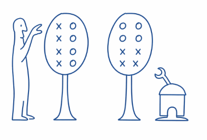

<style>
   h1 {  border-bottom: 4px solid black; }
   h2 {  border-bottom: 1px solid gray; padding-bottom: 0px; color: black; }
   dl {display: grid;}
   dt {grid-column-start: 1; width: 6cm;}
   dd {grid-column-start: 2; margin-left: 2em;}
</style>

<!-- https://tecunningham.github.io/posts/2026-03-13-apple-picking-ai.html -->

::: {.column-margin}
   Thanks to Nate Rush, Manish Shetty, Basil Halperin, & Parker Whitfill for helpful comments.
:::


A simple model for AI R&D.
: 
    In short: an agent helping you with optimizing an algorithm is like a robot helping you pick apples. It will take care of all the apples up to a certain height, and find apples you haven't found, but there will still be apples out of its reach.

    

    The specific motivation was to help think through the implications of recent evidence that AI can push forward the frontier on various optimization and AI R&D problems. If you can pay $10 to increase the efficiency of an algorithm by 1% then, on its surface, this look like the path to self-improvement, and you can replace humans with AI agents. But realistically the agents have been discovering *shalow* improvements to algorithms, and the apple-picking model tries to distinguish between shallow and deep improvements.

Implications of the apple-picking model.
: 
    1. Agents can autonomously advance the state-of-the-art on an optimization problem, yet still not be a perfect substitute for human labor (they can find the low apples that haven't been picked yet).
    2. Agent contribution to a problem, as you scale the expenditure, will be higher than human contribution, but then asymptote to a lower maximum value (they'll pick a lot of apples, but will never be able to pick them all).
    3. Agents will have relatively bigger value, relative to humans,  for problems that are not yet heavily optimized (robots are useful for trees that have never been picked).
    4. Agents will asymptote to higher points if they are given better human starting points (if a tree is partly picked).
    5. To gauge the ability of agents we want to test not just for their ability to improve performance, but their *reach* (we want to benchmark robots not on how many apples they can pick, but the height of the highest apple they can reach).


Relation to other literature. 
: 
    Most existing models of AI R&D assume that AI accelerates or multiples human researchers, e.g. by automating some of their tasks. I believe this is roughly true for @aghion2019artificial, @davidson2021could, @erdil2025gate, @davidson2026automatingairesearch, @jones2025aird, @kwa2026simpleraitimelines. These models then calibrate the effect through (1) how much does AI accelerate R&D workers; (2) how much do R&D workers contribute to our stock of knowledge. But this is hard to reconcile with evidence that AI is already autonomously speeding-up AI research. A critical distinction is that these models all summarize the level of productivity with a scalar. This means that a 1% improvement in efficiency is equal, there is no distinction between a shallow and deep speedup.

    There are two models I'm aware of that allow autonomous AI actions, but distinguish the quality of those actions.

    1. @kokotajlo2025aifuturesmodel model AI and human "research taste", though I don't have a clear idea exactly how taste is aggregated within a lab. 
    2. @ide2024artificialintelligenceknowledgeeconomy model AI with different levels of human ability.

Other notes / things to add.
: 
    *Relation to time horizon.* You can think of the high apples as long-time-horizon tasks.

    *Landscape.* A more general version would model the entire *landscape*. You can represent an optimization problem as $y=f(\bm{x})$, where you're trying to choose an $\bm{x}$ to maximize $y$, given some unknown $f(\cdot)$. (talk about non-additivity of optimizations; talk about conditions under which landscape is separable, and so each subspace is an independent apple).

    *Path dependence.*

    *Shape of the tree.* (examples of trees with naturally more low-hanging fruit; examples of trees that are now pretty bare low-down).

    *Other bottlenecks.* -- e.g. compute bottlenecks, experiment bottlenecks.

    *Existing models of AI R&D.*

    *Implications for AI R&D.*

    - LLMs are suddenly able to optimize algorithms pretty well --- maybe  recursive-self-improvement has just kicked off. But the critical question is whether the fruit that it's picking are low-hanging. If all the optimizations are routine, then it'll run out pretty quickly.

    - LLM training is a big stack of algorithms, which we've been optimizing at perhaps 10X/year. [add some speculation about which parts of the stack have low-hanging fruit]


#               Basic Model

Setup.
:   There are a continuum of apples spready uniformly on the real line.
    
    A human can find apples over $[0,1]$, but agent can only find apples over $[0,\lambda]$, with $\lambda<1$ (at least for now).
    
    Humans find apples at rate $r_H$, agents find apples at rate $r_A$, and we use $t_H$ and $t_A$ to represent the time humans and agents spend searching (you can also interpret $t_H$ and $t_A$ as expenditure on the problem).

**We can then derive apples found:**

   $$\text{share apples found}= \underbrace{\lambda(1-e^{-r_Ht_H+r_At_A})}_{\text{apples from bottom of tree}}+\underbrace{(1-\lambda)(1-e^{-r_Ht_H})}_{\text{apples from top of tree}}.$$

Implication: agents asymptote to a lower level than humans.
: 
    Here we illustrate agent-only and human-only search curves: the agent curve rises more quickly ($r_A>r_H$), but asymptotes to a lower level ($\lambda<1$).

    ```{tikz}
    \begin{tikzpicture}[x=1.2cm, y=5cm]
    \def\rH{0.2} \def\rA{0.9} \def\lam{0.5}
    \draw[-] (0,0) -- (5.5,0) node[midway,below] {search-time / expenditure}
        --(5.5,1)--(0,1)--(0,0) node[midway,rotate=90,above] {share apples found};
    % human: 1 - e^{-r_H t}
    \draw[teal, thick, domain=0:5.3, samples=120]
        plot (\x, {1 - (1-\lam)*exp(-\rH*\x) - \lam*exp(-\rH*\x)});
    % agent: λ(1 - e^{-r_A t})
    \draw[orange, thick, domain=0:5.3, samples=120]
        plot (\x, {1 - (1-\lam) - \lam*exp(-\rA*\x)});
    \draw[teal, dashed, thin] (0,.99) -- (5.3,.99);
    \draw[orange, dashed, thin] (0,\lam) -- (5.3,\lam);
    \node[teal, right] at (4.2, {1 - exp(-\rH*4.2) + 0.12}) {human};
    \node[orange, right] at (4.2, {\lam*(1 - exp(-\rA*4.2)) - 0.04}) {agent};
    \node[above] at (2.5,1) {$r_H=0.2,\; r_A=0.9,\; \lambda=0.5$};
    \end{tikzpicture}
    ```

    The shape of these curves is a good match for what we see across tasks, e.g. in @metr2024capability. For most tasks either (1) an agent can do it much cheaper than a human; or (2) an agent can't do it at all.

    


```{r}
#| include: false
#| cache: false
old_tinytex_engine_args <- getOption("tinytex.engine_args")
options(tinytex.engine_args = unique(c(old_tinytex_engine_args, "-shell-escape")))
```


Implication: agents can improve on human SoTA, but only by a limited amount.
: 
    We can see that agents can improve on the humans' SoTA performance, but in each case the value asymptotes.

    ```{tikz}
    #| engine-opts:
    #|   extra.preamble: "\\usepackage{pgfplots}\\pgfplotsset{compat=1.18}"
    \begin{tikzpicture}
    \begin{axis}[
        view={0}{90}, width=8cm, height=8cm,
        xlabel={agent search time}, ylabel={human search time},
        title={Share of apples found \;($r_H{=}0.2,\; r_A{=}0.9,\; \lambda{=}0.5$)},
        domain=0:5, y domain=0:5,
        xmin=0, xmax=5, ymin=0, ymax=5,
        enlargelimits=false,
        axis equal image,
        axis on top,
        colormap/viridis,
    ]
    \addplot3[
        surf,
        shader=interp,
        samples=45,
        draw=none,
    ] {1 - 0.5*exp(-0.2*y) - 0.5*exp(-0.2*y - 0.9*x)};
    \addplot3[
        contour gnuplot={
            levels={0.1,0.2,0.3,0.4,0.5,0.6,0.7,0.8,0.9},
            labels over line,
            draw color=black,
        },
        samples=51,
        thick,
        draw=black,
    ] {1 - 0.5*exp(-0.2*y) - 0.5*exp(-0.2*y - 0.9*x)};
    \end{axis}
    \end{tikzpicture}
    ```


Implication: agent asymptote depends on the starting point.
: 
    The plot below shows a variety of agent trajectories, each starting after a different amount of human work.
    
    You could interpret this as starting an agent at different points in the history of optimizing some algorithm, e.g. nanoGPT.

    The model implies that if you start an agent from the original unoptimized version of an algorithm it will quickly make high gains, but asymptote to a value well below the human state-of-the-art.

    If you start an agent after a small amount of human optimization, it will have smaller initial value (some of the apples have already been picked), but it will be able to achieve a higher asymptote.

    ```{tikz}
    \begin{tikzpicture}[x=1.1cm, y=5cm]
    \def\rH{0.2} \def\rA{0.9} \def\lam{0.5}
    \draw[-] (0,0) -- (5.5,0) node[midway,below] {search expenditure}
        -- (5.5,1) -- (0,1) -- (0,0) node[midway,rotate=90,above] {share found};
    \node[above] at (2.75,1) {$r_H=0.2,\; r_A=0.9,\; \lambda=0.5$};
    \draw[teal, thick, domain=0:5.3, samples=120]
        plot (\x, {1 - exp(-\rH*\x)});
    \draw[orange, thick, domain=0:5.3, samples=120]
        plot (\x, {1 - \lam*exp(-\rA*\x) - (1-\lam)});
    \draw[orange, thick, dashed, domain=1:5.3, samples=120]
        plot (\x, {1 - (1-\lam)*exp(-\rH) - \lam*exp(-\rH - \rA*(\x-1))});
    \draw[orange, thick, dash dot, domain=2:5.3, samples=120]
        plot (\x, {1 - (1-\lam)*exp(-2*\rH) - \lam*exp(-2*\rH - \rA*(\x-2))});
    \draw[orange, thick, densely dotted, domain=3:5.3, samples=120]
        plot (\x, {1 - (1-\lam)*exp(-3*\rH) - \lam*exp(-3*\rH - \rA*(\x-3))});
    \draw[orange, thick, loosely dashed, domain=4:5.3, samples=120]
        plot (\x, {1 - (1-\lam)*exp(-4*\rH) - \lam*exp(-4*\rH - \rA*(\x-4))});
    \node[teal, right] at (5.5, {1 - exp(-\rH*5)}) {human-only};
    %\node[orange, right] at (4.15, {1 - \lam*exp(-\rA*4.15) - (1-\lam) - 0.03}) {$t_H=0,1,2,3,4$};
    \end{tikzpicture}
    ```


#          Closed Apple-Picking Model

Now let the robot's height depend on apples harvested.
: 
    The previous model applied to agents working on an arbitrary problem. Now we focus on agents working on AI R&D. We make two changes:

    1. We assume that the agent's ability ($\lambda$) is itself a function of AI R&D progress (the robot is eating the apples and getting taller). It turns out that we can get a simple closed-form solution when this function is linear. To add a touch of realism we assume that agents have no meaningful ability until algorithmic progress passes some minimum threshold ($\bar{a}$).
    2. We assume that agents pick *all* the apples available to them each period. This makes things easier to model (the state of the tree can be summarized with just two variables, $\lambda$ and $a$), but it also seems a reasonable assumption: AI research labs will keep spending money on agent-optimizing their algorithms until they hit low returns.

Implications:
: 
    1. Agents will get taller than humans iff $\alpha + \beta(1-\bar{a}) > 1$
    2. Agent height will be explosive iff $\beta >1$, i.e. if eating all the apples in a 1-cm slice of tree causes you to grow 1cm higher. If not then you converge to a finite height $\lambda^*$.


<!-- 1. Apples sit at heights in $[0,\infty)$; human reach is normalized to 1. The agent has reach $\lambda_t \ge 0$ and picks everything below it.
2. Humans pick in the band $(\lambda_t, 1]$ at a rate governed by $p$.
3. Agent reach depends on cumualtive apples harvested: they can only pick apples after some minimum threshold ($\bar{a}$), and then linear in $a$. -->


### 1. State variables and dynamics

Normalize human reach to 1.

- **$\lambda_t \ge 0$**: agent reach (how high the AI can pick).
- **$h_t \in [0,1]$**: human coverage of the human-only band $(\lambda_t, 1]$ (fraction of that band already picked by humans).

**Human dynamics** (one parameter $p \in (0,1)$): per period, a fraction $1-p$ of the remaining human-level band gets picked, so
$$h_{t+1} = 1 - p(1-h_t), \qquad h_0 = 0.$$
(Equivalently $h_t = 1 - p^t$; the recursion keeps the model closed and autonomous.)

**Apples harvested** (agent + humans, with clipping at 1):
$$a_t = \lambda_t + (1-\lambda_t)_+ \, h_t, \qquad (x)_+ \equiv \max\{x,0\}.$$
Agent gets everything up to $\lambda_t$; humans only contribute on the band of length $(1-\lambda_t)_+$, of which fraction $h_t$ is covered by time $t$.

**Self-improvement** (activation threshold $\bar{a}$, then affine in $a_t$):
$$\lambda_{t+1} = \begin{cases} 0, & a_t < \bar{a} \\ \alpha + \beta(a_t - \bar{a}), & a_t \ge \bar{a}. \end{cases}$$

Parameters: **$p$** (human speed), **$\bar{a}$** (minimum progress to “turn on” the agent), **$\alpha$** (baseline capability once on), **$\beta$** (strength of recursive improvement). Initial condition $\lambda_0$ (typically 0). Four parameters plus $\lambda_0$.

---

### 2. Crisp conditions

**A) Activation.** With $\lambda_t = 0$, $a_t = h_t \to 1$. So the agent can ever turn on **iff $\bar{a} < 1$**. If $\bar{a} \ge 1$, $\lambda_t \equiv 0$ forever. Activation-time approximation: $h_t = 1 - p^t \ge \bar{a}$ $\Leftrightarrow$ $t \ge \ln(1-\bar{a})/\ln p$; $p$ mainly shifts *when* activation happens.

**B) Crossing human level.** As $t \to \infty$, $h_t \to 1$. If $\lambda_t < 1$, $a_t \to 1$; if $\lambda_t \ge 1$, $a_t = \lambda_t$. So asymptotically $\lambda_{t+1} \to f(1)$ with $f(1) = 0$ if $1 < \bar{a}$, and $f(1) = \alpha + \beta(1-\bar{a})$ if $1 \ge \bar{a}$. So **takeoff past human level** (eventually $\lambda > 1$) **iff**
$$\boxed{\alpha + \beta(1-\bar{a}) > 1.}$$
Interpretation: “If the orchard were fully human-level ($a=1$), would the next agent be at least human-level?” If not, the system stays below 1. This condition is essentially independent of $p$ (timing, not whether).

**C) Above human level: runaway vs saturation.** For $\lambda_t \ge 1$, $a_t = \lambda_t$ and
$$\lambda_{t+1} = \alpha + \beta(\lambda_t - \bar{a}).$$

- **Runaway / hard takeoff** iff $\boxed{\beta > 1}$ (roughly geometric growth in $\lambda_t$).

- **Soft takeoff / saturation** iff $\boxed{\beta < 1}$: convergence to
$$\lambda^* = \frac{\alpha - \beta\bar{a}}{1-\beta}$$
(provided the system crosses 1 first).

- **Knife-edge** $\beta = 1$: linear growth.

---


```{tikz}
#| engine-opts:
#|   extra.preamble: "\\usepackage{pgfplots}\\pgfplotsset{compat=1.18}"
% Recurrence: h_t = 1 - p^t; a_t = λ_t + (1-λ_t)*h_t when λ_t<1 else λ_t; λ_{t+1} = a_t≥ā ? α+β(a_t-ā) : 0.
% Four scenarios: (p, ā, α, β) = (0.6, 1.5, 0, 0) no activation; (0.6, 0.2, 0.12, 0.4) stuck; (0.6, 0.2, 0.35, 0.9) soft; (0.6, 0.2, 0.32, 1.1) hard.
\def\appleloop#1#2#3#4{
  \pgfmathsetmacro{\p}{#1}\pgfmathsetmacro{\bara}{#2}\pgfmathsetmacro{\alphap}{#3}\pgfmathsetmacro{\betap}{#4}
  \gdef\coordslambda{}\gdef\coordsat{}
  \gdef\lambdai{0}
  \foreach \t in {0,1,...,25} {
    \pgfmathsetmacro{\ht}{1 - pow(\p,\t)}
    \pgfmathparse{\lambdai >= 1 ? \lambdai : \lambdai + (1-\lambdai)*\ht}
    \pgfmathsetmacro{\at}{\pgfmathresult}
    \pgfmathparse{\at < \bara ? 0 : \alphap + \betap*(\at - \bara)}
    \pgfmathsetmacro{\lambdanext}{\pgfmathresult}
    \xdef\coordslambda{\coordslambda (\t,\lambdai)}
    \xdef\coordsat{\coordsat (\t,\at)}
    \xdef\lambdai{\lambdanext}
  }
}
\begin{tikzpicture}
\appleloop{0.6}{1.5}{0}{0}
\edef\coordslambdaA{\coordslambda}\edef\coordsatA{\coordsat}
\appleloop{0.6}{0.2}{0.12}{0.4}
\edef\coordslambdaB{\coordslambda}\edef\coordsatB{\coordsat}
\appleloop{0.6}{0.2}{0.35}{0.9}
\edef\coordslambdaC{\coordslambda}\edef\coordsatC{\coordsat}
\appleloop{0.6}{0.2}{0.32}{1.1}
\edef\coordslambdaD{\coordslambda}\edef\coordsatD{\coordsat}

\begin{axis}[
    name=ax1,
    width=7cm, height=5cm,
    xmin=0, xmax=25, ymin=0, ymax=2.2,
    xlabel={$t$}, ylabel={$\lambda_t$},
    title={$\lambda_t$ (agent reach)},
    grid=both,
    grid style={dotted, gray!60},
    axis on top,
    legend pos=north west,
    legend cell align=left,
    legend style={draw=none, fill=none, font=\small},
]
\addplot[dashed, gray!70] coordinates {(0,1) (25,1)};
\addplot[very thick, gray] coordinates {\coordslambdaA};
\addplot[very thick, orange] coordinates {\coordslambdaB};
\addplot[very thick, teal] coordinates {\coordslambdaC};
\addplot[very thick, violet] coordinates {\coordslambdaD};
\legend{No activation ($\bar a \ge 1$), Stuck ($f(1)<1$), Soft takeoff ($\beta<1$), Hard takeoff ($\beta>1$)}
\end{axis}

\begin{axis}[
    at={(ax1.outer east)},
    anchor=outer west,
    xshift=0.9cm,
    width=7cm, height=5cm,
    xmin=0, xmax=25, ymin=0, ymax=2.2,
    xlabel={$t$}, ylabel={$a_t$},
    title={$a_t$ (apples harvested)},
    grid=both,
    grid style={dotted, gray!60},
    axis on top,
    legend pos=north west,
    legend cell align=left,
    legend style={draw=none, fill=none, font=\small},
]
\addplot[dashed, gray!70] coordinates {(0,1) (25,1)};
\addplot[very thick, gray] coordinates {\coordsatA};
\addplot[very thick, orange] coordinates {\coordsatB};
\addplot[very thick, teal] coordinates {\coordsatC};
\addplot[very thick, violet] coordinates {\coordsatD};
\legend{No activation ($\bar a \ge 1$), Stuck ($f(1)<1$), Soft takeoff ($\beta<1$), Hard takeoff ($\beta>1$)}
\end{axis}
\end{tikzpicture}
```
