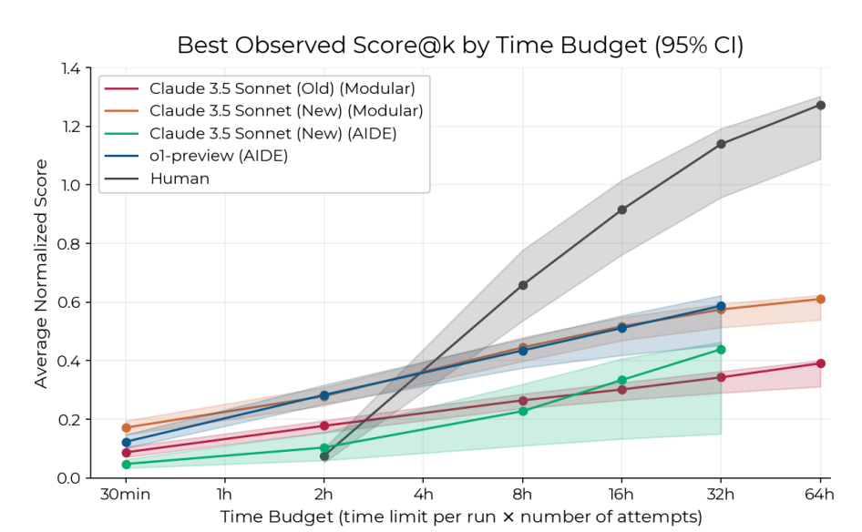

<!-- TODO

    - Set up clearer contrast with augmentation & automation
    - First sentence should be should be more cautious -- this is just a theory.
    - Nate: TTT-discover & Kaggle playbook.
    - Be anxious about token scaling.
    - Put in the expenditure-success function from RE-bench paper
    - Application to economic research
    - Ide Talamas ; mention difference is cumulative progress unstead of binary success ; 
    - Extensions: differently sized apples; apple-size and height; .
    - Draw diagrams of different trees.
    - *what makes an apple high?* -- theory: degree of nonconvexity; 
    - _specific things to test optimization ability_
    - _Two types of agentic problem:_ (1) pick a lock; (2) navigate a maze.
    - Mark: strip the RSI model down to the absolute core.
    - Mark: mention the standing-on-shoulders of giants effect, to get balanced growth.
    - Show the expenditure curve, change all axes to *expenditure* instead of time.
    - Terrance Tao: (1) Erdos problems are done, we hit a plateau, the Erdos problems solved were the ones with relatively little human time on them; (2) LLMs have breadth but not depth.
    - Nathan Lambert: https://www.interconnects.ai/p/lossy-self-improvement
-->

::: {.callout-important}
## Takeaways

1. **We think there's credible evidence that agents are making autonomous contributions to AI R&D.**
2. **It is critical to understand how agent contribution *scales*.** The two standard models are (A) AI speeds up humans; (B) AI replaces humans, but hard to fit. The apple-picking model is one way of explaining: (A) AI can autonomously push the frontier, but hit diminishing returns; (B) agents and human expenditure are complements.
3. **We need better evidence:** (A) How does agent contribution scale?; (B) Are agent & human contributions complements?
:::

<!-- TWEETS


 -->

<!-- https://tecunningham.github.io/posts/2026-03-13-apple-picking-ai.html -->

::: {.column-margin}
   Thanks to Nate Rush, Thomas Kwa, Basil Halperin, Tom Houlden, Parker Whitfill, Phil Trammell, & Andy Haupt for comments.
:::


An apple-picking model of AI R&D.
: 
    In this note we describe a model of AI R&D, to help reconcile two facts:

    1. AI agents are making genuine autonomous contributions to R&D.
    2. AI agents do not seem a perfect substitute for humans researchers.

    The model is very simple: an AI agent helping you to optimize an algorithm is like a robot helping you pick apples. It will take care of all the apples up to a certain height, and it may find apples you haven't found yet, but there will still be apples out of its reach.
    
    We are not confident that the reassuring conclusion is correct, it is possible that autonomous R&D is already ready to take over from humans, but we find the model helpful for organizing what evidence we would need.

    We give a formal model but the basic ideas can all be seen in the drawing below. Here both the human and robot have picked four apples, but they've left the tree in a very different state, so the robot isn't ready to replace the human yet:


    ```{tikz}
    %| fig-align: center
    %| fig-width: 4
    \begin{tikzpicture}[
        x=0.55cm, y=0.55cm,
        line cap=round, line join=round,
        draw=black, line width=1.6pt
    ]
    %%% --- PARAMETERS (edit these) ---
    \def\nrows{4}           % number of apple rows
    \def\canopyBot{3}       % y where canopy starts
    \def\canopyTop{9.6}     % y where canopy ends
    \def\canopyHalfW{2.0}   % half-width of canopy
    \def\canopyRound{1cm} % corner rounding
    \def\treeSpacing{5.2}     % horizontal distance between tree centers
    \def\leftTreeX{4.5}     % x of left tree center
    \def\fruitInset{0.9}    % fruit distance from tree center
    \def\humanX{0.8}        % x of human
    \def\humanReachRow{4}   % human reaches row N (1=bottom, \nrows=top)
    \def\robotReachRow{2}   % robot reaches row N
    \def\armGap{0.6}        % gap between arm tip and canopy edge
    \def\fruitR{0.36}
    \def\filledR{0.3}
    \def\canopyPad{1}     % vertical padding inside canopy for fruit
    \colorlet{humancolor}{black}
    \colorlet{robotcolor}{black}
    %%% --- END PARAMETERS ---

    \pgfmathsetmacro{\rightTreeX}{\leftTreeX+\treeSpacing}
    \pgfmathsetmacro{\robotX}{\rightTreeX+\canopyHalfW+1.8}
    \pgfmathsetmacro{\groundLeft}{\humanX-5}
    \pgfmathsetmacro{\groundRight}{\robotX+5.8}
    \pgfmathsetmacro{\rowStep}{(\canopyTop-\canopyBot-2*\canopyPad)/(\nrows-1)}

    \newcommand{\apple}[2]{\draw (#1,#2) circle (\fruitR);}
    \newcommand{\cross}[2]{
        \draw (#1,#2) circle (\fruitR);
        \draw ({#1-\fruitR*0.7},{#2-\fruitR*0.7}) -- ({#1+\fruitR*0.7},{#2+\fruitR*0.7});
        \draw ({#1-\fruitR*0.7},{#2+\fruitR*0.7}) -- ({#1+\fruitR*0.7},{#2-\fruitR*0.7});
    }

    \newcommand{\drawTree}[1]{
        \draw (#1,0) -- (#1,\canopyBot);
        \draw[rounded corners=\canopyRound]
            ({#1-\canopyHalfW},\canopyBot) rectangle ({#1+\canopyHalfW},\canopyTop);
    }

    % row y-coordinate: row 1 = bottom, row \nrows = top
    \newcommand{\rowY}[1]{\pgfmathparse{\canopyBot+\canopyPad+(\rowStep)*(#1-1)}\pgfmathresult}

    % --- ground ---
    \draw (\groundLeft,0) -- (\groundRight,0);

    % --- human (head at row 3 = second from top) ---
    \def\humanHeadRow{3}
    \pgfmathsetmacro{\humanHeadY}{\canopyBot+\canopyPad+\rowStep*(\humanHeadRow-1)}
    \pgfmathsetmacro{\humanBodyTop}{\humanHeadY-0.4}
    \pgfmathsetmacro{\humanShoulderY}{\humanBodyTop-0.8}
    \draw[humancolor] (\humanX,0) -- (\humanX,\humanBodyTop);
    \draw[humancolor] (\humanX,\humanHeadY) circle (0.35);
    \pgfmathsetmacro{\humanArmY}{\canopyBot+\canopyPad+\rowStep*(\humanReachRow-1)}
    \pgfmathsetmacro{\humanArmTipX}{\leftTreeX-\canopyHalfW-\armGap}
    \pgfmathsetmacro{\humanElbowX}{(\humanX+\humanArmTipX)/2}
    \pgfmathsetmacro{\humanElbowY}{(\humanArmY+\humanShoulderY)/2 - 1.0}
    \draw[humancolor] (\humanX,\humanShoulderY) -- (\humanElbowX,\humanElbowY) -- (\humanArmTipX,\humanArmY);
    \draw[humancolor] (\humanArmTipX,\humanArmY) -- ++(0.25,0.18);
    \draw[humancolor] (\humanArmTipX,\humanArmY) -- ++(0.25,-0.18);

    % --- left tree (human-picked: crosses scattered, apples scattered) ---
    \drawTree{\leftTreeX}
    \pgfmathsetmacro{\fL}{\leftTreeX-\fruitInset}
    \pgfmathsetmacro{\fR}{\leftTreeX+\fruitInset}
    \foreach \row/\leftType/\rightType in {4/x/o, 3/o/x, 2/x/o, 1/o/x} {
        \pgfmathsetmacro{\fy}{\canopyBot+\canopyPad+\rowStep*(\row-1)}
        \if x\leftType \cross{\fL}{\fy} \else \apple{\fL}{\fy} \fi
        \if x\rightType \cross{\fR}{\fy} \else \apple{\fR}{\fy} \fi
    }

    % --- right tree (robot-picked: apples on top, crosses on bottom) ---
    \drawTree{\rightTreeX}
    \pgfmathsetmacro{\gL}{\rightTreeX-\fruitInset}
    \pgfmathsetmacro{\gR}{\rightTreeX+\fruitInset}
    \foreach \row/\leftType/\rightType in {4/o/o, 3/o/o, 2/x/x, 1/x/x} {
        \pgfmathsetmacro{\fy}{\canopyBot+\canopyPad+\rowStep*(\row-1)}
        \if x\leftType \cross{\gL}{\fy} \else \apple{\gL}{\fy} \fi
        \if x\rightType \cross{\gR}{\fy} \else \apple{\gR}{\fy} \fi
    }

    % --- robot (head at row 1 = bottom) ---
    \def\robotHeadRow{1}
    \pgfmathsetmacro{\robotHeadBotY}{\canopyBot+\canopyPad+\rowStep*(\robotHeadRow-1)-0.4}
    \pgfmathsetmacro{\robotHeadTopY}{\robotHeadBotY+0.8}
    \pgfmathsetmacro{\robotBodyTop}{\robotHeadBotY-0.2}
    \pgfmathsetmacro{\robotShoulderY}{\robotBodyTop-0.3}
    \draw[robotcolor] (\robotX,0) -- (\robotX,\robotBodyTop) -- ({\robotX+1.2},\robotBodyTop) -- ({\robotX+1.2},0);
    \draw[robotcolor] (\robotX,\robotHeadBotY) rectangle ({\robotX+1.2},\robotHeadTopY);
    \pgfmathsetmacro{\robotArmY}{\canopyBot+\canopyPad+\rowStep*(\robotReachRow-1)}
    \pgfmathsetmacro{\robotArmTipX}{\rightTreeX+\canopyHalfW+\armGap}
    \draw[robotcolor] (\robotX,\robotShoulderY) -- (\robotArmTipX,\robotArmY);
    \draw[robotcolor] (\robotArmTipX,\robotArmY) -- ++(-0.25,0.18);
    \draw[robotcolor] (\robotArmTipX,\robotArmY) -- ++(-0.25,-0.18);
    \end{tikzpicture}
    ```

    The first graph below shows how we expect the contribution of humans & agents to scale with expenditure (assuming robots are relatively cheaper to run than humans). The second plot shows agent trajectories starting at different stages in the optimization process: if they are given a stronger human starting-point then they can reach a stronger end-state.

    ::: {layout-ncol=2}

    ```{tikz}
    #| fig-width: 3
    #| fig-align: center
    \begin{tikzpicture}[scale=.7,yscale=4]
    \def\rH{0.3} \def\rA{2} \def\lam{0.5}
    \draw[-] (0,0) -- (5.5,0) node[midway,below] {expenditure}
        --(5.5,1)--(0,1)--(0,0) node[midway,rotate=90,above] {apples remaining};
    % human: e^{-r_H t}
    \draw[green!50!black, thick, domain=0:5.3, samples=120]
        plot (\x, {exp(-\rH*\x)});
    % agent: (1-\lambda) + \lambda e^{-r_A t}
    \draw[red!70!black, thick, domain=0:5.3, samples=120]
        plot (\x, {(1-\lam) + \lam*exp(-\rA*\x)});
    \node[green!50!black, right] at (5.5, {exp(-\rH*5.5)}) {human};
    \node[red!70!black, right] at (5.5, {(1-\lam) + \lam*exp(-\rA*5.5)}) {agent};
    %\node[above] at (2.5,1) {$r_H=0.2,\; r_A=0.9,\; \lambda=0.5$};
    \end{tikzpicture}
    ```

    ```{tikz}
    #| fig-width: 3
    #| fig-align: center
    \begin{tikzpicture}[scale=.7,yscale=4]
    \def\rH{0.3} \def\rA{2} \def\lam{0.5}
    \draw[-] (0,0) -- (5.5,0) node[midway,below] {expenditure}
        --(5.5,1)--(0,1)--(0,0) node[midway,rotate=90,above] {apples remaining};
    \draw[green!50!black, thick, domain=0:5.3, samples=120]
        plot (\x, {exp(-\rH*\x)});
    \node[green!50!black, right] at (5.5, {exp(-\rH*5.5)}) {human};
    %\node[red!70!black, right] at (5.5, {(1-\lam) + \lam*exp(-\rA*5.5)}) {agent};
    \draw[red!70!black, thick, dashed, domain=0:5.3, samples=120]
        plot (\x, {(1-\lam) + \lam*exp(-\rA*\x)}) node[right,xshift=5px] {agent 1};
    \draw[red!70!black, thick, dashed, domain=1:5.3, samples=120]
        plot (\x, {(1-\lam)*exp(-\rH) + \lam*exp(-\rH - \rA*(\x-1))}) node[right,xshift=5px] {agent 2};
    \draw[red!70!black, thick, dashed, domain=2:5.3, samples=120]
        plot (\x, {(1-\lam)*exp(-2*\rH) + \lam*exp(-2*\rH - \rA*(\x-2))}) node[right,xshift=5px] {agent 3};
    %\draw[red!70!black, thick, dashed, domain=3:5.3, samples=120]
    %    plot (\x, {(1-\lam)*exp(-3*\rH) + \lam*exp(-3*\rH - \rA*(\x-3))});
    \end{tikzpicture}
    ```

    :::


    The graphs illustrate an important technical observation: if we wish to model this behavior we cannot summarize the *state* of R&D with a scalar, e.g. a single metric of overall progress. Instead we need to keep track, at least to some degree, of the path by which we arrived at this state.

    <!-- The motivation for writing this model was to help think through the implications of recent evidence that AI can push forward the frontier on various optimization and AI R&D problems. If you can spend $100 in tokens to increase the efficiency of a frontier AI training algorithm by 0.1% then this looks like the path to self-improvement, and we'll be able to replace humans with AI. But realistically the agents have been discovering *shallow* improvements to algorithms. The idea is not original, it already exists in cliche form ("low hanging fruit"), but I still found it useful to formalize it. -->


Some implications for recursive self-improvement.
: 
    We start with the simplest model of AI progress:

    1. There is a fixed mapping from training expenditure to general-purpose model intelligence.
    2. Training expenditure has been increasing by  ≈5X per year.
    3. Training efficiency has been increasing by ≈5X per year due to R&D.[^estimates]
    

    We can draw this as follows:

    ```{tikz}
    %| fig-width: 3
    %| fig-align: center
    \begin{tikzpicture}[scale=6]
        \draw[step=0.1, gray, dotted] (0,0) grid (1,1);
        \draw (0,0) -- (1,0) node[midway,below] {ln(training expenditure)}
            -- (1,1) -- (0,1) -- (0,0) node[midway,above,rotate=90] {model intelligence};
        
        \draw[blue,->] (0.15,0.1)--(0.11,0.1);
        \draw[blue,->] (0.25,0.1)--(0.2,0.1);

        \draw[thick, blue, dotted] (0,0) plot[domain=0.2:1, samples=100] (\x, {0.75*(1-exp(-2*(\x-0.2)))}) node[anchor=north west]{2023 technology};
        \draw[thick, blue, dotted] (0,0) plot[domain=0.1:1, samples=100] (\x, {0.75*(1-exp(-2*(\x-0.1)))}) node[right]{2024 technology};
        \draw[thick, blue] (0,0) plot[domain=0:1, samples=100] (\x, {0.75*(1-exp(-2*\x))}) node[anchor=south west]{2025 technology};    

        \fill[black] (0.4,{0.75*(1-exp(-2*(0.4-0.2)))}) circle (0.01) node[anchor=north west, xshift=2pt, fill=white, draw=black, inner sep=2pt] {2023 model};
        \fill[black] (0.5,{0.75*(1-exp(-2*(0.5-0.1)))}) circle (0.01) node[anchor=north west, xshift=2pt, fill=white, draw=black, inner sep=2pt] {2024 model};
        \fill[black] (0.6,{0.75*(1-exp(-2*0.6))}) circle (0.01) node[anchor=north west, xshift=2pt,  fill=white, draw=black, inner sep=2pt] {2025 model};
    \end{tikzpicture}
    ```

    Humans have been painstakingly pushing those blue curves to the left. We now are seeing clear signs of agents joining the effort and contributing to that leftward movement, and we want to know what to expect. The apple-picking model gives us some broad implications:
    
    1. Observing an agent autonomously improve the frontier (push the curve left) does not imply that agents can replace humans, because they may be only picking low-hanging fruit.
    2. We should benchmark agent AI R&D ability against frontier problems, which represent cumulative human effort, and so are relatively picked-clean, instead of against toy problems which represent the effort of a single human.
    3. The effects of AI R&D are likely show up in parts of the AI stack that have low-hanging fruit, e.g. where there's a lot of fairly natural ideas to try but we are bottlenecked on execution.

A concordance
: [NOTE: i'm not sure whether this is worth including, maybe too obvious.]==

|Robots picking apples|Agents finding optimizations|
|-|-|
|Robots can find low apples that humans have not picked yet.|Agents can find improvements on state-of-the-art optimization problems.|
|Robots cannot pick all the apples humans can.|Agents cannot do as well as human experts on optimization (even with high expenditure).|
|Robots are more useful for trees that have never been picked.|Agents are more useful on problems that are not heavily optimized.|
|A tree will yield more apples if it's harvested by both a human and robots.|An algorithm will be better-optimized if both humans and agents work on it.|
|To gauge the ability of robots we want to measure the highest apple they can reach.|To gauge the value of agents we want to test for the maximum depth of optimization they can find.|


[^estimates]: The R&D progress is inclusive of declining cost of compute, pretraining, posttraining, and elicitation. These estimates are very loose, based on Epoch's [trends](https://epoch.ai/trends) and other sources. 

#  Evidence on Autonomous AI R&D

Agents are improving on the state-of-the-art in well-studied optimization problems.
: 
    - Andrej Karpathy's [autoresearch](https://github.com/karpathy/autoresearch) (March 2026) tasks an agent with reducing validation loss to pretrain a GPT-2-small model given a fixed compute budget (one H100, ~5 minutes per training loop). Over ~2 days the agent tried ~700 changes and found ~20 additive edits, yielding an ~11% improvement in "Time-to-GPT-2". In Karpathy's [words](https://x.com/karpathy/status/2031135152349524125) "It's not novel, ground-breaking "research" (yet), but all the adjustments are "real", I didn't find them manually previously, and they stack up and actually improved nanochat."

    - [nanoGPT speedrun](https://github.com/KellerJordan/modded-nanogpt) (@kellerjordan2026moddednanogpt) is a public competition to minimize training time for GPT-2 given a fixed target loss, which has brought training time from 45 min down to 1.4 min over 77 records since May 2024. Of these, 4 recent records were by AI systems.

    - [TTT-Discover](https://arxiv.org/abs/2601.16175) (@yuksekgonul2026learning, January 2026), a test-time training method, optimized the TriMul GPU kernel used in AlphaFold, achieving >15% improvement over the best human implementations. The [authors](https://www.gpumode.com/leaderboard/496?tab=rankings) of the TriMul task, expert kernel engineers, called it "legit" and noted the strategy was “similar to the current best humans, but executed better,” with most human solutions falling behind on fusing more complex operators together.

    - Google's [AlphaEvolve](https://arxiv.org/abs/2506.13131) (@novikov2025alphaevolve, June 2025) is an evolutionary coding agent powered by Gemini models. They report a 23% speedup on a key Gemini training kernel and 0.7% of Google's worldwide compute recovered through a better scheduling heuristic.


Some optimizations are *deeper* than others.
: 
    The nanoGPT speedrun provides a useful case study as a public ledger of cumulative human effort on an AI R&D problem. 
    
    Some *deep* contributions in the speedrun are:

    - [*Muon*](https://x.com/kellerjordan0/status/1842300916864844014) (October 2024) came from original research in the nanogpt codebase on Newton-Schulz orthogonalization, cutting training time by 21% (31.4 → 24.9 min). It has since been adopted widely, including by Kimi K2 (1T MoE), GLM-4.5 (355B MoE), and Arcee Trinity (400B MoE), and is now part of PyTorch's standard optimizer suite.
    - [*U-Net skip connections*](https://x.com/kellerjordan0/status/1856053121103093922) (November 2024) applied an encoder-decoder pattern from 2015 computer vision to transformer layers, yielding an 8% speedup (7.8 → 7.2 min). This became foundational and later records kept building on it.
    - [*Paired Head Attention*](https://x.com/classiclarryd/status/2008963501688324228) (January 2026) is a novel attention mechanism that interleaves K/Q/V across head pairs to double the effective sequence length in attention.

    These required theoretical insight, cross-domain transfer, or novel architectural ideas. 
    
    By contrast, many other records in the speedrun are *shallow* improvements: [bundling known techniques like ReLU² and QK-norm](https://x.com/kellerjordan0/status/1845865698532450646) (32% speedup), [importing FlexAttention](https://x.com/kellerjordan0/status/1859331370268623321) (30% speedup), [lowering the logit softcap from 30 to 15](https://x.com/kellerjordan0/status/1876048851158880624) (5% speedup), or [upgrading PyTorch](https://x.com/kellerjordan0/status/1847358578686152764) (8% speedup).

    We note that both shallow and deep optimizations can provide significant speedups.

But, agent optimizations are often described as *shallow*.
: 
    - Several AI R&D and optimization benchmarks, such as [MLGymBench](https://arxiv.org/abs/2502.14499) (@nathani2025mlgym), [GSO](https://arxiv.org/abs/2509.13458) (@shetty2025gso), and [SWE-fficiency](https://arxiv.org/abs/2511.06090) (@ma2025swefficiency), report that agents achieve "surface-level speedups" but "fail to discover algorithmic innovations." For instance, one of the largest speedups in [AlgoTune](https://arxiv.org/abs/2507.15887) (@press2025algotune) is a 142× on a graph communicability task, achieved by replacing pure Python with BLAS calls.

    - We observe all AI-assisted records in nanoGPT speedrun to be shallow relative to the optimizations above (e.g., Muon's 21% speedup): replacing Python loops with faster library calls ([hiverge.ai](https://github.com/KellerJordan/modded-nanogpt/pull/125), ~1.2%) and combining two GPU operations to avoid writing intermediate results to memory ([Locus](https://x.com/classiclarryd/status/2012927211448516796), ~0.9%). These can be classified as typical optimization techniques that apply to many problems.

    - Karpathy's own diagnosis on autoresearch fits this picture. The improvements that worked were things like adjusting AdamW constants, adding a scalar multiplier for QKnorm, and even making [random seed changes](https://github.com/karpathy/autoresearch/issues/131). He notes that out of the box, most of the agent's changes are tuning existing knobs, though not all. 
    
        Overall he notes that the agents feel "cagey" on open-ended ideas.


#               Discussion

We can apply the model to recursive self-improvement.
: 
    It's also possible to close this model, where agent R&D contributes to the next generation of agent ability. This is like assuming that a robot can eat apples they harvested & grow taller. The condition for explosive growth is simple: it will happen when eating the apples within a one-foot slice of the tree are sufficient for the robot to grow another foot.

Relation to other models of AI R&D. 
: 
    The critical distinction between this model and others is how we represent the state. Most existing models summarize the level of productivity (or stock of knowledge) with a single number, meaning there's no distinction between a shallow and deep contribution to the state of knowledge. The model I'm using here allows us to represent the state with two numbers: the share of apples picked above $\lambda$, and the share below $\lambda$. For the RSI version of the model we instead track the current level of capabilities ($\lambda_n$) and the share of apples picked above that threshold.

    Most existing models of recursive self-improvement assume that either AI accelerates or replaces human R&D researchers. I believe this is roughly true for @aghion2019artificial, @davidson2021could, @erdil2025gate, @davidson2026automatingairesearch, @jones2025aird, @kwa2026simpleraitimelines. These models then calibrate the effect through (1) how much does AI accelerate R&D workers; (2) how much do R&D workers contribute to our stock of knowledge.
    
    However there is some awkwardness in fitting these models to the data:
    
    1. It is hard to reconcile these models with evidence that AI is already autonomously contributing to AI research, yet still not replacing humans (i.e. autonomous agents are not perfect substitutes for humans). 
    2. Models with human replacement typically assume a limited number of AI R&D agents (e.g. @davidson2026automatingairesearch), because having an infinite number of R&D agents would cause immediate explosive growth. But it's hard to motivate why we would have a small number, rather than scaling the number of agents up to the limits of compute.

    @kokotajlo2025aifuturesmodel models AI and human "research taste", though I don't have a clear idea exactly how taste is aggregated.^[@ide2024artificialintelligenceknowledgeeconomy model AI with different levels of human ability, though I believe they only discrete problem-solving, not cumulative contribution to knowledge-gathering.]

Things to add.
: 
    - *Landscape.* A more general version would model the entire *landscape*. You can represent an optimization problem as $y=f(\bm{x})$, where you're trying to choose an $\bm{x}$ to maximize $y$, given some unknown $f(\cdot)$. (talk about non-additivity of optimizations; talk about conditions under which landscape is separable, and so each subspace is an independent apple; talk about path dependence).

    - *Relation to time horizon.* You could think of the high apples as long-time-horizon tasks, i.e. tasks that AI agents are relatively worse at performing.

    - *Shape of the tree.* You can extend the model such that apples are non-uniformly distributed, then we can replace $\lambda$ with $F(\lambda)$ below. We can then talk about types of domain which are bottom-heavy (most optimizations are pretty easy to find) vs top-heavy (most optimizations are hard to find). It then becomes important to know whether AI R&D is relatively more bottom-heavy or top-heavy, if the former then we might already be on the brink of an intelligence explosion.

    - *Directed search.* We assumed that the probability of finding an apple is independent of other apples already found. Realistically people have an ability to put direct their attention to finding new innovations. This implies lower diminishing returns to expenditure, and higher complementarity between agents and humans, I'm not sure whether it would change the qualitative conclusions of the model.
    
    - *Bottlenecks.* Some R&D is bottlenecked not just by thinking (which agents can do), but also by running experiments.

    - *Acceleration.* This model is missing the effect of acceleration through explicit cooperation -- e.g. a human comes up with an idea, and an agent executes it. This seems very likely to be an important contribution to AI progress.

    - *Sketch of a quantitative model of LLM training.* LLM training is a big stack of algorithms, which we've been optimizing at perhaps 10X/year. Would be useful to add some speculation about which parts of the stack have low-hanging fruit.

    - *Relation to task model.* You could describe a version of apple-picking with a task model, though it would be a quite different interpretation than the usual task model: 
        1. There's a uniform distribution of tasks (low through high apples)
        2. There are diminishing returns within each task, but additive across tasks (usually there are additive returns within tasks, but tasks are complements)
        3. Agents can only do low tasks.

        For simplicity we take the price of agent & human labor as given (i.e. parital equilibrium). Then we'll get specialization, agents work on apples below $\lambda$, humans work on apples above $\lambda$ (assuming the price of agent labor is relatively low). As $\lambda$ increases human wages fall (because there's more congestion in working on the high apples, so lower marginal product).


#               Model

Setup.
:   There is a continuum of apples spread uniformly on the real line.
    
    A human can find apples over $[0,1]$, but an agent can only find apples over $[0,\lambda]$, with $\lambda < 1$ (at least for now).
    
    Humans find apples at rate $r_H$, agents find apples at rate $r_A$, and we use $t_H$ and $t_A$ to represent the time humans and agents spend searching (you can also interpret $t_H$ and $t_A$ as monetary expenditure).

**We can then derive apples remaining:**

   $$\text{share apples remaining}= \underbrace{\lambda e^{-r_Ht_H-r_At_A}}_{\text{remaining apples from bottom of tree}}+\underbrace{(1-\lambda)e^{-r_Ht_H}}_{\text{remaining apples from top of tree}}.$$

Implication: agents asymptote to a higher level of remaining apples than humans.
: 
    Here we illustrate agent-only and human-only search curves: the agent curve falls more quickly ($r_A>r_H$), but asymptotes to a higher level of remaining apples ($\lambda<1$).

    ```{tikz}
    \begin{tikzpicture}[scale=2,yscale=2]
    \def\rH{0.3} \def\rA{2} \def\lam{0.5}
    \draw[-] (0,0) -- (5.5,0) node[midway,below] {search-time / expenditure}
        --(5.5,1)--(0,1)--(0,0) node[midway,rotate=90,above] {share apples remaining};
    % human: e^{-r_H t}
    \draw[green!50!black, thick, domain=0:5.3, samples=120]
        plot (\x, {exp(-\rH*\x)});
    % agent: (1-\lambda) + \lambda e^{-r_A t}
    \draw[red!70!black, thick, domain=0:5.3, samples=120]
        plot (\x, {(1-\lam) + \lam*exp(-\rA*\x)});
    \draw[green!50!black, dashed, thin] (0,.01) -- (5.3,.01);
    \draw[red!70!black, dashed, thin] (0,{1-\lam}) -- (5.3,{1-\lam});
    \node[green!50!black, right] at (4.2, {exp(-\rH*4.2) + 0.04}) {human};
    \node[red!70!black, right] at (4.2, {(1-\lam) + \lam*exp(-\rA*4.2) - 0.06}) {agent};
    \node[above] at (2.5,1) {$r_H=0.2,\; r_A=0.9,\; \lambda=0.5$};
    \end{tikzpicture}
    ```

    We see roughly this shape when comparing human and AI scaling on continuously-scored AI R&D tasks, e.g. in RE-Bench (@wijk2025rebench):

    


```{r}
#| include: false
#| cache: false
old_tinytex_engine_args <- getOption("tinytex.engine_args")
options(tinytex.engine_args = unique(c(old_tinytex_engine_args, "-shell-escape")))
```


Implication: agents can improve on human SoTA, but only by a limited amount.
: 
    The plot below shows the returns on human and agent performance. The y-axis shows human-only apples remaining, which you can interpret as the remaining gaps after the effort of a single human or the cumulative effort of humanity. At each vertical point, moving to the right (adding agent optimizations) lowers the remaining apples, but only by a limited amount.

    ```{tikz}
    %| engine-opts:
    %|   extra.preamble: "\\usepackage{pgfplots}\\pgfplotsset{compat=1.18}"
    \begin{tikzpicture}
    \pgfmathsetmacro{\xopt}{ln(3.5)/0.9}
    \begin{axis}[
        view={0}{90}, width=8cm, height=8cm,
        xlabel={agent expenditure}, ylabel={human expenditure},
        title={Apples remaining \;($r_H{=}0.2,\; r_A{=}0.9,\; \lambda{=}0.5$)},
        domain=0:5, y domain=0:5,
        xmin=0, xmax=5, ymin=0, ymax=5,
        enlargelimits=false,
        axis equal image,
        axis on top,
        colormap/viridis,
    ]
    \addplot3[
        surf,
        shader=interp,
        samples=45,
        draw=none,
    ] {0.5*exp(-0.2*y) + 0.5*exp(-0.2*y - 0.9*x)};
    \addplot3[
        contour gnuplot={
            levels={0.1,0.2,0.3,0.4,0.5,0.6,0.7,0.8,0.9},
            labels over line,
            draw color=black,
        },
        samples=51,
        thick,
        draw=black,
    ] {0.5*exp(-0.2*y) + 0.5*exp(-0.2*y - 0.9*x)};
    \addplot3[
        dashed,
        very thick,
        draw=white,
    ] coordinates {(0,5,0) (5,0,0)};
    \node[
        fill=white,
        fill opacity=0.85,
        text opacity=1,
        inner sep=1pt,
        anchor=south west
    ] at (axis cs:0.15,4.75) {$x_A + x_H = \$5$};
    \draw[
        blue!70!black,
        very thick,
        rounded corners=8pt,
        ->,
    ] (axis cs:0,0) -- (axis cs:\xopt,0) -- (axis cs:\xopt,{5-\xopt});
    \node[
        blue!70!black,
        fill=white,
        fill opacity=0.85,
        text opacity=1,
        inner sep=1pt,
        anchor=west,
        align=left
    ] at (axis cs:{\xopt+0.1},3.85) {optimal allocation\\as budget rises};
    \end{axis}
    \end{tikzpicture}
    ```


Implication: the agent asymptote depends on the starting point.
: 
    The plot below shows a variety of agent trajectories, each starting after a different amount of human work.
    
    You could interpret this as starting an agent at different points in the history of optimizing some algorithm, e.g. nanoGPT.

    The model implies that if you start an agent from the original unoptimized version of an algorithm it will quickly reduce the remaining apples, but asymptote to a value well above the human state-of-the-art.

    If you start an agent after some human optimization has been performed the agent will contribute less at first (because fewer apples remain), but it will be able to achieve a lower asymptote.

    ```{tikz}
    \begin{tikzpicture}[x=1.1cm, y=5cm]
    \def\rH{0.2} \def\rA{0.9} \def\lam{0.5}
    \draw[-] (0,0) -- (5.5,0) node[midway,below] {search expenditure}
        -- (5.5,1) -- (0,1) -- (0,0) node[midway,rotate=90,above] {share remaining};
    \node[above] at (2.75,1) {$r_H=0.2,\; r_A=0.9,\; \lambda=0.5$};
    \draw[green!50!black, thick, domain=0:5.3, samples=120]
        plot (\x, {exp(-\rH*\x)});
    \draw[red!70!black, thick, domain=0:5.3, samples=120]
        plot (\x, {(1-\lam) + \lam*exp(-\rA*\x)});
    \draw[red!70!black, thick, dashed, domain=1:5.3, samples=120]
        plot (\x, {(1-\lam)*exp(-\rH) + \lam*exp(-\rH - \rA*(\x-1))});
    \draw[red!70!black, thick, dash dot, domain=2:5.3, samples=120]
        plot (\x, {(1-\lam)*exp(-2*\rH) + \lam*exp(-2*\rH - \rA*(\x-2))});
    \draw[red!70!black, thick, densely dotted, domain=3:5.3, samples=120]
        plot (\x, {(1-\lam)*exp(-3*\rH) + \lam*exp(-3*\rH - \rA*(\x-3))});
    \draw[red!70!black, thick, loosely dashed, domain=4:5.3, samples=120]
        plot (\x, {(1-\lam)*exp(-4*\rH) + \lam*exp(-4*\rH - \rA*(\x-4))});
    \node[green!50!black, right] at (5.5, {exp(-\rH*5)}) {human-only};
    %\node[red!70!black, right] at (4.15, {(1-\lam) + \lam*exp(-\rA*4.15) - 0.03}) {$t_H=0,1,2,3,4$};
    \end{tikzpicture}
    ```


#          Extension: Recursive Self-Improvement

Now let the robot's height depend on apples harvested.
: 
    The previous model applied to agents working on an arbitrary optimization problem. Now we focus on agents working on AI R&D, which in turn increases agent ability.
    
    We make a few changes:

    1. We now track progress in picking apples over periods, where each period represents a generation of AI models, and we assume that agents pick *all* the apples available to them each period (apples below $\lambda_n$). This makes things easier to model because the state of the tree can be summarized with just two variables, $\lambda_n$ and $h_n$. It also seems like a reasonable assumption: AI research labs will keep spending money on agent-optimizing their algorithms until there are low returns to additional use.
    2. We assume that the agent's ability in period $n+1$ is a function of AI R&D progress in period $n$ (the robot is eating the apples and getting taller). It turns out that we can get a simple closed-form solution when this function is linear. To add a touch of realism we assume that agents have no meaningful ability to do R&D until algorithmic progress passes some minimum threshold ($\bar{a}$).


Implications:
: 
    1. We will eventually get superhuman progress (robots will be taller than humans) iff $\alpha + \beta(1-\bar{a}) > 1$.
    2. Agent height will be explosive iff $\beta > 1$, i.e. if eating all the apples in a 1-foot slice of tree causes you to grow another foot taller. If not, it converges to a finite height $\lambda^*$.


<!-- 1. Apples sit at heights in $[0,\infty)$; human reach is normalized to 1. The agent has reach $\lambda_n \ge 0$ and picks everything below it.
2. Humans pick in the band $(\lambda_n, 1]$ at a rate governed by $p$.
3. Agent reach depends on cumulative apples harvested: it can only pick apples after some minimum threshold ($\bar{a}$), and is then linear in $a_n$. -->


## State variables and dynamics

Assumptions.
: 
    - Apples are distributed uniformly on the real line, as before.
    - Human reach is normalized to 1.
    - Agent reach in period $n$ is $\lambda_n \ge 0$.
    - $h_n \in [0,1]$: human coverage of the human-only band $(\lambda_n, 1]$ by the end of period $n$.

Human dynamics. 
: 
    Each period, a fraction $1-p$ of the remaining human-level band gets picked, so:

    $$h_{n+1} = 1 - p(1-h_n), \qquad h_0 = 0.$$

Apples harvested.
: 
    (agent + humans, with clipping at 1):
    $$a_n = \lambda_n + (1-\lambda_n)_+ \, h_n, \qquad (x)_+ \equiv \max\{x,0\}.$$

    Agent gets everything up to $\lambda_n$; humans only contribute on the band of length $(1-\lambda_n)_+$, of which fraction $h_n$ is covered by period $n$.

Self-improvement.
: 
    (activation threshold $\bar{a}$, then affine in $a_n$):
    $$\lambda_{n+1} = \begin{cases} 0, & a_n < \bar{a} \\ \alpha + \beta(a_n - \bar{a}), & a_n \ge \bar{a}. \end{cases}$$

    Parameters: **$p$** (human speed), **$\bar{a}$** (minimum progress to "turn on" the agent), **$\alpha$** (baseline capability once on), **$\beta$** (strength of recursive improvement). Initial condition $\lambda_0$ (typically 0).

## Conditions

Agents contributing to AI research.
: 
    With $\lambda_n = 0$, $a_n = h_n \to 1$. So the agent can ever turn on **iff $\bar{a} < 1$**. If $\bar{a} \ge 1$, $\lambda_n \equiv 0$ forever. Activation-time approximation: $h_n = 1 - p^n \ge \bar{a}$ $\Leftrightarrow$ $n \ge \ln(1-\bar{a})/\ln p$; $p$ mainly shifts *when* activation happens.

Getting to superhuman AI research.
: 
    As $n \to \infty$, $h_n \to 1$. If $\lambda_n < 1$, $a_n \to 1$; if $\lambda_n \ge 1$, $a_n = \lambda_n$. So asymptotically $\lambda_{n+1} \to f(1)$ with $f(1) = 0$ if $1 < \bar{a}$, and $f(1) = \alpha + \beta(1-\bar{a})$ if $1 \ge \bar{a}$. So **takeoff past human level** (eventually $\lambda_n > 1$) **iff**
    $$\boxed{\alpha + \beta(1-\bar{a}) > 1.}$$

    Interpretation: “If the orchard were fully human-level ($a=1$), would the next agent be at least human-level?” If not, the system stays below 1. This condition is essentially independent of $p$.

Self-sustaining AI research.
: 
    For $\lambda_n \ge 1$, $a_n = \lambda_n$ and
    $$\lambda_{n+1} = \alpha + \beta(\lambda_n - \bar{a}).$$

    - **Runaway / hard takeoff** iff $\boxed{\beta > 1}$ (roughly geometric growth in $\lambda_n$).

    - **Soft takeoff / saturation** iff $\boxed{\beta < 1}$: convergence to
    $$\lambda^* = \frac{\alpha - \beta\bar{a}}{1-\beta}$$
    (provided the system crosses 1 first).

    - **Knife-edge** $\beta = 1$: linear growth.

---


```{tikz}
%| engine-opts:
%|   extra.preamble: "\\usepackage{pgfplots}\\pgfplotsset{compat=1.18}"
% Recurrence: h_n = 1 - p^n; a_n = \lambda_n + (1-\lambda_n) h_n when \lambda_n < 1, else a_n = \lambda_n; \lambda_{n+1} = 0 if a_n < \bar a, else \alpha + \beta(a_n-\bar a).
% Four scenarios: (p, ā, α, β) = (0.6, 1.5, 0, 0) no activation; (0.6, 0.2, 0.12, 0.4) stuck; (0.6, 0.2, 0.35, 0.9) soft; (0.6, 0.2, 0.32, 1.1) hard.
\def\appleloop#1#2#3#4{
  \pgfmathsetmacro{\p}{#1}\pgfmathsetmacro{\bara}{#2}\pgfmathsetmacro{\alphap}{#3}\pgfmathsetmacro{\betap}{#4}
  \gdef\coordslambda{}\gdef\coordsat{}
  \gdef\lambdai{0}
  \foreach \t in {0,1,...,25} {
    \pgfmathsetmacro{\ht}{1 - pow(\p,\t)}
    \pgfmathparse{\lambdai >= 1 ? \lambdai : \lambdai + (1-\lambdai)*\ht}
    \pgfmathsetmacro{\at}{\pgfmathresult}
    \pgfmathparse{\at < \bara ? 0 : \alphap + \betap*(\at - \bara)}
    \pgfmathsetmacro{\lambdanext}{\pgfmathresult}
    \xdef\coordslambda{\coordslambda (\t,\lambdai)}
    \xdef\coordsat{\coordsat (\t,\at)}
    \xdef\lambdai{\lambdanext}
  }
}
\begin{tikzpicture}
\appleloop{0.6}{1.5}{0}{0}
\edef\coordslambdaA{\coordslambda}\edef\coordsatA{\coordsat}
\appleloop{0.6}{0.2}{0.12}{0.4}
\edef\coordslambdaB{\coordslambda}\edef\coordsatB{\coordsat}
\appleloop{0.6}{0.2}{0.35}{0.9}
\edef\coordslambdaC{\coordslambda}\edef\coordsatC{\coordsat}
\appleloop{0.6}{0.2}{0.32}{1.1}
\edef\coordslambdaD{\coordslambda}\edef\coordsatD{\coordsat}

\begin{axis}[
    name=ax1,
    width=7cm, height=5cm,
    xmin=0, xmax=25, ymin=0, ymax=2.2,
    xlabel={$n$}, ylabel={$\lambda_n$},
    title={$\lambda_n$ (agent reach)},
    grid=both,
    grid style={dotted, gray!60},
    axis on top,
    legend pos=north west,
    legend cell align=left,
    legend style={draw=none, fill=none, font=\small},
]
\addplot[dashed, gray!70] coordinates {(0,1) (25,1)};
\addplot[very thick, gray] coordinates {\coordslambdaA};
\addplot[very thick, red!70!black] coordinates {\coordslambdaB};
\addplot[very thick, green!50!black] coordinates {\coordslambdaC};
\addplot[very thick, violet] coordinates {\coordslambdaD};
\legend{No activation ($\bar a \ge 1$), Stuck ($f(1)<1$), Soft takeoff ($\beta<1$), Hard takeoff ($\beta>1$)}
\end{axis}

\begin{axis}[
    at={(ax1.outer east)},
    anchor=outer west,
    xshift=0.9cm,
    width=7cm, height=5cm,
    xmin=0, xmax=25, ymin=0, ymax=2.2,
    xlabel={$n$}, ylabel={$a_n$},
    title={$a_n$ (apples harvested)},
    grid=both,
    grid style={dotted, gray!60},
    axis on top,
    legend pos=north west,
    legend cell align=left,
    legend style={draw=none, fill=none, font=\small},
]
\addplot[dashed, gray!70] coordinates {(0,1) (25,1)};
\addplot[very thick, gray] coordinates {\coordsatA};
\addplot[very thick, red!70!black] coordinates {\coordsatB};
\addplot[very thick, green!50!black] coordinates {\coordsatC};
\addplot[very thick, violet] coordinates {\coordsatD};
\legend{No activation ($\bar a \ge 1$), Stuck ($f(1)<1$), Soft takeoff ($\beta<1$), Hard takeoff ($\beta>1$)}
\end{axis}
\end{tikzpicture}
```


#           Offcuts

Scaling curves from @metr2024capability. For most tasks either (1) an agent can do it much cheaper than a human; or (2) an agent can't do it at all.


(see my earlier post on [AI knowledge creation](https://tecunningham.github.io/posts/2026-01-29-knowledge-creating-llms.html))


```{tikz}
%| fig-align: center
%| fig-width: 3
\begin{tikzpicture}[
    x=0.62cm,
    y=0.62cm,
    line cap=round,
    line join=round,
    draw=blue!65!black,
    line width=2pt
]
% easy-to-tune layout parameters
\def\groundY{0.2}
\def\humanX{1.6}
\def\leftTreeX{6.7}
\def\rightTreeX{12.9}
\def\robotX{17.0}
\def\trunkTopY{4.0}
\def\canopyTopY{9.55}
\def\canopyLeft{-1.55}
\def\canopyRight{1.55}
\def\fruitRadius{0.18}
\def\crossHalf{0.15}
\def\robotReachY{5.6}

\newcommand{\drawCross}[2]{
    \begin{scope}[shift={({#1},{#2})}]
    \draw (-\crossHalf,-\crossHalf) -- (\crossHalf,\crossHalf);
    \draw (-\crossHalf,\crossHalf) -- (\crossHalf,-\crossHalf);
    \end{scope}
}

\newcommand{\drawFruit}[2]{
    \draw (#1,#2) circle (\fruitRadius);
}

\newcommand{\drawTree}[1]{
    \begin{scope}[shift={({#1},0)}]
    \draw (-0.80,\groundY-0.05) -- (0.80,\groundY-0.05);
    \draw (-0.10,\groundY-0.05)
        .. controls +(0.35,0.25) and +(-0.10,-0.90) .. (-0.02,\trunkTopY);
    \draw (0.10,\groundY-0.05)
        .. controls +(-0.35,0.25) and +(0.10,-0.90) .. (0.02,\trunkTopY);
    \draw (\canopyLeft,\trunkTopY)
        .. controls +(-0.60,0.80) and +(-0.30,-1.30) .. (-1.30,8.35)
        .. controls +(0.25,1.05) and +(-0.95,0.30) .. (0.00,\canopyTopY)
        .. controls +(0.90,0.25) and +(-0.45,0.95) .. (1.25,8.75)
        .. controls +(0.55,-0.75) and +(0.25,1.00) .. (1.10,5.80)
        .. controls +(-0.20,-1.00) and +(0.90,-0.20) .. (\canopyRight,\trunkTopY)
        .. controls +(-1.00,-0.20) and +(0.95,-0.20) .. (\canopyLeft,\trunkTopY);
    \end{scope}
}

\newcommand{\drawHuman}[1]{
    \begin{scope}[shift={({#1},0)}]
    \draw (0,8.15) circle (0.45);
    \fill[blue!65!black] (-0.15,8.3) circle (0.04);
    \draw (0.15,8.05) -- ++(0.15,-0.15);
    \draw (0,7.7) -- ++(0,-5.5);
    \draw (0,6.55) -- (1.95,7.25) -- (2.75,7.88);
    \draw (2.75,7.88) -- ++(0.20,0.18);
    \draw (2.75,7.88) -- ++(0.08,0.26);
    \draw (2.88,8.01) -- ++(-0.16,0.04);
    \draw (0,2.2) -- ++(-0.18,-2.0);
    \draw (0,2.2) -- ++(0.32,-2.0);
    \draw (-0.45,\groundY) -- ++(1.0,0);
    \end{scope}
}

\newcommand{\drawRobot}[1]{
    \begin{scope}[shift={({#1},0)}]
    \draw (0,4.75) circle (0.5);
    \draw (-1.0,4.25) -- (1.0,4.25) -- (1.0,3.0) -- (-1.0,3.0) -- cycle;
    \draw (-1.0,3.0) -- ++(0,-2.65) -- ++(0.95,0);
    \draw (1.0,3.0) -- ++(0,-2.65) -- ++(-0.8,0);
    \draw (-1.25,\groundY) -- ++(2.6,0);
    % straight robotic arm showing a limited reach
    \draw (-0.75,4.0) -- (-2.05,\robotReachY);
    \draw (-2.05,\robotReachY) -- ++(-0.18,0.22);
    \draw (-2.05,\robotReachY) -- ++(-0.26,-0.08);
    \draw (-2.18,\robotReachY+0.08) -- ++(0.08,-0.16);
    \end{scope}
}

\drawHuman{\humanX}
\drawTree{\leftTreeX}
\drawTree{\rightTreeX}
\drawRobot{\robotX}

% fruit layouts relative to tree centers
\begin{scope}[shift={({\leftTreeX},0)}]
\drawCross{-0.8}{8.6}
\drawFruit{0.75}{8.6}
\drawFruit{-0.8}{7.4}
\drawCross{0.75}{7.4}
\drawCross{-0.8}{6.2}
\drawFruit{0.75}{6.2}
\drawFruit{-0.8}{5.0}
\drawCross{0.75}{5.0}
\end{scope}
\foreach \x/\y in {-0.85/8.6, 0.65/8.6, -0.85/7.35, 0.65/7.35}{
    \begin{scope}[shift={({\rightTreeX},0)}]
    \drawFruit{\x}{\y}
    \end{scope}
}
\foreach \x/\y in {-0.85/6.05, 0.65/6.05, -0.85/4.85, 0.65/4.85}{
    \begin{scope}[shift={({\rightTreeX},0)}]
    \drawCross{\x}{\y}
    \end{scope}
}
\end{tikzpicture}
```
