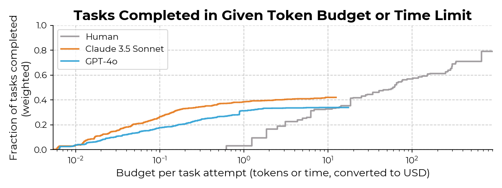

<!--
   h1 {  border-bottom: 4px solid black; }
   h2 {  border-bottom: 1px solid gray; padding-bottom: 0px; color: black; }
   dl {display: grid;}
   dt {grid-column-start: 1; width: 6cm;}
   dd {grid-column-start: 2; margin-left: 2em;}
-->

<!-- https://tecunningham.github.io/posts/2026-03-13-apple-picking-ai.html -->

::: {.column-margin}
   Thanks to Nate Rush, Manish Shetty, Thomas Kwa, Basil Halperin, Tom Houlden, & Parker Whitfill for comments.
:::


A simple model for AI R&D.
: 
    An agent helping you to optimize an algorithm is like a robot helping you pick apples. It will take care of all the apples up to a certain height, and it may find apples you haven't found yet, but there will still be apples out of its reach.

    The motivation for writing this model was to help think through the implications of recent evidence that AI can push forward the frontier on various optimization and AI R&D problems (see my earlier post on [AI knowledge creation](https://tecunningham.github.io/posts/2026-01-29-knowledge-creating-llms.html)). If you can spend $100 in tokens to increase the efficiency of an AI training algorithm by 0.1% then, on its surface, this looks like the path to self-improvement, and you can replace humans with AI. But realistically the agents have been discovering *shallow* improvements to algorithms. This apple-picking model is my attempt to help think through the distinction, and figure out how to measure agents' optimization ability.

    Below I give a formal model but the basic ideas can all be seen with a drawing: here both the human and robot have picked four apples, but they've left the tree in a very different state, so the robot isn't ready to replace the human yet:

\ 

```{tikz}
#| fig-align: center
#| fig-width: 3
\begin{tikzpicture}[
    x=0.62cm,
    y=0.62cm,
    line cap=round,
    line join=round,
    draw=blue!65!black,
    line width=0.8pt
]
% easy-to-tune layout parameters
\def\groundY{0.2}
\def\humanX{1.6}
\def\leftTreeX{6.7}
\def\rightTreeX{12.9}
\def\robotX{17.0}
\def\trunkTopY{4.0}
\def\canopyTopY{9.55}
\def\canopyLeft{-1.55}
\def\canopyRight{1.55}
\def\fruitRadius{0.18}
\def\crossHalf{0.15}
\def\robotReachY{5.6}

\newcommand{\drawCross}[2]{
    \begin{scope}[shift={({#1},{#2})}]
    \draw (-\crossHalf,-\crossHalf) -- (\crossHalf,\crossHalf);
    \draw (-\crossHalf,\crossHalf) -- (\crossHalf,-\crossHalf);
    \end{scope}
}

\newcommand{\drawFruit}[2]{
    \draw (#1,#2) circle (\fruitRadius);
}

\newcommand{\drawTree}[1]{
    \begin{scope}[shift={({#1},0)}]
    \draw (-0.80,\groundY-0.05) -- (0.80,\groundY-0.05);
    \draw (-0.10,\groundY-0.05)
        .. controls +(0.35,0.25) and +(-0.10,-0.90) .. (-0.02,\trunkTopY);
    \draw (0.10,\groundY-0.05)
        .. controls +(-0.35,0.25) and +(0.10,-0.90) .. (0.02,\trunkTopY);
    \draw (\canopyLeft,\trunkTopY)
        .. controls +(-0.60,0.80) and +(-0.30,-1.30) .. (-1.30,8.35)
        .. controls +(0.25,1.05) and +(-0.95,0.30) .. (0.00,\canopyTopY)
        .. controls +(0.90,0.25) and +(-0.45,0.95) .. (1.25,8.75)
        .. controls +(0.55,-0.75) and +(0.25,1.00) .. (1.10,5.80)
        .. controls +(-0.20,-1.00) and +(0.90,-0.20) .. (\canopyRight,\trunkTopY)
        .. controls +(-1.00,-0.20) and +(0.95,-0.20) .. (\canopyLeft,\trunkTopY);
    \end{scope}
}

\newcommand{\drawHuman}[1]{
    \begin{scope}[shift={({#1},0)}]
    \draw (0,8.15) circle (0.45);
    \fill[blue!65!black] (-0.15,8.3) circle (0.04);
    \draw (0.15,8.05) -- ++(0.15,-0.15);
    \draw (0,7.7) -- ++(0,-5.5);
    \draw (0,6.55) -- (1.95,7.25) -- (2.75,7.88);
    \draw (2.75,7.88) -- ++(0.20,0.18);
    \draw (2.75,7.88) -- ++(0.08,0.26);
    \draw (2.88,8.01) -- ++(-0.16,0.04);
    \draw (0,2.2) -- ++(-0.18,-2.0);
    \draw (0,2.2) -- ++(0.32,-2.0);
    \draw (-0.45,\groundY) -- ++(1.0,0);
    \end{scope}
}

\newcommand{\drawRobot}[1]{
    \begin{scope}[shift={({#1},0)}]
    \draw (0,4.75) circle (0.5);
    \draw (-1.0,4.25) -- (1.0,4.25) -- (1.0,3.0) -- (-1.0,3.0) -- cycle;
    \draw (-1.0,3.0) -- ++(0,-2.65) -- ++(0.95,0);
    \draw (1.0,3.0) -- ++(0,-2.65) -- ++(-0.8,0);
    \draw (-1.25,\groundY) -- ++(2.6,0);
    % straight robotic arm showing a limited reach
    \draw (-0.75,4.0) -- (-2.05,\robotReachY);
    \draw (-2.05,\robotReachY) -- ++(-0.18,0.22);
    \draw (-2.05,\robotReachY) -- ++(-0.26,-0.08);
    \draw (-2.18,\robotReachY+0.08) -- ++(0.08,-0.16);
    \end{scope}
}

\drawHuman{\humanX}
\drawTree{\leftTreeX}
\drawTree{\rightTreeX}
\drawRobot{\robotX}

% fruit layouts relative to tree centers
\begin{scope}[shift={({\leftTreeX},0)}]
\drawCross{-0.8}{8.6}
\drawFruit{0.75}{8.6}
\drawFruit{-0.8}{7.4}
\drawCross{0.75}{7.4}
\drawCross{-0.8}{6.2}
\drawFruit{0.75}{6.2}
\drawFruit{-0.8}{5.0}
\drawCross{0.75}{5.0}
\end{scope}
\foreach \x/\y in {-0.85/8.6, 0.65/8.6, -0.85/7.35, 0.65/7.35}{
    \begin{scope}[shift={({\rightTreeX},0)}]
    \drawFruit{\x}{\y}
    \end{scope}
}
\foreach \x/\y in {-0.85/6.05, 0.65/6.05, -0.85/4.85, 0.65/4.85}{
    \begin{scope}[shift={({\rightTreeX},0)}]
    \drawCross{\x}{\y}
    \end{scope}
}
\end{tikzpicture}
```


|Agents finding optimizations|Robots picking apples|
|-|-|
|Agents can autonomously advance the state-of-the-art on an optimization problem|Robots can find low apples that humans have not picked yet|
|Agents will asymptote to a lower maximum value|Robots will not be able to pick all the apples humans can|
|Agents will have greater relative value for problems that are not yet heavily optimized|Robots are more useful for trees that have never been picked|
|An algorithm will be more optimized if agents are started after some rounds of human optimization|A tree will yield more apples if it's harvested by both a human and robots|
|To gauge the value of agents we want to test for the maximum *depth* of optimization they can do|To gauge the ability of robots we want to measure the highest apple they can reach|

Recursive self-improvement.
: 
    It's also possible to close this model, where agent R&D contributes to the next generation of agent ability. This is like assuming that a robot can eat apples they harvested & grow taller. The condition for explosive growth is simple: it will happen when eating the apples within a one-foot slice of the tree are sufficient for the robot to grow another foot.

Relation to other models of AI R&D. 
: 
    The critical distinction between this model and others is how we represent the state. Most existing models summarize the level of productivity (or stock of knowledge) with a single number, meaning there's no distinction between a shallow and deep contribution. The model I'm using here allows us to represent the state with two numbers: the share of apples picked above and below $\lambda$. For the RSI version of the model, we track $\lambda$ and the share of apples picked between $\lambda$ and 1.

    Most existing models of recurse self-improvement assume that either AI accelerates or replaces human R&D researchers. I believe this is roughly true for @aghion2019artificial, @davidson2021could, @erdil2025gate, @davidson2026automatingairesearch, @jones2025aird, @kwa2026simpleraitimelines. These models then calibrate the effect through (1) how much does AI accelerate R&D workers; (2) how much do R&D workers contribute to our stock of knowledge.
    
    However there is some awkwardness in fitting these models to the data:
    
    1. It is hard to reconcile these models with evidence that AI is already autonomously contributing to AI research, yet still not replacing humans (i.e. autonomous agents are not perfect substitutes for humans). 
    2. Models with human replacement typically assume a limited number of AI R&D agents (e.g. @davidson2026automatingairesearch), because having an infinite number of R&D agents would cause immediate explosive growth. But it's hard to motivate why we would have a small number, rather than scaling the number of agents up to the limits of compute.

    @kokotajlo2025aifuturesmodel models AI and human "research taste", though I don't have a clear idea exactly how taste is aggregated.^[@ide2024artificialintelligenceknowledgeeconomy model AI with different levels of human ability, though I believe they only discrete problem-solving, not cumulative contribution to knowledge-gathering.]

Things to add.
: 
    - *Landscape.* A more general version would model the entire *landscape*. You can represent an optimization problem as $y=f(\bm{x})$, where you're trying to choose an $\bm{x}$ to maximize $y$, given some unknown $f(\cdot)$. (talk about non-additivity of optimizations; talk about conditions under which landscape is separable, and so each subspace is an independent apple; talk about path dependence).

    - *Relation to time horizon.* You can think of the high apples as long-time-horizon tasks.

    - *Shape of the tree.* You can extend the model such that apples are non-uniformly distributed, then we can replace $\lambda$ with $F(\lambda)$ below. We can then talk about types of domain which are bottom-heavy (most optimizations are pretty easy to find) vs top-heavy (most optimizations are hard to find). It then becomes important to know whether AI R&D is relatively more bottom-heavy or top-heavy, if the former then we might already be on the brink of an intelligence explosion.

    - *Directed search.* We assume that the probability of finding an apple/optimization is independent of other apples already found. 
    
    - *Other bottlenecks.* -- e.g. compute bottlenecks, experiment bottlenecks.

    - *Sketch of a quantitative model of LLM training.* LLM training is a big stack of algorithms, which we've been optimizing at perhaps 10X/year. [add some speculation about which parts of the stack have low-hanging fruit]


#               Open Model

Setup.
:   There is a continuum of apples spread uniformly on the real line.
    
    A human can find apples over $[0,1]$, but an agent can only find apples over $[0,\lambda]$, with $\lambda < 1$ (at least for now).
    
    Humans find apples at rate $r_H$, agents find apples at rate $r_A$, and we use $t_H$ and $t_A$ to represent the time humans and agents spend searching (you can also interpret $t_H$ and $t_A$ as expenditure on the problem).

**We can then derive apples found:**

   $$\text{share apples found}= \underbrace{\lambda(1-e^{-r_Ht_H-r_At_A})}_{\text{apples from bottom of tree}}+\underbrace{(1-\lambda)(1-e^{-r_Ht_H})}_{\text{apples from top of tree}}.$$

Implication: agents asymptote to a lower level than humans.
: 
    Here we illustrate agent-only and human-only search curves: the agent curve rises more quickly ($r_A>r_H$), but asymptotes to a lower level ($\lambda<1$).

    ```{tikz}
    \begin{tikzpicture}[x=1.2cm, y=5cm]
    \def\rH{0.2} \def\rA{0.9} \def\lam{0.5}
    \draw[-] (0,0) -- (5.5,0) node[midway,below] {search-time / expenditure}
        --(5.5,1)--(0,1)--(0,0) node[midway,rotate=90,above] {share apples found};
    % human: 1 - e^{-r_H t}
    \draw[teal, thick, domain=0:5.3, samples=120]
        plot (\x, {1 - (1-\lam)*exp(-\rH*\x) - \lam*exp(-\rH*\x)});
    % agent: λ(1 - e^{-r_A t})
    \draw[orange, thick, domain=0:5.3, samples=120]
        plot (\x, {1 - (1-\lam) - \lam*exp(-\rA*\x)});
    \draw[teal, dashed, thin] (0,.99) -- (5.3,.99);
    \draw[orange, dashed, thin] (0,\lam) -- (5.3,\lam);
    \node[teal, right] at (4.2, {1 - exp(-\rH*4.2) + 0.12}) {human};
    \node[orange, right] at (4.2, {\lam*(1 - exp(-\rA*4.2)) - 0.04}) {agent};
    \node[above] at (2.5,1) {$r_H=0.2,\; r_A=0.9,\; \lambda=0.5$};
    \end{tikzpicture}
    ```

    The shape of these curves is a good match for what we see across tasks, e.g. in @metr2024capability. For most tasks either (1) an agent can do it much cheaper than a human; or (2) an agent can't do it at all.

    


```{r}
#| include: false
#| cache: false
old_tinytex_engine_args <- getOption("tinytex.engine_args")
options(tinytex.engine_args = unique(c(old_tinytex_engine_args, "-shell-escape")))
```


Implication: agents can improve on human SoTA, but only by a limited amount.
: 
    We can see that agents can improve on the humans' SoTA performance, but in each case the value asymptotes.

    ```{tikz}
    #| engine-opts:
    #|   extra.preamble: "\\usepackage{pgfplots}\\pgfplotsset{compat=1.18}"
    \begin{tikzpicture}
    \begin{axis}[
        view={0}{90}, width=8cm, height=8cm,
        xlabel={agent search time}, ylabel={human search time},
        title={Share of apples found \;($r_H{=}0.2,\; r_A{=}0.9,\; \lambda{=}0.5$)},
        domain=0:5, y domain=0:5,
        xmin=0, xmax=5, ymin=0, ymax=5,
        enlargelimits=false,
        axis equal image,
        axis on top,
        colormap/viridis,
    ]
    \addplot3[
        surf,
        shader=interp,
        samples=45,
        draw=none,
    ] {1 - 0.5*exp(-0.2*y) - 0.5*exp(-0.2*y - 0.9*x)};
    \addplot3[
        contour gnuplot={
            levels={0.1,0.2,0.3,0.4,0.5,0.6,0.7,0.8,0.9},
            labels over line,
            draw color=black,
        },
        samples=51,
        thick,
        draw=black,
    ] {1 - 0.5*exp(-0.2*y) - 0.5*exp(-0.2*y - 0.9*x)};
    \end{axis}
    \end{tikzpicture}
    ```


Implication: agent asymptote depends on the starting point.
: 
    The plot below shows a variety of agent trajectories, each starting after a different amount of human work.
    
    You could interpret this as starting an agent at different points in the history of optimizing some algorithm, e.g. nanoGPT.

    The model implies that if you start an agent from the original unoptimized version of an algorithm it will quickly make high gains, but asymptote to a value well below the human state-of-the-art.

    If you start an agent after a small amount of human optimization, it will have smaller initial value (some of the apples have already been picked), but it will be able to achieve a higher asymptote.

    ```{tikz}
    \begin{tikzpicture}[x=1.1cm, y=5cm]
    \def\rH{0.2} \def\rA{0.9} \def\lam{0.5}
    \draw[-] (0,0) -- (5.5,0) node[midway,below] {search expenditure}
        -- (5.5,1) -- (0,1) -- (0,0) node[midway,rotate=90,above] {share found};
    \node[above] at (2.75,1) {$r_H=0.2,\; r_A=0.9,\; \lambda=0.5$};
    \draw[teal, thick, domain=0:5.3, samples=120]
        plot (\x, {1 - exp(-\rH*\x)});
    \draw[orange, thick, domain=0:5.3, samples=120]
        plot (\x, {1 - \lam*exp(-\rA*\x) - (1-\lam)});
    \draw[orange, thick, dashed, domain=1:5.3, samples=120]
        plot (\x, {1 - (1-\lam)*exp(-\rH) - \lam*exp(-\rH - \rA*(\x-1))});
    \draw[orange, thick, dash dot, domain=2:5.3, samples=120]
        plot (\x, {1 - (1-\lam)*exp(-2*\rH) - \lam*exp(-2*\rH - \rA*(\x-2))});
    \draw[orange, thick, densely dotted, domain=3:5.3, samples=120]
        plot (\x, {1 - (1-\lam)*exp(-3*\rH) - \lam*exp(-3*\rH - \rA*(\x-3))});
    \draw[orange, thick, loosely dashed, domain=4:5.3, samples=120]
        plot (\x, {1 - (1-\lam)*exp(-4*\rH) - \lam*exp(-4*\rH - \rA*(\x-4))});
    \node[teal, right] at (5.5, {1 - exp(-\rH*5)}) {human-only};
    %\node[orange, right] at (4.15, {1 - \lam*exp(-\rA*4.15) - (1-\lam) - 0.03}) {$t_H=0,1,2,3,4$};
    \end{tikzpicture}
    ```


#          Closed Model

Now let the robot's height depend on apples harvested.
: 
    The previous model applied to agents working on an arbitrary problem. Now we focus on agents working on AI R&D, which in turn increases agent ability.
    
    We make a few changes:

    1. We now track progress in picking apples over periods, where each period represents a generation of AI models, and we assume that agents pick *all* the apples available to them each period (apples below $\lambda_n$). This makes things easier to model (the state of the tree can be summarized with just two variables, $\lambda_n$ and $h_n$), but it also seems like a reasonable assumption: AI research labs will keep spending money on agent-optimizing their algorithms until there are low returns to additional use.
    2. We assume that the agent's ability in period $n+1$ is a function of AI R&D progress in period $n$ (the robot is eating the apples and getting taller). It turns out that we can get a simple closed-form solution when this function is linear. To add a touch of realism we assume that agents have no meaningful ability to do R&D until algorithmic progress passes some minimum threshold ($\bar{a}$).


Implications:
: 
    1. We will eventually get superhuman progress (robots will be taller than humans) iff $\alpha + \beta(1-\bar{a}) > 1$
    2. Agent height will be explosive iff $\beta > 1$, i.e. if eating all the apples in a 1-foot slice of tree causes you to grow another foot taller. If not, it converges to a finite height $\lambda^*$.


<!-- 1. Apples sit at heights in $[0,\infty)$; human reach is normalized to 1. The agent has reach $\lambda_n \ge 0$ and picks everything below it.
2. Humans pick in the band $(\lambda_n, 1]$ at a rate governed by $p$.
3. Agent reach depends on cumulative apples harvested: it can only pick apples after some minimum threshold ($\bar{a}$), and is then linear in $a_n$. -->


## State variables and dynamics

Assumptions.
: 
    - Apples are distributed uniformly on the real line, as before.
    - Human reach is normalized to 1.
    - Agent reach in period $n$ is $\lambda_n \ge 0$.
    - $h_n \in [0,1]$: human coverage of the human-only band $(\lambda_n, 1]$ by the end of period $n$.

Human dynamics. 
: 
    Each period, a fraction $1-p$ of the remaining human-level band gets picked, so:

    $$h_{n+1} = 1 - p(1-h_n), \qquad h_0 = 0.$$

Apples harvested.
: 
    (agent + humans, with clipping at 1):
    $$a_n = \lambda_n + (1-\lambda_n)_+ \, h_n, \qquad (x)_+ \equiv \max\{x,0\}.$$

    Agent gets everything up to $\lambda_n$; humans only contribute on the band of length $(1-\lambda_n)_+$, of which fraction $h_n$ is covered by period $n$.

Self-improvement.
: 
    (activation threshold $\bar{a}$, then affine in $a_n$):
    $$\lambda_{n+1} = \begin{cases} 0, & a_n < \bar{a} \\ \alpha + \beta(a_n - \bar{a}), & a_n \ge \bar{a}. \end{cases}$$

    Parameters: **$p$** (human speed), **$\bar{a}$** (minimum progress to "turn on" the agent), **$\alpha$** (baseline capability once on), **$\beta$** (strength of recursive improvement). Initial condition $\lambda_0$ (typically 0).

## Conditions

Agents contributing to AI research.
: 
    With $\lambda_n = 0$, $a_n = h_n \to 1$. So the agent can ever turn on **iff $\bar{a} < 1$**. If $\bar{a} \ge 1$, $\lambda_n \equiv 0$ forever. Activation-time approximation: $h_n = 1 - p^n \ge \bar{a}$ $\Leftrightarrow$ $n \ge \ln(1-\bar{a})/\ln p$; $p$ mainly shifts *when* activation happens.

Getting to superhuman AI research.
: 
    As $n \to \infty$, $h_n \to 1$. If $\lambda_n < 1$, $a_n \to 1$; if $\lambda_n \ge 1$, $a_n = \lambda_n$. So asymptotically $\lambda_{n+1} \to f(1)$ with $f(1) = 0$ if $1 < \bar{a}$, and $f(1) = \alpha + \beta(1-\bar{a})$ if $1 \ge \bar{a}$. So **takeoff past human level** (eventually $\lambda_n > 1$) **iff**
    $$\boxed{\alpha + \beta(1-\bar{a}) > 1.}$$

    Interpretation: “If the orchard were fully human-level ($a=1$), would the next agent be at least human-level?” If not, the system stays below 1. This condition is essentially independent of $p$.

Self-sustaining AI research.
: 
    For $\lambda_n \ge 1$, $a_n = \lambda_n$ and
    $$\lambda_{n+1} = \alpha + \beta(\lambda_n - \bar{a}).$$

    - **Runaway / hard takeoff** iff $\boxed{\beta > 1}$ (roughly geometric growth in $\lambda_n$).

    - **Soft takeoff / saturation** iff $\boxed{\beta < 1}$: convergence to
    $$\lambda^* = \frac{\alpha - \beta\bar{a}}{1-\beta}$$
    (provided the system crosses 1 first).

    - **Knife-edge** $\beta = 1$: linear growth.

---


```{tikz}
#| engine-opts:
#|   extra.preamble: "\\usepackage{pgfplots}\\pgfplotsset{compat=1.18}"
% Recurrence: h_n = 1 - p^n; a_n = \lambda_n + (1-\lambda_n) h_n when \lambda_n < 1, else a_n = \lambda_n; \lambda_{n+1} = 0 if a_n < \bar a, else \alpha + \beta(a_n-\bar a).
% Four scenarios: (p, ā, α, β) = (0.6, 1.5, 0, 0) no activation; (0.6, 0.2, 0.12, 0.4) stuck; (0.6, 0.2, 0.35, 0.9) soft; (0.6, 0.2, 0.32, 1.1) hard.
\def\appleloop#1#2#3#4{
  \pgfmathsetmacro{\p}{#1}\pgfmathsetmacro{\bara}{#2}\pgfmathsetmacro{\alphap}{#3}\pgfmathsetmacro{\betap}{#4}
  \gdef\coordslambda{}\gdef\coordsat{}
  \gdef\lambdai{0}
  \foreach \t in {0,1,...,25} {
    \pgfmathsetmacro{\ht}{1 - pow(\p,\t)}
    \pgfmathparse{\lambdai >= 1 ? \lambdai : \lambdai + (1-\lambdai)*\ht}
    \pgfmathsetmacro{\at}{\pgfmathresult}
    \pgfmathparse{\at < \bara ? 0 : \alphap + \betap*(\at - \bara)}
    \pgfmathsetmacro{\lambdanext}{\pgfmathresult}
    \xdef\coordslambda{\coordslambda (\t,\lambdai)}
    \xdef\coordsat{\coordsat (\t,\at)}
    \xdef\lambdai{\lambdanext}
  }
}
\begin{tikzpicture}
\appleloop{0.6}{1.5}{0}{0}
\edef\coordslambdaA{\coordslambda}\edef\coordsatA{\coordsat}
\appleloop{0.6}{0.2}{0.12}{0.4}
\edef\coordslambdaB{\coordslambda}\edef\coordsatB{\coordsat}
\appleloop{0.6}{0.2}{0.35}{0.9}
\edef\coordslambdaC{\coordslambda}\edef\coordsatC{\coordsat}
\appleloop{0.6}{0.2}{0.32}{1.1}
\edef\coordslambdaD{\coordslambda}\edef\coordsatD{\coordsat}

\begin{axis}[
    name=ax1,
    width=7cm, height=5cm,
    xmin=0, xmax=25, ymin=0, ymax=2.2,
    xlabel={$n$}, ylabel={$\lambda_n$},
    title={$\lambda_n$ (agent reach)},
    grid=both,
    grid style={dotted, gray!60},
    axis on top,
    legend pos=north west,
    legend cell align=left,
    legend style={draw=none, fill=none, font=\small},
]
\addplot[dashed, gray!70] coordinates {(0,1) (25,1)};
\addplot[very thick, gray] coordinates {\coordslambdaA};
\addplot[very thick, orange] coordinates {\coordslambdaB};
\addplot[very thick, teal] coordinates {\coordslambdaC};
\addplot[very thick, violet] coordinates {\coordslambdaD};
\legend{No activation ($\bar a \ge 1$), Stuck ($f(1)<1$), Soft takeoff ($\beta<1$), Hard takeoff ($\beta>1$)}
\end{axis}

\begin{axis}[
    at={(ax1.outer east)},
    anchor=outer west,
    xshift=0.9cm,
    width=7cm, height=5cm,
    xmin=0, xmax=25, ymin=0, ymax=2.2,
    xlabel={$n$}, ylabel={$a_n$},
    title={$a_n$ (apples harvested)},
    grid=both,
    grid style={dotted, gray!60},
    axis on top,
    legend pos=north west,
    legend cell align=left,
    legend style={draw=none, fill=none, font=\small},
]
\addplot[dashed, gray!70] coordinates {(0,1) (25,1)};
\addplot[very thick, gray] coordinates {\coordsatA};
\addplot[very thick, orange] coordinates {\coordsatB};
\addplot[very thick, teal] coordinates {\coordsatC};
\addplot[very thick, violet] coordinates {\coordsatD};
\legend{No activation ($\bar a \ge 1$), Stuck ($f(1)<1$), Soft takeoff ($\beta<1$), Hard takeoff ($\beta>1$)}
\end{axis}
\end{tikzpicture}
```
