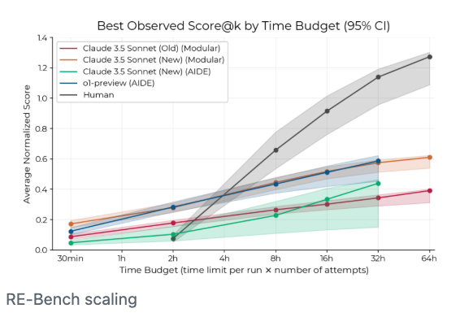
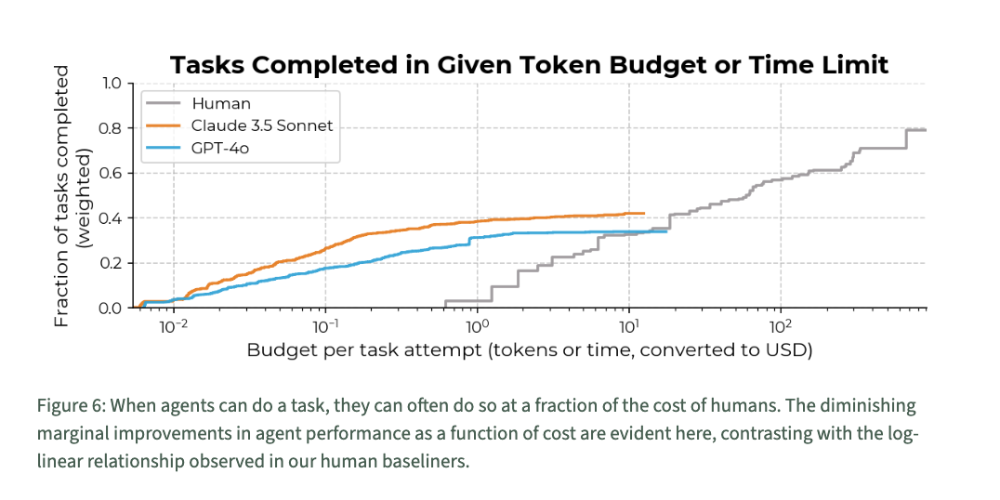
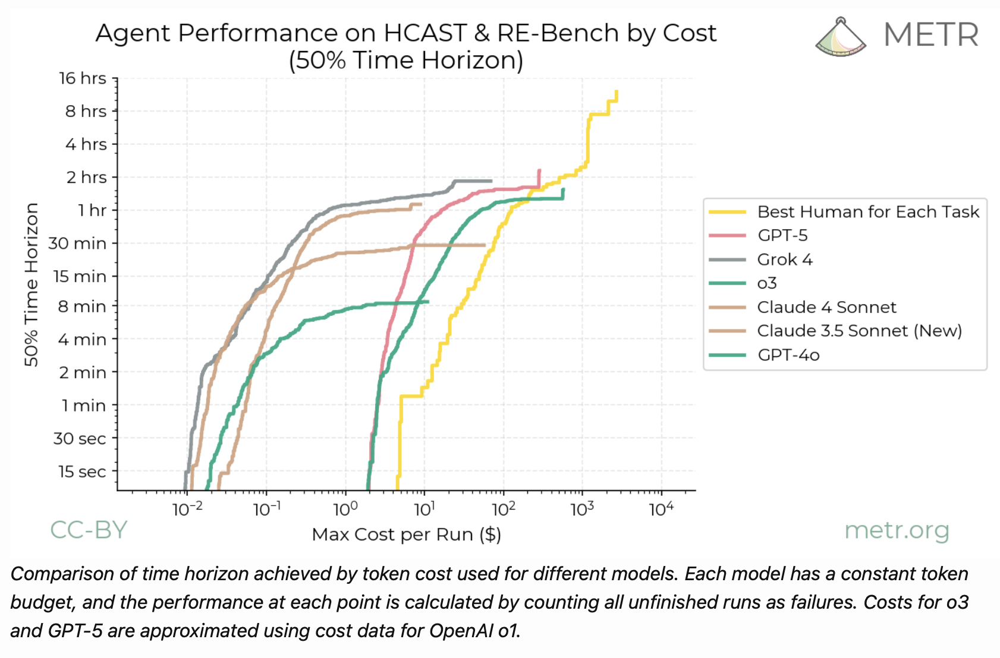
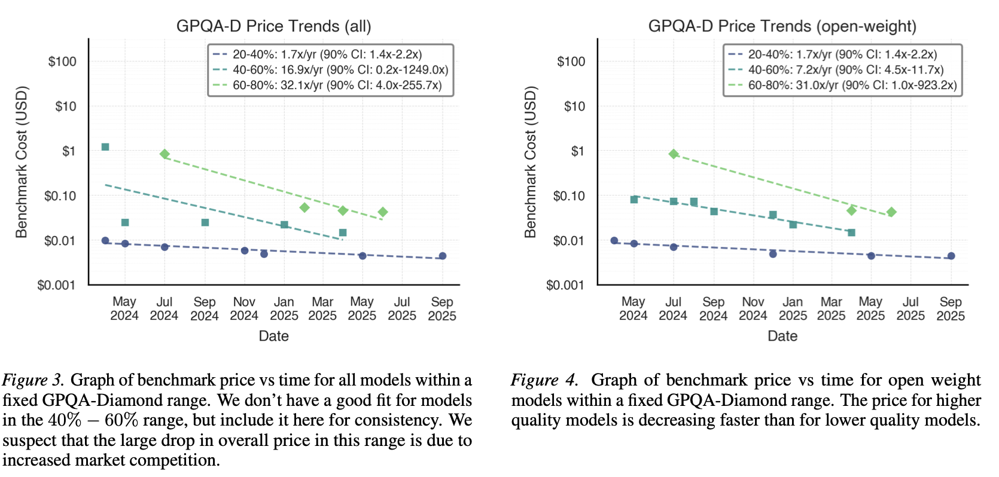
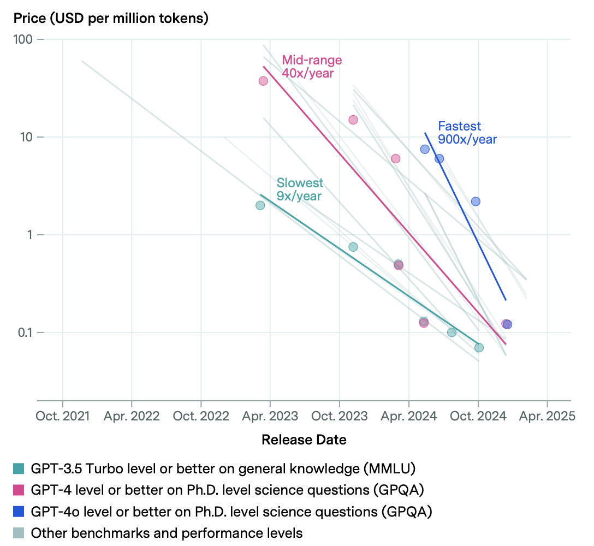

<!-- 
https://tecunningham.github.io/posts/2026-04-24-expenditure-on-agents.html

TODO:

- Galaxy brain take: the world will get a lot of value from AI but spend almost nothing on it. You only need to spend compute on new problems, most problems are common.
- Corollary: the AI firms will not get the majority share of value.

 -->

Summary.
: 
    **The returns to expenditure on AI appears to be relatively *inelastic*.** This means you get a lot of value from the first few dollars but then the marginal value falls quickly.

    **This implies the value we get AI will be much larger than the money we spend on AI.** If the returns to AI expenditure remain inelastic (and there are reasons to expect this), then people and firms will get much more value from AI than what they spend on it.

#           Summary

Expenditure on AI has diminishing returns.
: 
    We often see that the returns to expenditure on AI agents are *inelastic* meaning you get a lot of value from the first few dollars, but then the marginal value falls quickly:
    ```{tikz}
    #| fig-width: 2.5
    #| fig-align: center 
    \begin{tikzpicture}[scale=1,yscale=3]
        % --- parameters ---
        \def\xmax{5}
        \def\ytop{1.2}
        \def\mslope{0.25}
        % human: V = Ah * E^alphah
        \def\Ah{0.4}  \def\alphah{0.7}
        % agent: V = Aa * E^alphaa
        \def\Aa{0.35} \def\alphaa{0.2}

        % --- derived tangencies (E* = (A*alpha/slope)^(1/(1-alpha))) ---
        \pgfmathsetmacro{\Eh}{pow(\Ah*\alphah/\mslope, 1/(1-\alphah))}
        \pgfmathsetmacro{\Vh}{\Ah*pow(\Eh,\alphah)}
        \pgfmathsetmacro{\Ihi}{\Vh-\mslope*\Eh}
%        \pgfmathsetmacro{\Ehtop}{(\ytop-\Ihi)/\mslope}
        \pgfmathsetmacro{\Ea}{pow(\Aa*\alphaa/\mslope, 1/(1-\alphaa))}
        \pgfmathsetmacro{\Va}{\Aa*pow(\Ea,\alphaa)}
        \pgfmathsetmacro{\Iai}{\Va-\mslope*\Ea}
%        \pgfmathsetmacro{\Eatop}{(\ytop-\Iai)/\mslope}

        \draw[-] (0,0) -- (\xmax,0) node[midway,below] {expenditure (\$)}
            --(\xmax,1.4)--
            %node[midway,above,align=center] {situation today:\\higher expenditure on humans\\higher value from humans}
            (0,1.4)--(0,0) node[midway,rotate=90,above] {value (\$)};
        \draw[green!50!black, thick, domain=0:\xmax, samples=120]
            plot (\x, {\Ah*pow(\x,\alphah)}) node[right] {human};
        \draw[red!70!black, thick, domain=0:\xmax, samples=120]
            plot (\x, {\Aa*pow(\x,\alphaa)}) node[right] {agent};
    \end{tikzpicture}
    ```

    When we compare with the returns to human labor we often see a "tortoise-hare" relationship, where the agent wins at low levels of expenditure, but the human wins with higher levels. I discuss some theory and evidence for this below.


This implies the value from AI will be significantly higher than the expenditure on AI.
: 
    In the plot below I mark the *optimal* expenditure on agents and on humans: where the marginal value of each is equalized to their marginal cost. You can see that the expenditure on agents is much lower, but the ratio between value and expenditure is much greater for agents than humans.

    ```{tikz}
    #| fig-width: 2.5
    #| fig-align: center 
    \begin{tikzpicture}[scale=1,yscale=3]
        % --- parameters ---
        \def\xmax{5}
        \def\ytop{1.2}
        \def\mslope{0.25}
        % human: V = Ah * E^alphah
        \def\Ah{0.4}  \def\alphah{0.7}
        % agent: V = Aa * E^alphaa
        \def\Aa{0.35} \def\alphaa{0.2}

        % --- derived tangencies (E* = (A*alpha/slope)^(1/(1-alpha))) ---
        \pgfmathsetmacro{\Eh}{pow(\Ah*\alphah/\mslope, 1/(1-\alphah))}
        \pgfmathsetmacro{\Vh}{\Ah*pow(\Eh,\alphah)}
        \pgfmathsetmacro{\Ihi}{\Vh-\mslope*\Eh}
        \pgfmathsetmacro{\Ehtop}{(\ytop-\Ihi)/\mslope}
        \pgfmathsetmacro{\Ea}{pow(\Aa*\alphaa/\mslope, 1/(1-\alphaa))}
        \pgfmathsetmacro{\Va}{\Aa*pow(\Ea,\alphaa)}
        \pgfmathsetmacro{\Iai}{\Va-\mslope*\Ea}
        \pgfmathsetmacro{\Eatop}{(\ytop-\Iai)/\mslope}

        \draw[-] (0,0) -- (\xmax,0) node[midway,below] {expenditure (\$)}
            --(\xmax,1.4)--
            %node[midway,above,align=center] {situation today:\\higher expenditure on humans\\higher value from humans}
            (0,1.4)--(0,0) node[midway,rotate=90,above] {value (\$)};
        \draw[green!50!black, thick, domain=0:\xmax, samples=120]
            plot (\x, {\Ah*pow(\x,\alphah)}) node[right] {human};
        \draw[red!70!black, thick, domain=0:\xmax, samples=120]
            plot (\x, {\Aa*pow(\x,\alphaa)}) node[right] {agent};
        \draw[dotted] (0,\Ihi) -- (\Ehtop,\ytop);
        \node[circle,fill=black,inner sep=0pt,minimum size=4pt,green!50!black] at (\Eh,\Vh) {};
        \draw[dotted] (0,\Iai) -- (\Eatop,\ytop);
        \node[circle,fill=black,inner sep=0pt,minimum size=4pt,red!50!black] at (\Ea,\Va) {};
    \end{tikzpicture}
    ```

This has some important implications.
: 
    If we think the returns to expenditure on AI will remain inelastic then:

    1. We would see a big impact of AI on productivity without much expenditure on AI.
    2. The companies that sell scarce inputs to AI (compute, algorithms) would only capture a small share of the value that is being generated.


#           Argument

The returns on agent expenditure appear to be relatively *inelastic*.
: 
    There are a few lines of evidence that the returns to AI expenditure are more inelastic than the returns on human labor:

    1. AI can often beat humans at a given task at a small expenditure level, but falls behind humans at higher expenditure levels.
    2. There are many tasks which AI can do much cheaper than a human, and many which it cannot do at any reasonable price. This implies the number of tasks performed, as a function of expenditure, is relatively inelastic for agents.
    
    We can also give a theoretical argument that LLMs tend to *cache* the solutions to many problems, so the cost of solving many problems is low, while other problems are entirely out of their reach. Thus we would expect the returns to compute to be less-elastic than the returns to human expenditure.

If returns are inelastic then the ratio of value to expenditure will be high.
: 
    Intuitively, suppose the first few dollars on AI are very valuable but the value of additional expenditure diminishes quickly. Then you'll just spend a few dollars and get a very high value.

    More formally: suppose we have an function $F(K)$, where $K$ is expenditure on agents. If $K$ is chosen optimally, so that the marginal value is equal to the marginal cost ($F'(K^*)=1$) then the ratio between value and expenditure ($F(K^*)/K^*$) will be exactly equal to the elasticity of that function at $K^*$:

    ```{tikz}
    #| fig-width: 3
    #| fig-align: center 
    \begin{tikzpicture}[scale=1,yscale=3]
        % --- parameters ---
        \def\xmax{5}
        \def\ytop{1.4}
        \def\mslope{0.25}
        % human: V = Ah * E^alphah
        \def\Ah{0.4}  \def\alphah{0.7}
        % agent: V = Aa * E^alphaa
        \def\Aa{0.35} \def\alphaa{0.2}

        % --- derived tangencies (E* = (A*alpha/slope)^(1/(1-alpha))) ---
        \pgfmathsetmacro{\Eh}{pow(\Ah*\alphah/\mslope, 1/(1-\alphah))}
        \pgfmathsetmacro{\Vh}{\Ah*pow(\Eh,\alphah)}
        \pgfmathsetmacro{\Ihi}{\Vh-\mslope*\Eh}
        \pgfmathsetmacro{\Ehtop}{(\ytop-\Ihi)/\mslope}
        \pgfmathsetmacro{\slopeangle}{atan(\mslope*3)}

        \draw[-] (0,0) -- (\xmax,0) node[midway,below] {expenditure (\$)}
            --(\xmax,1.4)--
            (0,1.4)--(0,0) node[midway,rotate=90,above] {value (\$)};
        \draw[green!50!black, thick, domain=0:\xmax, samples=120]
            plot (\x, {\Ah*pow(\x,\alphah)});% node[right] {human};
        \draw (0,\Ihi) -- node[midway,pos=0.8,rotate=\slopeangle,above] {marginal value} (\Ehtop,\ytop);
        \draw (0,0) -- node[midway,pos=0.8,rotate=45,above] {average value} (\Eh*3,\Vh*3);
    \end{tikzpicture}
    ```


This has a few important implications.
: 
    **The value people are getting from AI could be higher than their expenditure.** We might see people spending $100 a month on agents, but getting far more than $100 of value from agents, due to the inelastic returns on expenditure.

    **Recursive self-improvement could happen without a significant increase in the capital share.** A common conjecture has been that we could monitor for signs of recursive self-improvement by AI labs through their relative expenditure on AI labor (agents) vs human labor. The argument in this note gives some reason to doubt this: recursive self-improvement might happen *without* a big increase in expenditure on agents.

    **AI could transform the economy but remain a small share of output.** Many analyses of AI have assumed that, if AI has dramatic implications on growth, then holders of scarce inputs (algorithms, compute, energy) will be paid a large share of the output. In fact if the returns to AI and compute are relatively inelastic, then they could have a large impact, but only get a small benefit.
    
    
<!-- Illustration.
: 
    The graphs below show stylized returns to expenditure on human and agent labor, with the common "tortoise-hare" pattern: the return to agent labor expenditure is higher at first, but diminishes more quickly. The black dots show the optimal expenditure on each, where the marginal cost and marginal value are equalized.

::: {layout-ncol=2}

```{tikz}
#| fig-width: 3
#| fig-align: center 
\begin{tikzpicture}[scale=1,yscale=3]
    % --- parameters ---
    \def\xmax{5}
    \def\ytop{1.2}
    \def\mslope{0.25}
    % human: V = Ah * E^alphah
    \def\Ah{0.4}  \def\alphah{0.7}
    % agent: V = Aa * E^alphaa
    \def\Aa{0.35} \def\alphaa{0.2}

    % --- derived tangencies (E* = (A*alpha/slope)^(1/(1-alpha))) ---
    \pgfmathsetmacro{\Eh}{pow(\Ah*\alphah/\mslope, 1/(1-\alphah))}
    \pgfmathsetmacro{\Vh}{\Ah*pow(\Eh,\alphah)}
    \pgfmathsetmacro{\Ihi}{\Vh-\mslope*\Eh}
    \pgfmathsetmacro{\Ehtop}{(\ytop-\Ihi)/\mslope}
    \pgfmathsetmacro{\Ea}{pow(\Aa*\alphaa/\mslope, 1/(1-\alphaa))}
    \pgfmathsetmacro{\Va}{\Aa*pow(\Ea,\alphaa)}
    \pgfmathsetmacro{\Iai}{\Va-\mslope*\Ea}
    \pgfmathsetmacro{\Eatop}{(\ytop-\Iai)/\mslope}

    \draw[-] (0,0) -- (\xmax,0) node[midway,below] {expenditure (\$)}
        --(\xmax,1.4)--
        node[midway,above,align=center] {situation today:\\higher expenditure on humans\\higher value from humans}
        (0,1.4)--(0,0) node[midway,rotate=90,above] {value (\$)};
    \draw[green!50!black, thick, domain=0:\xmax, samples=120]
        plot (\x, {\Ah*pow(\x,\alphah)}) node[right] {human};
    \draw[red!70!black, thick, domain=0:\xmax, samples=120]
        plot (\x, {\Aa*pow(\x,\alphaa)}) node[right] {agent};
    \draw[dotted] (0,\Ihi) -- (\Ehtop,\ytop);
    \node[circle,fill=black,inner sep=0pt,minimum size=4pt] at (\Eh,\Vh) {};
    \draw[dotted] (0,\Iai) -- (\Eatop,\ytop);
    \node[circle,fill=black,inner sep=0pt,minimum size=4pt] at (\Ea,\Va) {};
\end{tikzpicture}
```


```{tikz}
#| fig-width: 3
#| fig-align: center 
\begin{tikzpicture}[scale=1,yscale=3]
    % --- parameters ---
    \def\xmax{5}
    \def\ytop{1.2}
    \def\mslope{0.25}
    \def\Ah{0.4}  \def\alphah{0.7}
    \def\Aa{1}  \def\alphaa{0.2}
    \def\Aatoday{0.35}

    \pgfmathsetmacro{\Eh}{pow(\Ah*\alphah/\mslope, 1/(1-\alphah))}
    \pgfmathsetmacro{\Vh}{\Ah*pow(\Eh,\alphah)}
    \pgfmathsetmacro{\Ihi}{\Vh-\mslope*\Eh}
    \pgfmathsetmacro{\Ehtop}{(\ytop-\Ihi)/\mslope}
    \pgfmathsetmacro{\Ea}{pow(\Aa*\alphaa/\mslope, 1/(1-\alphaa))}
    \pgfmathsetmacro{\Va}{\Aa*pow(\Ea,\alphaa)}
    \pgfmathsetmacro{\Iai}{\Va-\mslope*\Ea}
    \pgfmathsetmacro{\Eatop}{(\ytop-\Iai)/\mslope}

    \draw[-] (0,0) -- (\xmax,0) node[midway,below] {expenditure (\$)}
        --(\xmax,1.4)--
        node[midway,above,align=center] {situation tomorrow:\\higher expenditure on humans,\\higher value from agents}
        (0,1.4)--(0,0) node[midway,rotate=90,above] {value (\$)};
    \draw[green!50!black, thick, domain=0:\xmax, samples=120]
        plot (\x, {\Ah*pow(\x,\alphah)}) node[right] {human};
    \draw[red!70!black, thick, domain=0:\xmax, samples=120]
        plot (\x, {\Aa*pow(\x,\alphaa)}) node[right] {agent};
    \draw[red!70!black, dotted, thick, domain=0:\xmax, samples=120]
        plot (\x, {\Aatoday*pow(\x,\alphaa)});
    \draw[dotted] (0,\Ihi) -- (\Ehtop,\ytop);
    \node[circle,fill=black,inner sep=0pt,minimum size=4pt] at (\Eh,\Vh) {};
    \draw[dotted] (0,\Iai) -- (\Eatop,\ytop);
    \node[circle,fill=black,inner sep=0pt,minimum size=4pt] at (\Ea,\Va) {};
\end{tikzpicture}
```

::: -->

#           Evidence on Returns to Expenditure

The ideal experiment.
: 
    The ideal data would be to map out the whole function, $F(K,L)$, where we vary the expenditure on agents and human inputs, and measure the economic value. E.g. along these lines:

    - ==adsf==

    Additionally we should want to see how the function changed as AI models became stronger.

Agent progress on RE-bench tasks is less-elastic than humans.
: 
    RE-bench (@metr2024capability) scaling curves find that agents beat humans at low levels of expenditure, but humans beat agents at higher levels: 

    

    This means the agent curve cuts the human curve from above, and so the agent curve is less-elastic than the human curve (at the point of intersection).

Agent task-completion is less-elastic than human task-completion.
: 
    We can compile a set of tasks, and calculate the share of those tasks completed at a given cost. Using the share of tasks completed as the y-axis, we can then plot the returns to expenditure, both for agents and humans:

    @metr2024capability compare the cost of humans and LLMs to do a variety of tasks and say:
    
    > "when agents can do a task, they can often do so at a fraction of the cost of humans."

    

    Similarly @metr2025gpt5evaluation find that agent curves cut the human curve from above:

    

Is agent-expenditure getting more elastic over time?
: 
    @gundlach2026priceprogress find the price of high capabilities is falling relatively faster than the price of low capabilities:
    
    

    This would imply that elasticity of returns to expenditure is *increasing*, i.e. the expenditure curve is rotating counter-clockwise.

    @cottier2025prices (Epoch) simimlarly find that the price of higher capabilities has been falling faster than the price of lower capabilities. However note that they report price/token, whereas we care more about the price per output, and the tokens/output can vary substantially across models.

    

    One important qualification: I believe the cost estimates are based on using the same model, and the same budget, on *all* tasks. In fact a cost-minimizing firm would vary the model and budget depending on the ex-ante difficulty of the tasks. This would make later curves relatively less elastic (it would lower the cost of the easy tasks), so push somewhat against this increasing-elasticity result.

The asymptote can be increasing, but the relevant elasticity remains constant.
: 
    There seems strong evidence that the value to scaling asymptotes (or that elasticity declines). However the economically-relevant elasticity could still remain constant, i.e. the elasticity at the optimum.

Some papers estimate constant-elasticity inference-time scaling.
: 
    @brown2024monkeys find that pass-rate on math and code benchmarks scales roughly log-linearly with the number of samples or with sequential test-time compute, with elasticities well below 1 (on SWE-bench lite, CodeContests, MATH).

    @snell2024scaling estimate the returns to test-time compute, but say it hits hard limits below human levels: "across the board these schemes provided small gains on hard problems". As discussed above, existence of a ceiling implies agent-expenditure is inelastic relative to human-expenditure.

Inference-time scaling laws.
: 
    @brown2024monkeys ("Large Language Monkeys") fit an *exponentiated power law* $\log c \approx a\,k^b$ to coverage (pass@k) as a function of samples $k$, with $b<0$. Translating their headline results into an arc-elasticity $\Delta\log c/\Delta\log k$:

    - SWE-bench Lite, DeepSeek-V2, k=1→250: ε ≈ 0.23.
    - CodeContests, Gemma-2B, k=1→10⁴: ε ≈ 0.64.
    - MATH, Pythia-160M, k=1→10⁴: ε ≈ 0.58.

    Two things are worth noting:

    1. The elasticity is well below 1, and the form $\log c \approx a\,k^b$ with $b<0$ implies it *declines* further with $k$.
    2. Without a perfect verifier the elasticity collapses much earlier. On MATH with Llama-3-8B-Instruct, majority-vote success rises only from 40.5% (k=100) to 41.4% (k=10,000) — an arc-elasticity of about 0.005.

    

Inference-time scaling fails on harder optimization benchmarks.
: 
    Several recent benchmarks find inference-time scaling stops paying off well below the level of human experts:

    - @shetty2025gso (GSO): "leading SWE-Agents struggle significantly, achieving less than 5% success rate, with limited improvements even with inference-time scaling."
    - @press2025algotune (AlgoTune): the largest speedups come from substituting faster libraries, not from algorithmic insight.
    - @nathani2025mlgym (MLGymBench), @ma2025swefficiency (SWE-fficiency): similar patterns of "surface-level speedups" without algorithmic discoveries.

    Equivalently: for these tasks the agent contribution function $\tilde F(K)$ has very low elasticity at the frontier, even though it has high level at low $K$.

ARC-AGI.
: 
    Data from ARC-AGI is a great illustration, we can observe a few relevant things:

    1. The organizers say the human scores are achievable at around $5/task, but we don't have any other datapoints, so we can't estimate an elasticity for human expenditure.
    2. Nevertheless, if an agent cannot match a human score at human expenditure, we can generally be confident that it will exceed human score at low expenditure, and therefore the agent expenditure curve will cut the human expenditure curve from above, thus the agent expenditure curve is less-elastici.
    3. We can observe how returns to expenditure have changed over time. ==[We want to know if the price of high scores has declined faster than the price of low scores]==


<!-- OpenAI / METR system-card scaling.
: 
    The o1, o3, and GPT-5 system cards (and @metr2025gpt5evaluation) all report that capability on math/code scales roughly log-linearly with reasoning compute, but saturates below expert-human performance. So the agent curve again cuts the human curve from above. -->

Other observation:
: 
    @svanberg2024beyond argue that many tasks could be done by computers, but are too expensive: "only 23% of worker compensation “exposed” to AI computer vision would be cost-effective for firms to automate because of the large upfront costs of AI systems." However this is almost entirely due to fixed costs (data collection, fine tuning, scaffolding), not marginal costs.


#           Models

Summary.
: 

    Suppose the firm is maximizing $Y(K,L)$, where $L$ is the quantity of human labor and $K$ the quantity of agent labor, with input prices $w$ and $r$. We want the value of agents (the degree to which they increase output) relative to expenditure on agents:
    
    $$\frac{\text{agent value}}{\text{agent expenditure}} = \frac{Y(K^*,\bar L)-Y(0,\bar L)}{rK^*}.$$

    To pin down the firm's optimum we need *some* nonlinearity. The cleanest choice is to fix human labor at $\bar L$ (treating $w\bar L$ as sunk in the short run), which leaves a one-dimensional problem $\max_K Y(K,\bar L) - rK$ with FOC $Y_K(K^*,\bar L) = r$. Define the *agent contribution function*

    $$\tilde F(K) \equiv Y(K,\bar L) - Y(0,\bar L).$$

    Then $\tilde F'(K) = Y_K(K,\bar L)$, the FOC is just $\tilde F'(K^*) = r$, and the value-expenditure ratio collapses to
    
    $$\frac{V_A}{rK^*} = \frac{\tilde F(K^*)}{\tilde F'(K^*)\,K^*} = \frac{1}{\varepsilon_{\tilde F}(K^*)}.$$
    
    **Universal punchline:** *the agent value-expenditure ratio is the inverse elasticity of the agent contribution function at the optimum.* If returns to agents are very inelastic ($\varepsilon_{\tilde F}\ll 1$), agents create much more value than they cost. Each subsection below just instantiates $\tilde F$.

    (For the continuum-of-tasks model, where labor isn't a single quantity, the analogous minimal nonlinearity is to fix output $\bar Y$ instead --- see that section.)

Perfect substitutes.
: 
    $Y = F(K) + G(\bar L)$, with $F$ concave. The agent contribution doesn't even depend on labor:
    
    $$\tilde F(K) = Y(K,\bar L) - Y(0,\bar L) = F(K),$$
    
    so directly from the universal result,
    
    $$\frac{V_A}{rK^*} = \frac{1}{\varepsilon_F(K^*)}.$$
    
    The value-to-expenditure ratio is the inverse elasticity of returns to agent expenditure. (Here fixing $\bar L$ isn't even necessary --- the FOCs decouple, so the ratio is the same under joint optimization over $L$.)

Imperfect substitutes (CES).
: 
    Suppose we have $Y=(K^\sigma+L^\sigma)^{1/\sigma}$, with elasticity of substitution $\eta = 1/(1-\sigma)$. Cost-minimization gives the standard CES results:

    1. _Optimal input ratio:_ $K/L = (w/r)^\eta$.
    2. _Agent expenditure share:_ $s_K = \frac{rK}{rK+wL} = \frac{r^{1-\eta}}{r^{1-\eta}+w^{1-\eta}}$.
    3. _Value share equals expenditure share:_ under constant returns to scale, total revenue exhausts factor payments ($Y=rK+wL$), so $s_K$ is also the share of output value attributable to agents.

    The comparative static on $s_K$ with respect to agent prices is $\frac{\partial \ln s_K}{\partial \ln r} = (1-\eta)(1-s_K)$, so as agents get cheaper (or, equivalently, more productive at fixed quality):

    - _Substitutes_ ($\eta>1$, i.e. $\sigma\in(0,1)$): agent expenditure share *rises*.
    - _Cobb-Douglas_ ($\eta=1$, the limit $\sigma\to 0$): expenditure shares are constant in prices.
    - _Complements_ ($\eta<1$, i.e. $\sigma<0$): agent expenditure share *falls*.

    So the puzzle in this note --- agents producing high value but commanding little expenditure --- corresponds naturally to the *complements* case in CES. As a numerical example: with $\eta=0.3$, $w=1$ and $r=0.001$ (agents 1000x cheaper than humans), the agent expenditure share is $0.001^{0.7}/(0.001^{0.7}+1) \approx 0.8\%$.

    This is essentially the Hicks/Acemoglu logic for input shares: factor-augmenting technical progress only raises that factor's revenue share when the factor is a gross substitute for the others.

    _Value-expenditure ratio (under fixed $\bar L$)._ The FOC at fixed $\bar L$ is $Y_K = Y^{1-\sigma}K^{\sigma-1} = r$, giving $K^* = Y_1\,r^{-\eta}$ and $rK^* = Y_1\, r^{1-\eta}$.

    1. _Complements ($\sigma\le 0$, $\eta\le 1$):_ $Y(0,\bar L) = 0$, so $\tilde F(K) = Y(K,\bar L)$ and the value-expenditure ratio is

       $$\frac{V_A}{rK^*} = \frac{Y_1}{Y_1\,r^{1-\eta}} = r^{\eta-1} = \frac{1}{r^{1-\eta}}.$$
       
       Closed form depending only on $r$ and $\eta$ (and not on $\bar L$ or $w$, since $w\bar L$ is sunk). Explodes as $r\to 0$, exactly the post's puzzle.

    2. _Substitutes ($\sigma>0$, $\eta>1$):_ $Y(0,\bar L) = \bar L$, so $\tilde F(K) = (K^\sigma+\bar L^\sigma)^{1/\sigma} - \bar L$. An interior $K^*$ requires $r$ above some threshold; for cheaper $r$ the firm wants only agents (corner solution).

Apple-picking with CES.
: 
    Suppose labor contributes to two tasks but capital only contributes to one. This is a version of the apple-picking model [@cunningham2026applepicking], where agents can only pick low-hanging fruit:

    $$Y(K,L)=L^\gamma+(K^\sigma+L^\sigma)^{\gamma/\sigma}.$$
    
    Here $L^\gamma$ is the high-apple output (humans only) and $(K^\sigma+L^\sigma)^{\gamma/\sigma}$ is the low-apple output (both, with substitutability $\sigma$ and diminishing returns $\gamma$). Labor enters both terms non-rivalrously: $L$ is human productive capacity contributing to high *and* low picking simultaneously, rather than a single bucket allocated between them.
    
    Restrict to $\sigma>0$ (humans can pick low apples on their own) and $\gamma\in(0,1)$ (apples exhaust). Apply the universal recipe with labor fixed at $\bar L$:
    
    $$\tilde F(K) = (K^\sigma+\bar L^\sigma)^{\gamma/\sigma} - \bar L^\gamma$$
    
    --- the agent contribution is purely the boost to low-apple output. The FOC $\tilde F'(K^*) = r$ multiplied by $K^*$ gives
    
    $$rK^* = \gamma\,s_K\,Y_L(K^*),$$
    
    where $Y_L(K) \equiv (K^\sigma+\bar L^\sigma)^{\gamma/\sigma}$ is low-apple output and $s_K \equiv K^{*\sigma}/(K^{*\sigma}+\bar L^\sigma)$ is the agent's CES share *within* low-apple. Using $\bar L^\gamma/Y_L = (1-s_K)^{\gamma/\sigma}$:
    
    $$\frac{V_A}{rK^*} = \frac{1 - (1-s_K)^{\gamma/\sigma}}{\gamma\,s_K}.$$
    
    The ratio interpolates between two inverse elasticities depending on the agent share within low-apple:
    
    - $s_K\to 1$ (agents dominate low-apple): ratio $\to 1/\gamma$ (inverse of diminishing-returns parameter).
    - $s_K\to 0$ (agents marginal in low-apple): ratio $\to 1/\sigma$ (inverse of within-low-apple substitutability).
    - $\gamma=\sigma$: model degenerates to additive ($Y = K^\gamma + 2\bar L^\gamma$), ratio = $1/\gamma$ exactly.
    
    The post's headline pattern --- agents producing huge value with small expenditure --- arises naturally when $\gamma$ is small (low apples exhaust quickly) and $s_K$ is close to 1 (agents do most of the low-apple picking), giving ratio $\approx 1/\gamma \gg 1$.


Continuum of tasks.
: 
    Continuum of tasks $i\in[0,1]$, all necessary, agents and humans perfect substitutes within each task. Output is Leontief across tasks:
    
    $$Y = \min_{i\in[0,1]} y(i).$$
    
    Here labor isn't a single variable (humans are spread across tasks at different per-task costs), so the analogous minimal nonlinearity is to fix output at $\bar Y$ instead of fixed $\bar L$. The "value of agents" then becomes the cost saving per unit output relative to the humans-only counterfactual.
    
    Assume cost per unit of task $i$ is isoelastic in the task index, with agents steeper than humans (visualized below):
    
    $$c_H(i) = h \cdot i^{\alpha_H}, \qquad c_A(i) = a \cdot i^{\alpha_A}, \qquad \alpha_A > \alpha_H \ge 0.$$
    
    Each task is assigned to whoever is cheaper, with threshold $i^* = (h/a)^{1/(\alpha_A-\alpha_H)}$. Agents do $[0,i^*]$, humans do $[i^*,1]$. Let $\bar c \equiv h(i^*)^{\alpha_H} = a(i^*)^{\alpha_A}$. Per unit $\bar Y$:
    
    1. _Share of tasks done by agents:_ $i^*$.
    2. _Per-unit expenditures:_ $E_A = \int_0^{i^*} a\,i^{\alpha_A}\,di = \frac{\bar c\,i^*}{\alpha_A+1}$, $E_H = \int_{i^*}^1 h\,i^{\alpha_H}\,di = \frac{h-\bar c\,i^*}{\alpha_H+1}$.
    3. _Agent expenditure share:_ $s_A = \frac{(i^*)^{\alpha_H+1}(\alpha_H+1)}{(i^*)^{\alpha_H+1}(\alpha_H+1) + (1-(i^*)^{\alpha_H+1})(\alpha_A+1)}$. We have $s_A < i^*$ whenever $\alpha_A>\alpha_H$: agents do a non-trivial share of tasks but command a smaller share of expenditure, because they handle the cheap tasks.

    _Value-expenditure ratio (under fixed $\bar Y$)._ Cost per unit $\bar Y$ without agents is $c_0 = h/(\alpha_H+1)$, with agents it is $c_1 = E_A + E_H$. The cost saving per unit output is the natural "value of agents" here, and dividing by per-unit agent expenditure gives a strikingly clean formula:
    
    $$\frac{V_A}{rK^*} = \frac{c_0 - c_1}{E_A} = \frac{\alpha_A - \alpha_H}{\alpha_H+1},$$
    
    independent of $h$, $a$, and $i^*$. The ratio is pinned down entirely by the elasticity *gap*: agents create more value per dollar exactly when their cost-curve is steeper than humans'.

    Numerical example: with $\alpha_H = 1$, $\alpha_A = 3$, $h=1$, $a=4$ we get $i^* = 1/2$, $E_A = 1/16$, $E_H = 3/8$, $c_0 = 1/2$, $c_1 = 7/16$. Agents do 50% of tasks but only $1/7 \approx 14\%$ of expenditure; cost saving is $V_A = 1/16$ per unit $\bar Y$, and the value-expenditure ratio is exactly 1.
    
    (This is essentially the @zeira1998workers / @acemoglu2011handbook / @acemoglu2018race task-based model, specialized to isoelastic comparative-advantage schedules.)

```{tikz}
#| fig-width: 5
#| fig-align: center
\begin{tikzpicture}[scale=2]
    \def\axmax{2}
    \def\mw{0.4}   % width of marginal-density strip

    \useasboundingbox (-\mw-0.7,-\mw-0.45) rectangle (\axmax+0.3,\axmax+0.25);

    % Marginal of c_A (below x-axis): pdf f_A(c_A) = (1/12)*4^(2/3)*c_A^(-2/3)
    %   = 0.21 * c_A^(-2/3) on [0, 4]; truncate to [0.04, 2] for plotting
    %   scale factor 0.18 so peak (at c_A=0.04) maps to ~ \mw - 0.05
    \fill[red!10]
        (0.04,-\mw) --
        plot[domain=0.04:2, samples=120] (\x,{-\mw + 0.18*0.21*pow(\x,-2/3)}) --
        (2,-\mw) -- cycle;
    \draw[red!55, thick, domain=0.04:2, samples=120]
        plot (\x,{-\mw + 0.18*0.21*pow(\x,-2/3)});

    % Marginal of c_H (left of y-axis): pdf f_H = 1 (uniform on [0,1])
    %   draw as a flat rectangle of width 0.25 (within strip width 0.4)
    \fill[green!12]
        (-\mw,0) -- (-\mw+0.25,0) -- (-\mw+0.25,1) -- (-\mw,1) -- cycle;
    \draw[green!45!black, thick]
        (-\mw,1) -- (-\mw+0.25,1) -- (-\mw+0.25,0);

    % Main square plot box
    \draw (0,0) rectangle (\axmax,\axmax);

    % Indifference line c_H = (r/w) c_A; here w=r so slope is 1
    \draw[gray!50!black, thick, dashed] (0,0) -- (\axmax,\axmax);
    \node[gray!50!black, anchor=south west, font=\footnotesize]
        at (\axmax,\axmax) {$c_H = \tfrac{r}{w}\,c_A$};

    % Joint cost curve (rank-correlated, isoelastic):
    %   c_A(i) = 4*i^3,  c_H(i) = i,  i in [0,1]
    % agent costs more skewed: alpha_A = 3 vs alpha_H = 1
    % only show segment that fits in plot: i up to (2/4)^(1/3) ~ 0.794
    \draw[blue!55!black, thick, domain=0:0.794, samples=120, smooth]
        plot ({4*pow(\x,3)},{\x});

    % Endpoint markers
    \node[circle, fill=blue!55!black, inner sep=0.7pt] at (0,0) {};
    \node[anchor=west, font=\scriptsize] at (0.04,0.04) {$i=0$};

    % i=1 endpoint is off-plot at (4,1); show truncation point
    \node[anchor=south west, font=\scriptsize] at (2,0.794) {(curve continues to $i=1$)};

    % Threshold marker (where c_H = c_A given w=r)
    \node[circle, fill=black, inner sep=1pt] at (0.5,0.5) {};
    \node[anchor=south west, font=\scriptsize] at (0.53,0.53) {$i^*=\tfrac12$};

    % Region labels
    \node[font=\small, align=center] at (0.55,1.5) {agents\\cheaper};
    \node[font=\small, align=center] at (1.55,0.35) {humans\\cheaper};

    % Marginal labels
    \node[red!55, font=\scriptsize, anchor=west] at (1.4,-\mw/2-0.04) {pdf of $c_A$};
    \node[green!45!black, font=\scriptsize, anchor=south, rotate=90] at (-\mw/2-0.04,1.4) {pdf of $c_H$};

    % Axis labels
    \node[below, font=\small] at (\axmax/2,-\mw-0.25) {agent cost $c_A$};
    \node[rotate=90, above, font=\small] at (-\mw-0.25,\axmax/2) {human cost $c_H$};
\end{tikzpicture}
```

Joint distribution of $(c_A, c_H)$ across tasks for the calibration in the numerical example ($\alpha_H = 1$, $\alpha_A = 3$, $h=1$, $a=4$). Costs are perfectly rank-correlated and isoelastic in rank: $c_H(i)=i$ and $c_A(i)=4i^3$. The marginal density of each cost is shown alongside the corresponding axis (lighter shading): the human marginal is uniform on $[0,1]$ (since $\alpha_H=1$), while the agent marginal is concentrated near zero with a long right tail (since $\alpha_A=3>\alpha_H$). The dotted indifference line $c_H = (r/w)\,c_A$ (drawn here for $r=w$) partitions tasks: above it, agents are cheaper in dollar terms ($r\,c_A<w\,c_H$); below it, humans are. The joint curve crosses the line at the threshold task $i^*=1/2$. (The curve is plotted up to $c_A=2$; it continues to $(4,1)$ off the panel.)

::: {layout-ncol=2}

```{tikz}
#| fig-width: 3
#| fig-align: center
\begin{tikzpicture}[xscale=3, yscale=0.8]
    \def\imax{1}
    \def\ymax{4}
    \def\Ah{1}      \def\alphah{1}
    \def\Aa{4}      \def\alphaa{3}
    \def\istar{0.5}

    \useasboundingbox (-0.3,-0.6) rectangle (\imax+0.15,\ymax+0.4);

    % Shade region where agents are cheaper (i in [0, i*])
    \fill[red!15] (0,0)
        -- plot[domain=0:\istar, samples=60] (\x, {\Aa*pow(\x,\alphaa)})
        -- (\istar,0) -- cycle;
    % Shade region where humans are cheaper (i in [i*, 1])
    \fill[green!15] (\istar,0)
        -- plot[domain=\istar:\imax, samples=60] (\x, {\Ah*pow(\x,\alphah)})
        -- (\imax,0) -- cycle;

    \draw (0,0) rectangle (\imax,\ymax);

    \draw[green!50!black, thick, domain=0:\imax, samples=120]
        plot (\x, {\Ah*pow(\x,\alphah)});
    \draw[red!70!black, thick, domain=0:\imax, samples=120]
        plot (\x, {\Aa*pow(\x,\alphaa)});

    \node[green!50!black, anchor=south east] at (\imax,1) {human};
    \node[red!70!black, anchor=south east] at (\imax,4) {agent};

    \node[below] at (\imax/2,0) {task difficulty $i$};
    \node[rotate=90,above] at (0,\ymax/2) {cost (\$)};
    \node[above] at (\imax/2,\ymax) {today};
\end{tikzpicture}
```

```{tikz}
#| fig-width: 3
#| fig-align: center
\begin{tikzpicture}[xscale=3, yscale=0.8]
    \def\imax{1}
    \def\ymax{4}
    \def\Ah{1}      \def\alphah{1}
    \def\Aa{2}      \def\alphaa{3}
    \def\Aatoday{4}
    \def\istar{0.7071}   % (1/2)^(1/2) = 1/sqrt(2)

    \useasboundingbox (-0.3,-0.6) rectangle (\imax+0.15,\ymax+0.4);

    \fill[red!15] (0,0)
        -- plot[domain=0:\istar, samples=60] (\x, {\Aa*pow(\x,\alphaa)})
        -- (\istar,0) -- cycle;
    \fill[green!15] (\istar,0)
        -- plot[domain=\istar:\imax, samples=60] (\x, {\Ah*pow(\x,\alphah)})
        -- (\imax,0) -- cycle;

    \draw (0,0) rectangle (\imax,\ymax);

    \draw[green!50!black, thick, domain=0:\imax, samples=120]
        plot (\x, {\Ah*pow(\x,\alphah)});
    \draw[red!70!black, thick, domain=0:\imax, samples=120]
        plot (\x, {\Aa*pow(\x,\alphaa)});
    % dotted: today's agent curve (a=4) for reference
    \draw[red!70!black, dotted, thick, domain=0:\imax, samples=120]
        plot (\x, {\Aatoday*pow(\x,\alphaa)});

    \node[green!50!black, anchor=south east] at (\imax,1) {human};
    \node[red!70!black, anchor=south east] at (\imax,2) {agent};

    \node[below] at (\imax/2,0) {task difficulty $i$};
    \node[rotate=90,above] at (0,\ymax/2) {cost (\$)};
    \node[above] at (\imax/2,\ymax) {tomorrow};
\end{tikzpicture}
```

:::

Uplift.
: 
    Suppose capital is purely labor-augmenting,
    
    $$Y(K,L) = F(G(K)L),$$
    
    where $G$ is the agent "uplift" or productivity multiplier (normalize $G(0)=1$ so $Y(0,\bar L) = F(\bar L)$) and $F$ is concave. With labor fixed at $\bar L$:
    
    $$\tilde F(K) = F(G(K)\bar L) - F(\bar L).$$
    
    For $F(x) = x^\beta$, $\beta < 1$: $\tilde F(K) = \bar L^\beta\,[G(K)^\beta - 1]$, and the FOC $\tilde F'(K^*) = r$ gives $rK^* = \beta\,Y_1\,\varepsilon_G(K^*)$ where $\varepsilon_G(K) \equiv KG'(K)/G(K)$ is the elasticity of the uplift function. Then
    
    $$\frac{V_A}{rK^*} = \frac{1 - G(K^*)^{-\beta}}{\beta\,\varepsilon_G(K^*)}.$$
    
    The denominator features the *marginal* uplift $\varepsilon_G$ (the elasticity), the numerator features the *level* $G(K^*)$. The post's headline pattern --- agents commanding small expenditure but creating huge value --- arises naturally when $G$ has a high level but low elasticity at the optimum (uplift saturates fast).
    
    (If we instead jointly optimize over $L$, the exponent $\beta$ becomes $\theta = \beta/(1-\beta)$, because labor reallocates upward in response to agent-augmented productivity. The fixed-$\bar L$ version is the short-run picture.)


#           Notes

Separability of agent and human returns.
: 
    We have a reasonable amount of data on the returns to agent and human expenditure discussed below.

    Ideally we would characterize the *joint* returns to human and agent expenditure, $F(K,L)$. This could be through *uplift* or *centaur* experiments, e.g. @becker2025uplift.

Cardinal vs ordinal measures of capability.
: 
    Even with ordinal measures of capability, we can say something about the relative elasticity of returns.

    1. _Cardinal output._ Suppose we can directly measure output on a cardinal scale. This is true when using agents for optimization, where we can measure quantitatively the value of the optimizations returns. With cardinal output we can fully characterize the function $Y(K,L)$, and observe the elasticity at each point.
    2. _Ordinal output._ In many cases we can only the ordinal outcome, and we don't directly observe the *value* of that output. We can't observe the elasticity of returns but we can *rank* the elasticities at the point of intersction. If the returns to agent labor cross the returns to human labor from above (which seems generally true), then the elasticity of returns to expenditure must be lower for agent labor than human labor at that point.
    3. _Sets of tasks._ In some cases we only observe the set of tasks that can be achieved for a certain cost. If the ranking of the sets are the same, between humans and agents, then we can treat the sets as an ordinal variable.

Characterizing returns with elasticity.
: 
    There are a few related claims about the relative returns to expenditure on agent vs human labor:

    1. Agents have lower elasticity than humans.
    2. Agents have a capability ceiling below human ceiling (if any).
    3. For each task either (1) agents can do it cheaper than humans, or (2) agents cannot do it at any expenditure level.
    
    I believe statement #1 is the most useful, both theoretically and empirically. The other two claims involve asymptotic behavior of agents, i.e. whether they could do a task at enormously high levels of expenditure. But the elasticity claim is easier to test and seems sufficient for most practical cases.

Agents will have lower elasticity if they act ask lookup tables.
: 
    Here's a stylized model of human and agent labor:

    1. Humans think about a problem; harder questions require more thought.
    2. Agents immediately solve a problem if they have seen the solution before, otherwise they cannot solve it at any cost (i.e. they are lookup tables).

    This is a grossly simplified model but it gives a simple prediction, where the agent expenditure curve will be a step function (elasticity$\approx$0).
    
<!-- GALAXY BRAIN -->


#           Related

Notes.
: 
    - Ryan Greenblatt, [Distinguish between inference scaling and "larger tasks use more compute"](https://blog.redwoodresearch.org/p/distinguish-between-inference-scaling)
    - @ord2025agentcosts argues that the hourly cost of AI agents at their METR-style time-horizon may be rising roughly exponentially, so the time-horizon trend partly reflects increasing compute expenditure rather than improvements in cost-effectiveness.

