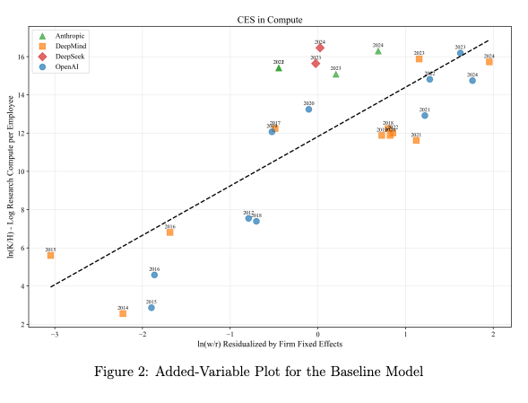

<!-- https://tecunningham.github.io/posts/2026-05-06-paper-on-effects.html -->

Question: does automated AI R&D result in a fast takeoff?
: 
    Suppose we successfully automate AI R&D, so that we have an agent that can substitute for human AI researchers, what will be the effect on capabilities progress?
    
    What data from a lab would help answer this question?

The key data is the correlation between R&D investment and algorithmic efficiency.
: 
    If algorithmic progress is very sensitive to R&D effort then automating R&D would have a big effect, and vice versa. So the core useful data would be the following:

    - R&D investment (number of FTE researchers, maybe weighted by salary)
    - algorithmic efficiency
    

A fuller model would split out different parts of the production.
: 
    We also want to account for:

    - Experiment compute
    - Data
    - (etc.)

Basic data requests.
: 
    Data for each team and each quarter:

    - Inputs: researchers, compoute, data.
    - Outputs: algorithmic efficiency.
    
    We also want survey data giving best-estimates on substitutability.

Out of scope: estimating R&D automation.
: 
    There are lots of related questions about R&D automation:

    - How much uplift is AI giving to researchers?
    - How close substitutes are agentic and human workers?
    - Is agentic R&D less experiment-efficient than human R&D? (this is potentially in-scope).


#               Core Model

Core model: R&D and algorithmic efficiency.
: 
    We start with this basic model:
    $$\xymatrix@C=3em@R=1.4em{
        *++[F]{\text{R\&D}}\ar[r]|(0.4)r
        & *++[F]{\text{algorithmic}\atop\text{efficiency}}
    }
    $$

    A very simple condition:
        $$r=\frac{\Delta\ln(\text{algorithmic efficiency})}{\Delta \ln(\text{R\&D})}$$
    
    This would allow us to estimate $r$, and immediately know whether to expect a takeoff.


Log data to collect.
: 
    For each research area (pretraining, midtraining, etc.) and in each quarter:

    | quarter | researchers | researcher salaries | compute efficiency win |
    | ------- | :---------: | :-----------------: | :--------------------: |
    | 2025Q1  |      3      |        $30M         |          +20%           |
    | 2025Q2  |      5      |        $50M         |          +30%           |
    | ...     |     ...     |         ...         |          ...           |

    
    The absolute value are sensitive, but we only need to know the relative numbers to estimate the relationship. Hypothetical scatter plot (each point is a quarter):

    ```{tikz}
    #| fig-width: 4
    #| fig-align: center
    \begin{tikzpicture}[scale=6]
        \draw (0,0) -- (1,0) node[midway,below=4pt] {ln(cumulative R\&D investment)}
            -- (1,1) -- (0,1) -- (0,0) node[midway,above,rotate=90] {ln(algorithmic efficiency)};

        \draw[red, thick] (0.03, 0.05) -- (0.97, 0.90);

        \fill (0.08, 0.12) circle (0.012);
        \fill (0.17, 0.22) circle (0.012);
        \fill (0.26, 0.27) circle (0.012);
        \fill (0.34, 0.34) circle (0.012);
        \fill (0.43, 0.41) circle (0.012);
        \fill (0.52, 0.53) circle (0.012);
        \fill (0.60, 0.55) circle (0.012);
        \fill (0.69, 0.66) circle (0.012);
        \fill (0.78, 0.71) circle (0.012);
        \fill (0.88, 0.80) circle (0.012);
    \end{tikzpicture}
    ```

Survey data to collect.
: 
    There are many reasons why the log data will be imperfect, we can ask the following question:

    > If you had 2X as many researchers last quarter, how much larger do you think your compute efficiency gains would be? (hold fixed experiment compute, training compute, data).


Complication: scale-dependent efficiency.
: 
    @gundlach2025algorithmicprogressai argue that (1) many algorithms have different efficiency at different scales; (2) most algorithmic efficiency growth over the past 10 years was due to the Transformer. I don't think this is a big worry for us, because we're just looking at the last few years, and in fact model scale hasn't changed so enormously (though I'm not sure if the Gundlach paper's "scale" refers to parameters or to training compute).

Complication: limits of compute efficiency.
: 
    Training compute efficiency can be an imperfect metric: (1) some algorithms shift the asymptote; (2) some algorithms change the inference-time efficiency.


#               Adding Experiment Compute

We can add experiment compute.
: 
    We want to know the relative importance of R&D labor and experiment compute. We can write this as follows, the $\sigma$ refers to an elasticity of substitution.

    ```{tikz}
    #| fig-width: 3
    #| fig-align: center
    #| engine-opts: !expr list(extra.preamble=c("\\usepackage{./preamble_quarto}"))
    \begin{tikzpicture}[node distance=0.5cm and 1.5cm,every path/.style={->},every node/.style={draw, rectangle, inner sep=4pt, outer sep=2pt}]
        \node[draw] (labor) {R\&D labor};
        \node[ebox] (algorithms) [below right=of labor,align=center] {$\sigma$\nodepart{second}algorithmic\\efficiency};
        \node[draw] (experiments) [below=2cm of labor] {experiment compute};
        %\draw (labor) to node[midway,fill=white,draw=none]{$r$} (algorithms);
        \draw (labor) to (algorithms);
        \draw (experiments) to (algorithms);

    \end{tikzpicture}
    \vspace{5cm}
    ```

    If $\sigma=0.5$, this means R&D and experiment-compute are strong complements, and having infinite R&D labor will only increase algorithmic efficiency by around 2X (assuming constant returns to scale).

It's harder to identify substitutability from historical data.
: 
    Suppose we had the following data:

    | quarter | researcher expenditure | experiment expenditure | compute efficiency |
    | ------- | :--------------------: | :--------------------: | :----------------: |
    | 2025Q1  |          $50M          |          $50M          |        +20%        |
    | 2025Q2  |          $50M          |          $50M          |        +20%        |
    |         |                        |                        |                    |

    The fact that we're spending on both researchers and experiments tells us that they're complements, but doesn't tell us how strong the complementarity it. Technically this data is consistent with either *perfect* bottleneck, or *zero* bottleneck.

    @whitfill2025bottlenecks estimate $\sigma$ by observing how expenditure shares change as the relative price of compute and researcher time changes:

    

    The basic observation is that (1) researcher salaries increased by 2-3X, and compute price fell by 10X; (2) compute-per-employee increased by 10-100X.


#               Fuller Model of Capabilities

A fuller model of AI R&D.
: 
    ```{tikz}
    #| engine-opts: !expr list(extra.preamble=c("\\usepackage{./preamble_quarto}"))
    \begin{tikzpicture}[node distance=0.5cm and 1.5cm,every path/.style={->},every node/.style={draw, rectangle, inner sep=4pt, outer sep=2pt}]
        \node[draw] (labor) {R\&D labor (3X)};
        \node[ebox] (algorithms) [below right=of labor,align=center] {0.5\nodepart{second}algorithmic\\efficiency (3X)};
        \node[draw] (experiments) [below=of labor] {experiment compute (3X)};
        \draw (labor) to node[midway,fill=white,draw=none]{$r$} (algorithms);
        \draw (experiments) to (algorithms);

        \node[draw] (compute) [below=of algorithms] {training compute (3X)};
        \node[draw] (data) [below=of compute] {data (3X)};
        \node[ebox] (capabilities) [right=of algorithms] {0.5\nodepart{second}capabilities (3X)};
        \draw (algorithms) to (capabilities);
        \draw (compute) to[out=0,in=180] (capabilities);
        \draw (data) to[out=0,in=180] (capabilities);
        %\draw[dashed] (capabilities) to[out=150,in=45] node[midway,draw=none,fill=white]{??} (labor);
    \end{tikzpicture}
    \vspace{5cm}
    ```

Survey data to collect.
: 
    What would your best-guess be at compute-equivalent gains in the following scenarios, over the last quarter:

    | researchers | experiment compute | training compute |  data   | **guess at gains?** |
    | :---------: | :----------------: | :--------------: | :-----: | :-----------------: |
    |     2X      |      (fixed)       |     (fixed)      | (fixed) |         ___         |
    |   (fixed)   |         2X         |     (fixed)      | (fixed) |         ___         |
    |   (fixed)   |      (fixed)       |        2X        | (fixed) |         ___         |
    |   (fixed)   |      (fixed)       |     (fixed)      |   2X    |         ___         |

